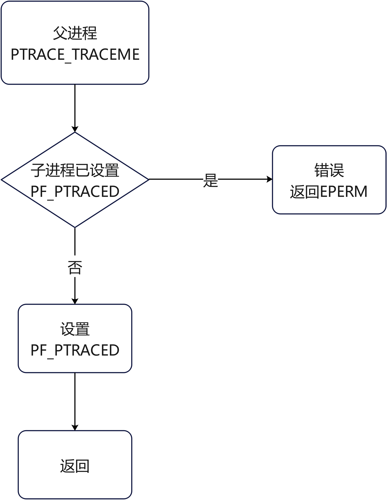
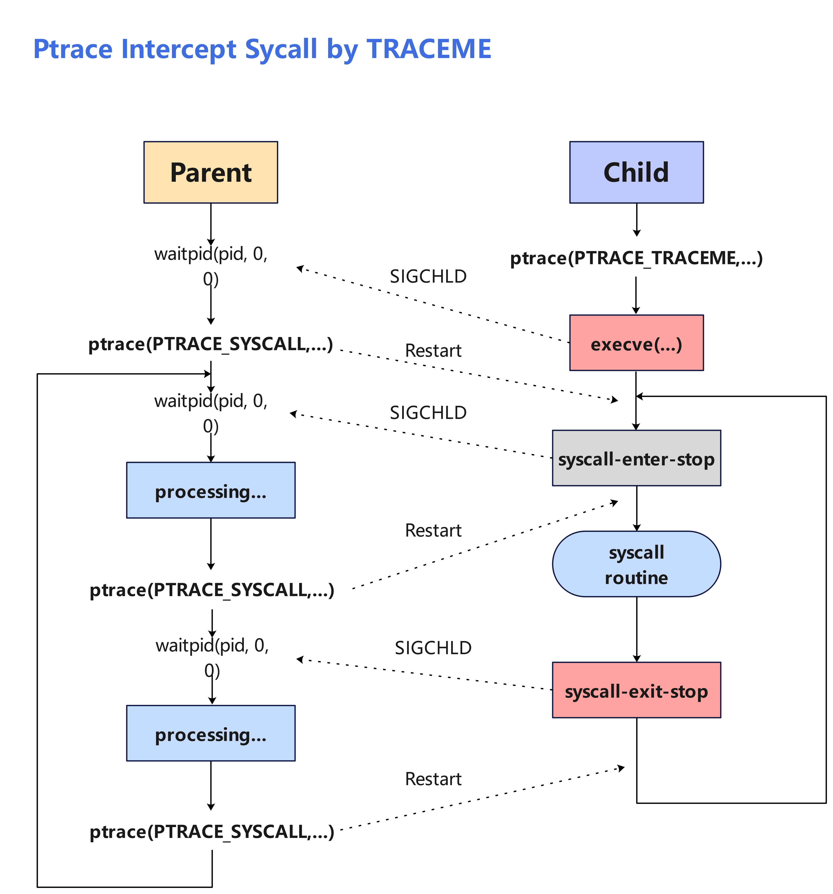

# Ptrace拦截系统调用

## 一、什么是Ptrace

### 1.1 简介

`ptrace` 是Linux下的一个系统调用，通过该系统调用可以使得一个进程（**tracer**）去观察和控制另一个进程（**tracee**）的执行，并检查和更改tracee的内存和寄存器。主要实现于断点调试和系统调用跟踪，是反调试技术的基础手段，我们熟悉的`gdb`和 `strace` 就是利用`ptrace`进行编写的。

ptrace通过不同的标志位来实现不同的功能。一般而言，使用ptrace跟踪进程有两种方式：

1. 父子进程间：使用**PTRACE_TRACEME**标志，子进程作为被跟踪者（tracee），父进程作为跟踪者（tracer）；
2. 不相关进程间：使用**PTRACE_ATTACH**标志，跟踪进程（tracer）使用指定进程PID跟踪指定进程（tracee）；

### 1.2 ptrace工作流程

ptrace使得父进程可以控制子进程，并可以检查和改变它的核心IMAGE，主要用于实现断点调试，父进程通过控制子进程的PF_PTRACED标志来进入调试状态：



也就是说同一个进程不能被一个以上ptrace程序跟踪，这也使得一些攻防技术通过检测进程的PF_PTRACED标志位来判断进程状态。关于ptrace的实现原理我们不打算细讲，有兴趣者可以去阅读Linux源码或相关博客。

父子进程双方通过信号来交流。父进程使用PTRACE_SYSCALL/PTRACE_CONT/PTRACE_SYSMU操作码控制子进程的中止状态，子进程触发中止状态时陷入暂停态，并向父进程发送信号，信号的种类取决于控制方式：

* PTRACE_TRACEME控制方式使用SIGTRAP信号；
* PTRACE_ATTACH控制方式使用SIGSTOP信号；

我们以PTRACE_SYSCALL和PTRACE_TRACEME的跟踪方式举例：



1. `tracee`创建子进程`tracee`，`tracee`中调用ptrace(PTRACE_ME, )向`tracer`发送SIGCHLD信号，并陷入暂停状态等待父进程跟踪；
2. `tracer`通过waitpid处于暂停状态直到接收到`tracee`的信号，接收到SIGCHLD信号之后使用PTRACE_SYSCALL通知`tracee`继续运行，然后通过waipid陷入暂停状态等待下一个信号的到来；
3. `tracee`执行execve跳转到另外一个代码段，继续执行代码直到下一个系统调用的入口，此时`tracee`陷入`syscall-enter-stop`状态并向`tracer`发送信号；
4. `tracer`接收到SIGTRAP信号从暂停态恢复，执行相应逻辑代码，执行完毕后使用PTRACE_SYSCALL通知`tracee`继续运行；
5. `tracee`接收到信号继续运行，执行系统调用。执行完毕后向`tracer`发送SIGCHLD信号并陷入`syscall-exit-stop`状态；
6. `tracer`接收到SIGCHLD信号从暂停态恢复，执行相应逻辑代码，执行完毕后使用PTRACE_SYSCALL通知`tracee`继续运行；
7. `tracee`继续执行，直到下一个系统调用入口，重复上述过程或程序结束；

PTRACE_CONT和PTRACE_SYSCALL是ptrace的操作码，通常被父进程使用来决定子进程陷入中止后的唤醒方式：

* `PTRACE_CONT` 用于继续进程的执行，如果进程当前被暂停，那么它会被恢复到之前被暂停的位置继续执行。如果进程没有被暂停，那么它会继续正常执行。该操作会忽略目标进程中发生的任何系统调用；
* `PTRACE_SYSCALL` 也用于继续进程的执行，但它会特别地在系统调用的入口和结束位置暂停。使得父进程可以更方便的监控系统调用；

### 1.3 ptrace性能分析

我们可以注意到，ptrace想要拦截一次系统调用，会导致`tracee`陷入两次`syscall-stop`处于暂停态等待`tracer`回应处理，分别是系统调用入口处的`syscall-enter-stop`和系统调用结束后的`syscall-exit-stop`；

如果想要拦截系统调用参数，则需要使用PTRACE_GETREGS标志获取寄存器数值；

如果系统调用参数为指针类型，由于应用父进程不能随意访问子进程的内存空间，那么还需要通过PTRACE_PEEKDATA获取`tracee`内存空间的数据；

如果想要修改系统调用参数，那么还需要使用PTRACE_SETREGS来设置寄存器的值；

综上总结下来，使用ptrace拦截一个系统调用，那么至少要花费2倍的开销，多的话可能近10倍（当需要修改参数并且参数都为指针类型时）。

### 1.4 ptrace函数原型

`ptrace`的函数原型如下所示：

```c
#include <sys/ptrace.h>
long ptrace(enum __ptrace_request request, pid_t pid, void *addr, void *data);
# return
#	成功返回0，错误返回-1, errno被设置
# error
#	EPERM 	- 特殊进程，不可以被跟踪或进程已经被跟踪
#	ESRCH 	- 指定进程不存在
#	EIO   	- 请求非法
#	EBUSY 	- (i386 only) 分配或释放调试寄存器时出错
#	EFAULT	- 试图读取或写入跟踪器或被跟踪者内存中的无效区域，可能是因为该区域未映射或不可访问。 不
#			幸的是，在 Linux 下，此故障的不同变体将或多或少任意返回 EIO 或 EFAULT。
# 	EPERM	- 无法追踪指定的进程。 这可能是因为跟踪器没有足够的权限（所需的能力是 
#			CAP_SYS_PTRACE）； 出于显而易见的原因，非特权进程无法跟踪它们无法向其发送信号的进程或
#			运行 set-user-ID/set-group-ID 程序的进程。 或者，该进程可能已经被跟踪，或者（在
#			2.6.26 之前的内核上）是 init(1) (PID 1)。
```

### 1.4 ptrace常用标志位

可以向*ptrace()*传入不同的标志参数来实现不同的操作，ptrace()常用的标志参数有以下几种：

**PTRACE_TRACEME**

在子进程中使用，指明该子进程将要被其父进程所跟踪，除了该标志位在子进程（即tracee）中被使用，其余ptrace request都要在父进程（tracer）中使用。除了PTRACE_ATTACH, PTRACE_SEIZE, PTRACE_INTERRUPT和PTRACE_KILL之外的其他 ptrace request，都需要在tracee处于暂停态才能使用。在子进程中使用该请求时，pid、addr、data参数被忽略，可为0。

**PTRACE_PEEKTEXT**, **PTRACE_PEEKDATA**

从*addr*指向的tracee的虚拟内存地址空间读取一个字的内容，读取内容作为ptrace的结果返回。Linux没有独立的代码和数据地址空间，所以两个标志等同。（*data*参数被忽略）通过查看源码可知道，PTRACE_PEEKTEXT, PTRACE_PEEKDATA操作的字节大小为*unsigned long*（x86, Linux-5.10）, 而函数的操作是以words为单位的，即4个字，而不是4个字节。 

**PTRACE_PEEKUSER**

从*addr*指向的tracee的 USER 区域读取一个字的内容，该区域包含进程寄存器和一些关于进程的信息（看<sys/user.h>）。读取的内容作为ptrace的调用结果返回。通常来说，*addr*指向的地址偏移必须是字对齐的，尽管在不同体系下这一点可能有些细微的不同。（*data*参数被忽略）

**PTRACE_POKETEXT**, **PTRACE_POKEDATA**

从*data*复制一份数据到*addr*指向的tracee的内存区域。两个标志目前没啥区别。

**PTRACE_POKEUSER**

从*data*复制一份数据到*addr*指向的tracee的 USER 区域。和PTRACE_PEEKUSER相同，*addr*的地址必须是字对齐的。为了维护内核的完整性，不允许对 USER 区域进行一些修改。

**PTRACE_GETREGS**, **PTRACE_GETFPREGS**

复制tracee的通用寄存器（PTRACE_GETREGS）和浮点寄存器（PTRACE_GETFPREGS）内容到*data*指向的tracer的内存中，*data*的数据格式参见<sys/user.h>（x86体系的通常在**/usr/include/x86_gnu_linux/sys/user.h**，*addr*参数被忽略）。注意，在SPARC系统中，*data*和*addr*的作用相反，*data*参数会被忽略且寄存器内容复制到*addr*中。注意，PTRACE_GETREGS, PTRACE_GETFPREGS并非在所有架构上都存在。

**PTRACE_GETREGSET**（Linux 2.6.34加入）

读取tracee的寄存器。 addr 以与体系结构相关的方式指定要读取的寄存器类型。 **NT_PRSTATUS**（数值为 1）通常会导致读取通用寄存器。 例如，如果 CPU 具有浮点和/或向量寄存器，则可以通过将 addr 设置为相应的 **NT_foo** 常量来检索它们。 data 指向一个 struct iovec，它描述了目标缓冲区的位置和长度。 返回时，内核修改 iov.len 以指示返回的实际字节数。

**PTRACE_SETREGS**, **PTRACE_SETFPREGS**

修改tracee的通用寄存器（PTRACE_SETREGS）和浮点寄存器内容（PTRACE_SETFPREGS），修改内容来自tracer的*data*。和PTRACE_POKEUSER标志相同，对于某些通用寄存器的修改将不被允许（*addr*参数会被忽略）。注意，与PTRACE_GETREGS, PTRACE_GETFPREGS相同，在SPARC系统上，*addr*和*data*参数的意义和作用相反。

**PTRACE_SETREGSET**（Linux 2.6.34加入）

修改tracee的寄存器，*data*和*addr*的作用与PTRACE_GETREGSET中的类似。

有关*ptrace()*更详细的说明请自行查阅[Linux手册](https://man7.org/linux/man-pages/man2/ptrace.2.html)

## 二、Ptrace使用

### 2.1 简单实现mini-strace

通过ptrace实现一个简单的系统调用跟踪器，跟踪子进程的系统调用的执行，并输出系统调用号、系统调用参数、系统调用执行结果

```c
/* C standard library */
#include <errno.h>
#include <stdio.h>
#include <stddef.h>
#include <stdlib.h>
#include <string.h>

/* POSIX */
#include <unistd.h>
#include <sys/user.h>
#include <sys/wait.h>

/* Linux */
#include <syscall.h>
#include <sys/ptrace.h>

#define FATAL(...) \
    do { \
        fprintf(stderr, "strace: " __VA_ARGS__); \
        fputc('\n', stderr); \
        exit(EXIT_FAILURE); \
    } while (0)

int
main(int argc, char **argv)
{
    if (argc <= 1)
        FATAL("too few arguments: %d", argc);

    pid_t pid = fork();
    switch (pid) {
        case -1: /* error */
            FATAL("%s", strerror(errno));
        case 0:  /* child */
            ptrace(PTRACE_TRACEME, 0, 0, 0);
            /* Because we're now a tracee, execvp will block until the parent
             * attaches and allows us to continue. */
            execvp(argv[1], argv + 1);
            FATAL("%s", strerror(errno));
    }

    /* parent */
    waitpid(pid, 0, 0); // sync with execvp
    ptrace(PTRACE_SETOPTIONS, pid, 0, PTRACE_O_EXITKILL);

    for (;;) {
        /* Enter next system call */
        if (ptrace(PTRACE_SYSCALL, pid, 0, 0) == -1)
            FATAL("%s", strerror(errno));
        if (waitpid(pid, 0, 0) == -1)
            FATAL("%s", strerror(errno));

        /* Gather system call arguments */
        struct user_regs_struct regs;
        if (ptrace(PTRACE_GETREGS, pid, 0, &regs) == -1)
            FATAL("%s", strerror(errno));
        long syscall = regs.orig_rax;

        /* Print a representation of the system call */
        fprintf(stderr, "%ld(%ld, %ld, %ld, %ld, %ld, %ld)",
                syscall,
                (long)regs.rdi, (long)regs.rsi, (long)regs.rdx,
                (long)regs.r10, (long)regs.r8,  (long)regs.r9);

        /* Run system call and stop on exit */
        if (ptrace(PTRACE_SYSCALL, pid, 0, 0) == -1)
            FATAL("%s", strerror(errno));
        if (waitpid(pid, 0, 0) == -1)
            FATAL("%s", strerror(errno));

        /* Get system call result */
        if (ptrace(PTRACE_GETREGS, pid, 0, &regs) == -1) {
            fputs(" = ?\n", stderr);
            if (errno == ESRCH)
                exit(regs.rdi); // system call was _exit(2) or similar
            FATAL("%s", strerror(errno));
        }

        /* Print system call result */
        fprintf(stderr, " = %ld\n", (long)regs.rax);
    }
}

```

#### 2.1.1 struct user_regs_struct

使用struct user_regs_struct存放系统调用的参数：

```C
/* /usr/include/x86_64-linux-gnu/sys/user.h
 * 在Linux系统中查看, 而不是去看gcc源码, 没错，笨蛋就是我
*/
struct user_regs_struct
{
  __extension__ unsigned long long int r15;
  __extension__ unsigned long long int r14;
  __extension__ unsigned long long int r13;
  __extension__ unsigned long long int r12;
  __extension__ unsigned long long int rbp;
  __extension__ unsigned long long int rbx;
  __extension__ unsigned long long int r11;
  __extension__ unsigned long long int r10;
  __extension__ unsigned long long int r9;
  __extension__ unsigned long long int r8;
  __extension__ unsigned long long int rax;
  __extension__ unsigned long long int rcx;
  __extension__ unsigned long long int rdx;
  __extension__ unsigned long long int rsi;
  __extension__ unsigned long long int rdi;
  __extension__ unsigned long long int orig_rax;
  __extension__ unsigned long long int rip;
  __extension__ unsigned long long int cs;
  __extension__ unsigned long long int eflags;
  __extension__ unsigned long long int rsp;
  __extension__ unsigned long long int ss;
  __extension__ unsigned long long int fs_base;
  __extension__ unsigned long long int gs_base;
  __extension__ unsigned long long int ds;
  __extension__ unsigned long long int es;
  __extension__ unsigned long long int fs;
  __extension__ unsigned long long int gs;
};
```

大家都知道，系统调用使用的参数通过寄存器来传递。按照顺序分别是rdi、dsi、rdx、r10、r8、r9，系统调用号通过eax传递，因此我们常用struct user_regs_struct来保存系统调用参数。

特别的，struct user_regs_struct使用orig_eax来保存系统调用号，因为eax不仅用于系统调用执行之前传递系统调用号，还负责存放系统调用执行后的返回值。因此，为了保存系统调用号，还需要使用orig_eax，所以在ptrace中对于系统调用号的检查通常是使用orig_eax而不是eax。

### 2.2 避开进程初始化和销毁相关系统调用

由上述可知，ptrace通常使用PTRACE_TRACEME和PTRACE_ATTACH来跟踪进程，PTRACE_ATTACH被用来跟踪指定进程，而PTRACE_TRACEME被用来跟踪子进程，相比起来PTRACE_TRACEME更常用，配合execve使用：

```c
pid_t pid = fork();
switch (pid) {
    case -1: /* error */
        FATAL("%s", strerror(errno));
    case 0:  /* child */
        ptrace(PTRACE_TRACEME, 0, 0, 0);
        /* Because we're now a tracee, execvp will block until the parent
         * attaches and allows us to continue. */
        execvp(argv[1], argv + 1);
        FATAL("%s", strerror(errno));
}
```

但是使用PTRACE_TRACEME的话，无法避免execve之后的系列进程初始化系统调用和进程销毁时的系统调用，因为ptrace只是“单纯”的跟踪`tracee`的所有系统调用，但是它无法区分这些系统调用是什么。我们简单将一个进程的系统调用划分为三个部分：进行初始化相关调用、进程主体相关调用、进程结束相关调用。进程主体相关调用我们可以简单理解为main函数中的系统调用。

所以此时我们会面临一个问题：我们只想跟踪进程主体相关的系统调用，而不是进程初始化时或进程销毁时的系统调用。举个例子，我们想拦截mmap这个系统调用，如果只是简单的在`tracer`中定义：

```c
if (orig_eax == 9) {
	// 拦截系统调用
}
```

那么就糟糕了，子进程初始化过程被中止了！

#### 2.2.1 使用侵入式机制

为了解决这个问题，我们可以使用进程同步机制，创建“系统调用拦截区”，在`tracee`中定义哪些代码需要被拦截系统调用。它的缺点很明显，加重了拦截的开销，并且会修改`tracee`的代码，这是最致命一点。

```c
/*
 * tracer.c
*/
// 获取或初始化信号量
    int sem_id;
    union SemUnion sem_arg;
    struct sembuf sem_buffer;
    if ((sem_id = SemaphoreGet()) < 0){
        printf("未能获取信号量...\n");
        exit(EXIT_FAILURE);
    }

    for(;;){
        // 使用信号量进行进程间通信
        SemaphoreWait(sem_id, ATTACH, 0);                      
        ptrace(PTRACE_ATTACH, pid, 0, 0);
        waitpid(pid, 0, 0);
        ptrace(PTRACE_SETOPTIONS, pid, 0, PTRACE_O_EXITKILL);
        SemaphorePost(sem_id, TARGET, 0);

        // 系统调用截取
        for(;;){
            if (SemaphoreWait(sem_id, TARGET_EXIT, IPC_NOWAIT) != -1){
                ptrace(PTRACE_DETACH, pid, 0, 0);
                SemaphorePost(sem_id, DETACH, 0);
            }

            if (ptrace(PTRACE_SYSCALL, pid, 0, 0) == -1){
                if (errno == 3) {
                    printf("[%s]: 代码区执行结束...\n", "ptrace_syscall");
                    break;
                }
                printf("[%s]: %d, %s\n", "ptrace_syscall_enter-point", errno, strerror(errno));
                break;
            }
            if (waitpid(pid, 0, 0) == -1){
                printf("[%s]: %d, %s\n", "waitpid_enter-point", errno, strerror(errno));
                exit(EXIT_FAILURE);
            }
            
            if (ptrace(PTRACE_GETREGS, pid, 0, &regs) == -1){
                printf("[%s]: %d, %s\n",  "ptrace_getregs", errno, strerror(errno));
                exit(EXIT_FAILURE);
            }
            printf("syscall:%lld, rax:%lld, rdi:%lld, rsi:%lld, rdx:%lld, r10:%lld, r8:%lld, r9:%lld\n", regs.orig_rax, regs.rax, regs.rdi,regs.rsi,regs.rdx,regs.r10,regs.r8,regs.r9);

            // syscall-exit-stop
            if (ptrace(PTRACE_SYSCALL, pid, 0, 0) == -1){
                printf("[%s]: %d, %s\n", "ptrace_syscall_stop-point", errno, strerror(errno));
                exit(EXIT_FAILURE);
            }
            if (waitpid(pid, 0, 0) == -1) FATAL("[%s]: %d, %s\n", "waitpid_stop-point", errno, strerror(errno));
        }
    }
    SemaPhoreDestroy(sem_id);
```

我们使用进程同步机制中的信号量来控制“系统调用拦截区“，上面是`tracer`中的相关实现，下面是`tracee`的相关实现：

```c
#include <stdio.h>
#include <string.h>
#include "../include/rsc_semaphore.h"

int main() {
    int sem_id;
    sem_id = SemaphoreGet();
    SemaphorePost(sem_id, ATTACH, 0);           // 通知 tracer 准备开始追踪
    SemaphoreWait(sem_id, TARGET, 0);           // 阻塞等待 tracer 开始追踪

    FILE *fp = fopen("cs_w.txt", "w");        
    char buffer_w[] = "wang";                         
    fwrite(buffer_w, sizeof(char), strlen(buffer_w), fp);   
    fclose(fp); 

    SemaphorePost(sem_id, TARGET_EXIT, 0); // 通知tracer准备结束跟踪
    SemaphoreWait(sem_id, DETACH, 0);      // 阻塞等待追踪进程结束追踪
    printf("远程系统调用代码区结束了, 我的使命也结束了!\n");
    return 0;
}
```

#### 2.3.2 使用调试机制

使用进程的同步机制会修改`tracee`的代码，这不是我们想要看到的，所以我们可以通过另外一种机制来实现避开进程初始化时的系统调用——调试机制。

ptrace的使用场景常见于调试，因此我们尝试使用另外一种思路来解决这个问题：直接找到main函数的进程内虚拟地址，直接跳转到这个地址执行系统调用拦截！很简单明了是不是？

这个思路需要两个步骤：

* 找到main函数的进程内虚拟地址
* “跳转”到这个地址开始执行系统调用拦截

当然，我所说的“跳转”并不是像“call”指令调用一样直接跳到这个地址上执行，而是通过断点、单步执行等手段让程序正常运行，直到遇到我们感兴趣的符号地址，如main。

首先是第一步，找到main函数的进程内虚拟地址，这里我们需要明确两个概念，偏移地址和进程加载地址。偏移地址是符号在可执行文件中的相对位置，进程加载地址是进程被加载到内存内的基地址，两个地址相加才是符号（函数、变量等）在进程执行时的地址，两者的具体概念见2.2.3-2.2.5的介绍。

要做到找到符号在可执行文件中的相对位置，我们需要对可执行文件进行解析，在linux中可执行文件通常是ELF文件，因此如下我们使用了libelf库对被跟踪程序的ELF文件进行解析，找到符号表，并从符号表中找到目标符号：

```c
long GetSymbolAddress(char* file_path, char* target_symbol) {

    /* 初始化ELF文件和对象 */
    Elf * elf;
    FILE * fp = NULL;
    if (elf_version(EV_CURRENT) == EV_NONE) {
        fprintf(stderr, "[get_symbol_address]: ELF library initialization failed: %s\n", elf_errmsg(-1));
        exit(1);
    }
    if ((fp = fopen(file_path, "r")) == NULL) {
        fprintf(stderr, "[get_symbol_address]: Failed to open ELF file\n");
        exit(2);
    }
    if ((elf = elf_begin(fileno(fp), ELF_C_READ, NULL)) == NULL) {
        fprintf(stderr, "[get_symbol_address]: Failed to get ELF object with error: %s.\n", elf_errmsg(elf_errno()));
        exit(2);
    }
    if (elf_kind(elf) != ELF_K_ELF) {
        fprintf(stderr, "[get_symbol_address]: Not an ELF file\n");
        elf_end(elf);
        exit(3);
    }


    /* 遍历sectioin找到symtab，从symtab中获取指定符号的地址 */
    Elf_Scn * scn = NULL; 
    while ((scn = elf_nextscn(elf, scn)) != NULL) {
        GElf_Shdr shdr;
        if (gelf_getshdr(scn, &shdr) != &shdr) {
            fprintf(stderr, "[get_symbol_address]: Failed to get section header: %s.\n", elf_errmsg(elf_errno()));
            exit(4);
        }
        if (shdr.sh_type == SHT_SYMTAB || shdr.sh_type == SHT_DYNSYM) {
            Elf_Data * data;
            if ((data = elf_getdata(scn, NULL)) == NULL) {
                fprintf(stderr, "[get_symbol_address]: Failed to get section data: %s.\n", elf_errmsg(elf_errno()));
                elf_end(elf);
                exit(5);
            }

            int count = shdr.sh_size / shdr.sh_entsize;
            size_t stridx = shdr.sh_link;

            // 遍历符号表中的每个符号
            for (int i = 0; i < count; i++) {
                GElf_Sym sym;
                if (gelf_getsym(data, i, &sym) != &sym) {
                    fprintf(stderr, "[get_symbol_address]: Failed to get symbol: %s.\n", elf_errmsg(elf_errno()));
                    exit(6);
                }

                const char * symname = elf_strptr(elf, stridx, sym.st_name);
                Elf64_Addr addr = sym.st_value;

                if (strcmp(symname, target_symbol) == 0) {
                        elf_end(elf);
                        fclose(fp);
                        return addr;
                    }
            }
        }
    }

    elf_end(elf);
    fclose(fp);
    return 0;
}
```

为了找到进程的加载地址，我们可以通过proc文件系统，找到被跟踪进程的VMA段，在/proc/pid/maps中第一个地址即是进程的加载地址：

```c
long GetLoadAddress(int pid) {
    
    /* 打开/proc/pid/maps文件 */
    char proc_file[30] = "";
    sprintf(proc_file, "/proc/%d/maps", pid);
    FILE* proc_fp = fopen(proc_file, "r");
    if (proc_file == NULL) {
        FATAL("read proc file failure! [%s]", strerror(errno));
    }

    char line[256] = "";
    char load_address_str[40] = "";
    char *offest_address = NULL;
    long int load_address_int = 0;
    fgets(line, 256, proc_fp);

    
    /* 从proc文件中获取进程加载地址 */
    if ((offest_address = strchr(line, '-')) == NULL) {
        FATAL("match load address failure! [%s]", strerror(errno));
    }
    strncpy(load_address_str, line, offest_address-line);   
    sscanf(load_address_str, "%lx", &load_address_int); // Converts a string to hex
    printf("load_address_int: %lx\n", load_address_int);

    return load_address_int;
}
```

第二步，为了“跳转”到目标符号地址，我们可以使用单步执行的方式，检查每条指令的RIP寄存器，判断下一条指令是否为目标符号：

```c
long RunTo(int pid, int status, long address) {

    int flag = 0;
    long current_rbp = 0;
    long ret_address = 0;

    /* 运行直到下一条指令为指定符号首地址 */
    if(WIFSTOPPED(status)) {
        while(1) {
            ptrace(PTRACE_SINGLESTEP, pid, NULL, NULL);
            waitpid(pid, &status, 0);
            if(WIFEXITED(status)) {
                printf("[RunTo]: tracee exited!\n");
                return 0;
            }
            struct user_regs_struct regs;
            if(WIFSTOPPED(status) && WSTOPSIG(status) == SIGTRAP) {
                ptrace(PTRACE_GETREGS, pid, NULL, &regs);
                if (current_rbp != (long)regs.rbp && flag == 1) {
                    ret_address = ptrace(PTRACE_PEEKDATA, pid, (long)regs.rbp + sizeof(long), NULL);
                    break;
                }
                if (regs.rip == address) {
                    current_rbp = (long)regs.rbp;
                    flag = 1;
                }
            }
        }
    }
    else {
        printf("[RunTo]: tracee status error!\n");
        exit(-1);
    }

    return ret_address;
}
```

目前我们并没实现中断功能，因此只能通过单步执行并检查每条指令的RIP寄存器来判断是否执行到目标符号，这是一个笨办法，留到之后改进。

#### 2.2.3 进程初始化


> 事实上，从操作系统的角度来看，一个进程最关键的特征是它拥有独立的虚拟地址空间，这使得它有别于其他进程。很多时候一个程序被执行同时都伴随着一个新的进程的创建，那么我们就来看看这种最通常的情形：创建一个进程，然后装载相应的可执行文件并且执行。在有虚拟存储的情况下，上述过程最开始只需要做三件事情：
>
> * 创建一个独立的虚拟地址空间。 
> * 读取可执行文件头，并且建立虚拟空间与可执行文件的映射关系。 
> * 将CPU的指令寄存器设置成可执行文件的入口地址，启动运行。
>
> 俞甲子 石凡 潘爱民. 程序员的自我修养：链接、装载与库 (Kindle 位置 4486-4491). 电子工业出版社. Kindle 版本. 

借用《程序员的自我修养》中的一段话，一个程序的执行最开始通常只需要完成三件事，即创建一个独立的虚拟地址空间、建立虚拟地址空间与可执行文件的关系、设置指令寄存器为可执行文件的入口地址。

然而可执行文件的入口地址并不是我们认为的main函数，gcc编译的可执行文件中入口地址如果不手动指定的话通常为`_start`，从_start到main之间其实还有一段距离，这一段距离中完成了一些初始化操作，这也是本小节我们想解决的问题——只监控main中的系统调用。

**创建进程**

在linux中我们通常通过fork+execve来启动一个新的进程：fork在当前进程基础上创建一个子进程，execve替换这个子进程的执行文件，“跳转到”新的可执行代码。

fork和execve是操作系统提供的API，在内部通过系统调用实现，主要完成：

* 创建内核中用于描述进程的数据结构，task_struct
* 创建进程的页目录、页表、用于构建新进程的内存地址空间

**加载可执行文件**

通过fork创建的子进程几乎和父进程”一模一样“，如果想让子进程执行新的程序，还需要使用execve函数实现对进程可执行程序的替换，它的一个重要工作就是加载可执行文件到进程空间中进行解析，提取出可执行文件的入口地址，通常是_start，也就是我们之前所说的那样。

我们使用C、C++等高级语言编写的代码，最终通过编译器会编译生成可执行文件，在Linux上，是**ELF**格式，在Windows上，称之为**PE**文件。

**从ELF入口到main函数**

从进程的入口地址\_start到main函数具体执行之间发生的事情取决于不同的操作系统和编译器，在Linux中使用GCC编译器的情况下，\_start执行的第一步是把程序的命令行参数和环境变量从堆栈中读取到寄存器中进行处理。此时，各个寄存器的含义和代码执行时的使用方式都与C程序不同。在这个阶段，操作系统还会根据可执行文件中的ELF信息建立动态链接库映射，寻找所需的共享对象文件，并将它们映射到进程的地址空间。

之后_start函数将控制权移交给\__libc_start_main函数，初始化一些必要的东西，特别是C library（比如malloc)线程环境并且调用我们的main函数。

下面是一个简单的代码程序：

```c
/*
 * tracee.c
 */
#include <stdio.h>

int hello(long a) {
    printf("hello!\n");
    return 1;
}

int main(void)
{
    char buf[8] = "1234567";
    long a = 0x12345678;
    hello(a);
    return 0;
}
```

我们通过objdump反汇编查看器汇编代码（为节省篇幅，只展示_start和mian）：

```c
0000000000001080 <_start>:
    1080:       f3 0f 1e fa             endbr64 
    1084:       31 ed                   xor    %ebp,%ebp
    1086:       49 89 d1                mov    %rdx,%r9
    1089:       5e                      pop    %rsi
    108a:       48 89 e2                mov    %rsp,%rdx
    108d:       48 83 e4 f0             and    $0xfffffffffffffff0,%rsp
    1091:       50                      push   %rax
    1092:       54                      push   %rsp
    1093:       45 31 c0                xor    %r8d,%r8d
    1096:       31 c9                   xor    %ecx,%ecx
    1098:       48 8d 3d f0 00 00 00    lea    0xf0(%rip),%rdi        # 118f <main>
    109f:       ff 15 33 2f 00 00       call   *0x2f33(%rip)        # 3fd8 <__libc_start_main@GLIBC_2.34>
    10a5:       f4                      hlt    
    10a6:       66 2e 0f 1f 84 00 00    cs nopw 0x0(%rax,%rax,1)
    10ad:       00 00 00 
 ...
 000000000000118f <main>:
    118f:       f3 0f 1e fa             endbr64 
    1193:       55                      push   %rbp
    1194:       48 89 e5                mov    %rsp,%rbp
    1197:       48 83 ec 20             sub    $0x20,%rsp
    119b:       64 48 8b 04 25 28 00    mov    %fs:0x28,%rax
    11a2:       00 00 
    11a4:       48 89 45 f8             mov    %rax,-0x8(%rbp)
    11a8:       31 c0                   xor    %eax,%eax
    11aa:       48 b8 31 32 33 34 35    movabs $0x37363534333231,%rax
    11b1:       36 37 00 
    11b4:       48 89 45 f0             mov    %rax,-0x10(%rbp)
    11b8:       48 c7 45 e8 78 56 34    movq   $0x12345678,-0x18(%rbp)
    11bf:       12 
    11c0:       48 8b 45 e8             mov    -0x18(%rbp),%rax
    11c4:       48 89 c7                mov    %rax,%rdi
    11c7:       e8 9d ff ff ff          call   1169 <hello>
    11cc:       b8 00 00 00 00          mov    $0x0,%eax
    11d1:       48 8b 55 f8             mov    -0x8(%rbp),%rdx
    11d5:       64 48 2b 14 25 28 00    sub    %fs:0x28,%rdx
    11dc:       00 00 
    11de:       74 05                   je     11e5 <main+0x56>
    11e0:       e8 8b fe ff ff          call   1070 <__stack_chk_fail@plt>
    11e5:       c9                      leave  
    11e6:       c3                      ret    
```

我们可以发现在_start中执行了一些初始化工作之后并没有跳转到main，而是跳转到__libc_start_main@GLIBC_2.34这个函数，正如我们上面所说，这个函数的具体作用，可以自行了解。

#### 2.2.4 ELF文件格式

目前，PC平台流行的 **可执行文件格式（Executable）** 主要包含如下两种，它们都是 **COFF（Common File Format）** 格式的变种。

- Windows下的 **PE（Portable Executable）**
- Linux下的 **ELF（Executable Linkable Format）**

**目标文件就是源代码经过编译后但未进行连接的那些中间文件（Windows的`.obj`和Linux的`.o`），它与可执行文件的格式非常相似，所以一般跟可执行文件格式一起采用同一种格式存储**。在Windows下采用**PE-COFF**文件格式；Linux下采用**ELF**文件格式。

事实上，除了**可执行文件**外，**动态链接库（DDL，Dynamic Linking Library）**、**静态链接库（Static Linking Library）** 均采用可执行文件格式存储。它们在Window下均按照PE-COFF格式存储；Linux下均按照ELF格式存储。只是文件名后缀不同而已。

- 动态链接库：Windows的`.dll`、Linux的`.so`
- 静态链接库：Windows的`.lib`、Linux的`.a`

这里我们主要介绍ELF文件（图为引用）：


如图所示，为ELF文件的基本结构，其主要由四部分组成：

- ELF Header
- ELF Program Header Table (或称Program Headers、程序头)
- ELF Section Header Table (或称Section Headers、节头表)
- ELF Sections

ELF Header存放关于ELF文件的一些描述，如ELF魔数、ELF文件类型等

ELF Section Header Table 是一个节头数组。每一个节头都描述了其所对应的节的信息，如节名、节大小、在文件中的偏移、读写权限等。**编译器、链接器、装载器都是通过节头表来定位和访问各个节的属性的。**

ELF Sections用于存放节的具体信息，比较知名的节有.text、.rodata、.data、.symtab、.strtab等。

#### 2.2.5 ELF解析—通过libelf

### 2.3 Ptrace跳过系统调用

ptrace常用来监控系统调用，但是它有一个很明显的特点，或者是缺点？它无法跳过系统调用！如果我们不想让某个系统系统调用执行，常见的做法是在系统调用执行前修改它的系统调用号，将它重定向到一个不存在的系统调用。

如果我们的目的中包括了禁用系统调用，那么使用`LD_PRELOAD`或者`secomp`可能要更方便一些。

这里演示一下怎么重定向系统调用：

```c
        /* Gather system call arguments */
        struct user_regs_struct regs;
        if (ptrace(PTRACE_GETREGS, pid, 0, &regs) == -1)
            FATAL("%s", strerror(errno));
        long syscall = regs.orig_rax;

        /* Print a representation of the system call */
        fprintf(stderr, "enter syscall:%ld (RDI: %ld, RSI: %ld, RDX: %ld, R10: %ld, R8: %ld, R9: %ld)\n",
                syscall,
                (long)regs.rdi, (long)regs.rsi, (long)regs.rdx,
                (long)regs.r10, (long)regs.r8,  (long)regs.r9);

        /* Run system call and stop on exit */
        if(syscall == 1){
            regs.orig_rax = 10000;
            if (ptrace(PTRACE_SETREGS, pid, 0, &regs) == -1){
                fputs(" = ?\n", stderr);
                if (errno == ESRCH)
                    exit(regs.rdi);
                FATAL("%s", strerror(errno));
            }
        }
```

此时`tracee`处于`syscall-enter-stop`状态，`tracer`通过PTRACE_GETREGS获取系统调用相关寄存器值，然后修改系统调用号，之后通过PTRACE_SETREGS将修改后的值写入到寄存器上，这样就实现了重定向的目的。

#### 2.3.1 PTRACE_SYSEMU

这是ptrace手册中对PTRACE_SYSEMU的描述：

> This request performs the same function, in the same way, as `PTRACE_CONT`, but with the additional step of causing the traced process to stop on entry to the next syscall, which will then not be executed.

但Linux手册上，PTRACE_SYSEMU似乎能实现这一点，但是我发现很少有人提及这个标志，在这里面被[描述](https://sysemu.sourceforge.net/)：这是UML提供的功能（当特殊内核作为普通进程运行时），而不是ptrace的典型运用场景。

因此我们更建议使用系统调用号重定向而非PTRACE_SYSEMU。

### 2.4 Ptrace获取系统调用参数

在x86_64位操作系统上，系统调用寄存器传递参数：

1. 使用RAX传递系统调用号
2. 当系统调用参数小于等于6个时，参数必须按照顺序放在**RDI**, **DSI**, **RDX**, **R10**, **R8**, **R9**中。
3. 当系统调用参数大于六个时，全部参数应该依次放在一块连续的内存区域中，同时在寄存器EBX中保存指向该区域的指针。

对于要传递的系统调用参数，可以粗略的将其总结为四类（参见[LINUX SYSTEM CALL TABLE FOR X86 64](http://blog.rchapman.org/posts/Linux_System_Call_Table_for_x86_64/)和Syscall proxying-simulating remote execution[1]）：

1. 整数
2. 指向整数的指针
3. 指向缓冲区的指针
4. 指向结构体的指针

指针类型参数传递

如果要传递的系统调用参数仅仅是整数，那么要做的事情就非常简单了。但是要传递的参数涉及到指针时，问题就很棘手了，因为本地进程传递给系统调用的指针参数指向是本地的内存。如果直接将指针参数传递到远程服务器，那么当远程服务器使用该指针参数去寻址时，会发生地址访问错误，如果运气坏一点，正好指向了一个标准但包含有害信息的数据，那么就会导致不可预估的事情发生。

重定向指针并使用额外的缓冲区

我们由前面可知道在x86_64中系统调用的参数传递是按照既定的规矩来的，即：使用寄存器传参，参数按照顺序依次压到栈中。

而指针参数的传递会出现问题是因为指针指向的内容存储在本地，那么第一时间我们可以想到：是否可以将指针参数指向的数据也传递给远程服务器。这样做的话，远程服务器就可以获取到本地的数据了。我们可以在客户端请求中增加一个缓冲区来实现该想法。

但是该做法还是存在一些问题，即按照指针参数去取值的话，并不能找到该数据。所以还需要做出一些改进：我们可以对指针参数的值进行修改，使其指向传递的具体的数据。但是我们怎么知道接收数据的远程服务器会将数据存储到什么地方以便我们对指针参数进行修改呢？可以借助远程服务器的堆栈和ESP。在客户端将要发送系统调用请求时，远程服务端可以先发送自己的ESP，使客户端根据服务端的ESP对指针参数进行重定向，当服务端接收到客户端请求之后，直接将请求copy到自己的堆栈中，这样服务端就可以对指针参数进行正常寻址了。

## 三、备注

### 3.1 PTRACE_O_TRACESYSGOOD

ptrace使得tracer可以对tracee进行调试的一个工作原理是使用信号。

当tracee执行到调式地点如系统调用入口时（tracer主动设置），内核会向其发送一个SIGTRAP信号，之后tracee陷入暂停态，并向tracer发送SIGCHLD信号。tracer会通过wait(&status)等待tracee并接受信号。

如果我们使用PTRACE_SYSCALL来拦截系统调用，那么在tracer中可以使用信号宏WIFSTOPPED(status)和WSTOPSIG(status)==SIGTRAP来识别出tracee正在处于syscall-enter-stop或syscall-exit-stop。

但这也导致了一个绕不开的问题：SIGTRAP信号通常为第三号中断也即是断点所使用，如果PTRACE_SYSCALL也是用SIGTAP信号，那么我们就没有办法分别出程序是正常抛出断点还是执行到了syscall-enter/exit-stop，怎么解决这个问题呢？我们通过查阅Linux手册发现，ptrace提供了一个标志位来对这种情况做出规避：

> Syscall-enter-stop and syscall-exit-stop are observed by thetracer as waitpid(2) returning with WIFSTOPPED(status) true, and WSTOPSIG(status) giving SIGTRAP.  If the PTRACE_O_TRACESYSGOOD option was set by the tracer, then WSTOPSIG(status) will give the value (SIGTRAP | 0x80).

因此，如果设置了PTRACE_O_TRACESYSGOOD标志，那么通过**WSTOPSIG**(status)就可以分辨出SIGTRAP是由断点中断引发的还是PTRACE_SYSCALL遇到系统调用引发的。

下面是一个简单的tracer跟踪示例：

```c
/*
 * tracer.c
 */

/* C standard library */
#include <errno.h>
#include <stdio.h>
#include <stddef.h>
#include <stdlib.h>
#include <string.h>
#include <fcntl.h>

/* POSIX */
#include <unistd.h>
#include <stdint.h>
#include <sys/user.h>
#include <sys/wait.h>

/* Linux */
#include <syscall.h>
#include <sys/ptrace.h>

int main(int argc, char **argv)
{
    if (argc < 2)
        FATAL("too few arguments: %d", argc);

    pid_t pid = fork();
    int status;
    switch (pid) {
        case -1:
            FATAL("%s", strerror(errno));
        case 0: 
            ptrace(PTRACE_TRACEME, 0, 0, 0);
            execvp(argv[1], argv + 1);
            exit(-1);
    }

    waitpid(pid, &status, 0);
    ptrace(PTRACE_SETOPTIONS, pid, 0, PTRACE_O_EXITKILL|PTRACE_O_TRACESYSGOOD);


    /* 开始拦截系统调用 */
    for (;;) {
        if (ptrace(PTRACE_SYSCALL, pid, 0, 0) == -1)
            exit(-1);
        if (wait(&status) == -1) 
            exit(-1);

        printf("entry status: %x\n", WSTOPSIG(status));
                
        if (ptrace(PTRACE_SYSCALL, pid, 0, 0) == -1)
            exit(-1);
        if (wait(&status) == -1)
            exit(-1);
    }
}
```

上面的代码通过`ptrace(PTRACE_SETOPTIONS, pid, 0, PTRACE_O_EXITKILL|PTRACE_O_TRACESYSGOOD)`设置PTRACE_O_TRACESYSGOOD标志位，之后在每一次syscall-enter_stop时输出tracer接受到的信号，我们可以使用一个简单的tracee来验证它：

```c
/*
 * tracee.c
 */
#include <stdio.h>

int main(void)
{
    printf("hello world!\n");
    printf("hello sb!\n");
    return 0;
}
```

编译执行跟踪：

```shell
gcc tracee.c -o tracee
gcc tracer.c -o tracer
./tracer ./tracee
```

得到程序输出：

```
entry status: 85
entry status: 85
entry status: 85
entry status: 85
entry status: 85
entry status: 85
entry status: 85
entry status: 85
entry status: 85
entry status: 85
entry status: 85
...
```

因为设置了PTRACE_O_TRACESYSGOOD，所以tracer接收到的信号为(SIGTRAP | 0x80) == 0x85。
