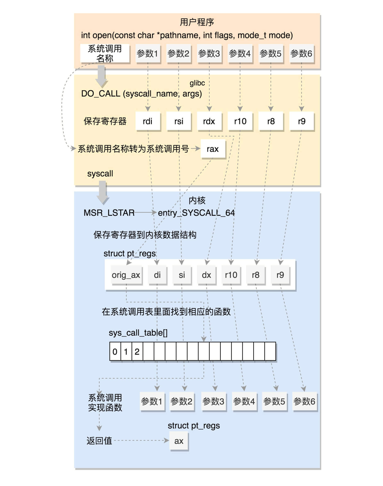

# Wc-Intercept

参赛队伍：队队怼怼对

参赛成员：王国琨、蔡柯迪，来自杭州电子科技大学

指导老师：贾刚勇

项目导师：胡万明、任玉鑫、汪旭

赛题名称：**高效库函数和系统调用拦截技术**

赛题描述：

选题地址：https://github.com/oscomp/proj250-functioncall-syscall-Interception

**拦截基础库、系统调用等底层函数**，对理解掌握系统行为至关重要，在安全管理、计算容错、异常检测和性能分析中经常使用，但其拦截性能对系统影响较大，实现高效的拦截，是业界和学术界研究的重点。

通过该项目，可以深入理解基础库和OS的工作原理和执行流程。我们聚焦在系统底层函数的拦截，包括libc和系统调用，要求根据配置，拦截不同的函数、不同拦截频率、对接不同的拦截后的处理。通过本项目，可帮助学生深入理解OS中最常见的系统调用原理，掌握系统执行流程、操作系统原理、以及用户与内核交互等内容。

该项目通过实现高性能的拦截系统，降低函数拦截对系统性能的影响，优化拦截系统的可扩展性。

通过调研，熟悉现有拦截工具的原理，并理解其对系统性能的影响和原因。设计新的拦截机制，支持灵活配置不同的拦截目标、频率和处理后端，降低拦截所引入的额外开销。

第一题：基本的环境搭建和熟悉

- 理解系统调用和libc函数的调用执行流程
- 尝试现有的拦截工具，熟悉其功能和性能

第二题：拦截特定的系统调用

- 根据配置，确定拦截的系统调用范围
- 在系统调用前后，采集其相关信息，比如参数；返回值等
- 将拦截到信息对接给后端处理逻辑（具体的后端处理不在本课题范围）

第三题：拦截特定的libc函数

- 根据配置，确定拦截的libc函数范围及所需拦截信息
- 将拦截到信息对接给后端处理逻辑（具体的后端处理不在本课题范围）
- 优化对libc和应用的侵入式修改，最好实现应用无感

## 文档介绍

我们将本分档细分为十一个部分。

第一部分为赛题分析，主要描述我们对赛题的目标、需求的调研和分析，在赛题基础上扩充了拦截点、拦截细粒度、非必要拦截开销等概念。

第二部分是我们基于ptrace完成的一个拦截工具，使用了断点功能实现在指定函数中拦截系统调用，将拦截细粒度限制在单个自定义函数中。

第三部分是我们基于LD_PRELOAD和ptrace的拦截工具，使用了预加载库技术实现了在库函数中拦截系统调用，将拦截细粒度限制在单个库函数中。

第四部分是我们对ebpf的应用的简单探索，通过比较ebpf的原理、功能、实现来论证我们对赛题的分析以及ptrace的拦截开销。

第五部分是我们的开发计划和分工协作。 

第六是我们的两个拦截工具的安装、使用、限制。

第七部分是我们在完成赛题的过程中遇到的难点、我们实现的功能、以及我们做到的创新点。

第八部分是我们的总结、不足以及未来的研究方向。

第九部分是我们在比赛过程中的收获。

第十部分是我们在探究赛题实现的过程中获得的实现细节、具体技术描述、相关知识理论，我们将这一部分放入附录中。因为篇幅有限，正文部分只是对框架的整体描述，不涉及到技术细节，所以我们将这部分内容单独放在一个文档中进行讨论。所有附录都在根目录下的**Documents**目录中。

第十一部分是我们借鉴的文献、博客。

[toc]

## 一、赛题解析


赛题为高效库函数和系统调用拦截技术，主要针对库函数和系统调用进行拦截，这里我们做一个平台限制，以下内容都基于Linux下x86-64架构进行分析。

基于题目描述，可以简单分析出赛题的两大研究目标为：

* 降低拦截开销
* 优化拦截可扩展性

拦截开销有赖于使用拦截技术，而拦截可扩展性可具体分为三个点：

* 动态配置拦截目标：可选的根据配置文件选择拦截目标；
* 动态配置拦截频率：针对某一拦截目标可以完成规律性拦截。如某一拦截目标拦截成本较高，可选择每执行10次拦截一次；
* 动态配置拦截后端：拦截功能与处理功能解耦，支持灵活配置后端处理逻辑；

但是，经过我们调研发现，以上概念既有区分，又有联系。我们接下来会主要围绕系统调用进行分析，因为库函数的拦截过于直接，要么使用LD_PRELOAD替换符号，要么直接替换库函数的符号表内的符号地址，其他手段大致不差。

### 1.1 系统调用的执行流程和开销分析

们的目标是高效的系统调用拦截程序，怎么解释高效，我们认为可以用**低开销**一词蔽之。但细分拦截开销又可以划成两部分，一部分是**执行拦截的开销**，另一部分是**非必要拦截开销**。

**执行拦截的开销，即为拦截技术在特定拦截点完成拦截这一功能所花费的开销**，如ebpf中在do_syscall前后插入钩子函数拦截系统调用，那么执行拦截的开销仅为函数的调用；而在ptrace中，对系统调用的拦截需要调用ptrace系统调用来使得被跟踪进程陷入暂停态并使用信号来通知跟踪进程进行处理，那么ptrace执行拦截的开销即为两次系统调用的开销、进程间交流等。

**而非必要拦截开销，主要与拦截点设置和拦截目标有关。**系统调用是内核向应用程序提供服务的接口，几百个系统调用囊括了操作系统底层的大部分功能，在实际情况下，拦截所有的系统调用是非必要且不实际的。因此我们需要有目的的选择必要的系统调用进行拦截。但是在系统调用的整个执行流程中，大部分的拦截点都需要设置过滤规则来过滤不是预设目标的系统调用，如：do_syscall是系统调用的通用入口，如果在do_syscall中设置拦截点，那么对于每一次系统调用的执行，我们都要去拦截系统调用号和参数进行对比，是否为拦截目标，这就造成了额外的开销。

因此，如何做到低开销的拦截，不仅和拦截技术有关，还与拦截点的设置相关，详细的分析过程较多，在本篇中并不提出，我们将这一部分放入[[附录1-系统调用执行流程和拦截开销分析]](#appendix_1)中，有兴趣者可以自行参考。

系统调用的大致流程如下：



经过上面的分析，我们可以大致了解到，系统调用的拦截点其实有四个（目前为止我们了解到的），在用户态中有：

1. 直接拦截库函数符号
2. 拦截库函数底层对系统调用指令的汇编封装

在内核态中有：

1. 系统调用通用入口do_syscall_64。
2. 系统调用服务例程，也就是我们常识中前缀是sys_的系统调用实现代码。如系统调用write对应的sys_write函数。

**拦截点的设置会影响到拦截技术和拦截目标的选择**。如果我们对系统调用拦截做一个抽象，那么可以是：

1. 设置拦截点，设置过滤规则
2. 拦截每一个系统调用的执行
3. 获取系统调用号和拦截目标对比，当前系统调用是否为拦截目标
4. 是则执行后端处理逻辑，否则跳过。

以EBPF举例，EBPF的核心是BPF虚拟机，它允许用户态程序将编写好后的BPF程序编译成字节码后注入内核。对于系统调用的拦截，它通常提供`kprobe()` 和 `kretprobe()` 函数，用于在系统调用的入口点和返回点处插入钩子函数，也即是在do_syscall_64。do_syscall_64的每次执行，都会首先调用我们注入的BPF程序进行拦截处理。然而这种BPF程序注入内核方式无疑相当于修改内核源码，它会对整个操作系统造成影响， 最直白就是它会拦截操作系统中所有进程的所有调用系统调用。

事实上除非直接在系统调用服务例程中设置拦截点，否则其他方法都需要这样一个抽象过程。而在这种抽象下，动态配置拦截目标和动态配置拦截频率都可以放入后端处理逻辑中。

如何改善、削减上述过程造成的开销，为此我们提出了拦截细粒度和非必要拦截开销两个概念，非必要拦截开销在之前我们已经提到了，而拦截细粒度可以解释为拦截范围，拦截点的设置和拦截技术决定了拦截细粒度，并因此生成非必要拦截开销，我们以这些概念来描述之后会使用的三个拦截技术：

| 拦截技术   | 拦截点                   | 拦截细粒度                         | 非必要拦截开销                                     |
| ---------- | ------------------------ | ---------------------------------- | -------------------------------------------------- |
| LD_PRELOAD | 用户态，库函数符号       | 单个库函数内的系统调用             | 库函数内非预设目标的系统调用                       |
| ptrace     | 系统调用入口前以及执行后 | 单个进程内的系统调用               | 进程内非预设目标的系统调用                         |
| ebpf       | 系统调用入口前以及执行后 | 操作系统内所有进程内的所有系统调用 | 其他进程的系统调用以及本进程内非预设目标的系统调用 |

### 1.2 我们的计划和选择

在最早期调研和探索时，我们决定了解各个拦截技术的原理、作用、限制。经过一定的调研后，我们决定从三个拦截技术进行展开，分别是：LD_PRELOAD、ptrace以及ebpf。

我们计划在初赛阶段使用三种拦截技术做出三个拦截工具demo，分析每种拦截工具的功能、开销、限制，以此决定之后的研究方向。

接下来的三个章节是我们的三个拦截工具的大体框架与设计思路。

## 二、基于ptrace的拦截工具

我们基于ptrace实现了系统调用的拦截功能，并且在“拦截所有系统调用是非必要的”这一前提下，实现了软断点功能，将ptrace的拦截范围从单个进程限制在了单个函数体内，减少了非必要拦截开销，弯道实现了减少开销的目的。


### 2.1 ptrace的简单介绍

我们将ptrace的探索细节放在了[[附录2-Ptrace拦截系统调用]](#appendix_2)，接下来只会简单介绍一下ptrace。

`ptrace` 是Linux下的一个系统调用，通过该系统调用可以使得一个进程（**tracer**）去观察和控制另一个进程（**tracee**）的执行，并检查和更改tracee的内存和寄存器。主要实现于断点调试和系统调用跟踪，是反调试技术的基础手段，我们熟悉的`gdb`和 `strace` 就是利用`ptrace`进行编写的。

ptrace通过不同的标志位来实现不同的功能。一般而言，使用ptrace跟踪进程有两种方式：

1. 父子进程间：使用**PTRACE_TRACEME**标志，子进程作为被跟踪者（tracee），父进程作为跟踪者（tracer）；
2. 不相关进程间：使用**PTRACE_ATTACH**标志，跟踪进程（tracer）使用指定进程PID跟踪指定进程（tracee）；

ptrace使得父进程可以控制子进程，并可以检查和改变它的核心IMAGE，主要用于实现断点调试，父进程通过控制子进程的PF_PTRACED标志来进入调试状态：


也就是说同一个进程不能被一个以上ptrace程序跟踪，这也使得一些攻防技术通过检测进程的PF_PTRACED标志位来判断进程状态。关于ptrace的实现原理我们不打算细讲，有兴趣者可以去阅读Linux源码或相关博客。

父子进程双方通过信号来交流。父进程使用PTRACE_SYSCALL/PTRACE_CONT/PTRACE_SYSMU操作码控制子进程的中止状态，子进程触发中止状态时陷入暂停态，并向父进程发送信号，信号的种类取决于控制方式：

* PTRACE_TRACEME控制方式使用SIGTRAP信号；
* PTRACE_ATTACH控制方式使用SIGSTOP信号；

我们以PTRACE_SYSCALL和PTRACE_TRACEME的跟踪方式举例：


1. `tracee`创建子进程`tracee`，`tracee`中调用ptrace(PTRACE_ME, )向`tracer`发送SIGCHLD信号，并陷入暂停状态等待父进程跟踪；
2. `tracer`通过waitpid处于暂停状态直到接收到`tracee`的信号，接收到SIGCHLD信号之后使用PTRACE_SYSCALL通知`tracee`继续运行，然后通过waipid陷入暂停状态等待下一个信号的到来；
3. `tracee`执行execve跳转到另外一个代码段，继续执行代码直到下一个系统调用的入口，此时`tracee`陷入`syscall-enter-stop`状态并向`tracer`发送信号；
4. `tracer`接收到SIGTRAP信号从暂停态恢复，执行相应逻辑代码，执行完毕后使用PTRACE_SYSCALL通知`tracee`继续运行；
5. `tracee`接收到信号继续运行，执行系统调用。执行完毕后向`tracer`发送SIGCHLD信号并陷入`syscall-exit-stop`状态；
6. `tracer`接收到SIGCHLD信号从暂停态恢复，执行相应逻辑代码，执行完毕后使用PTRACE_SYSCALL通知`tracee`继续运行；
7. `tracee`继续执行，直到下一个系统调用入口，重复上述过程或程序结束；

PTRACE_CONT和PTRACE_SYSCALL是ptrace的操作码，通常被父进程使用来决定子进程陷入中止后的唤醒方式：

* `PTRACE_CONT` 用于继续进程的执行，如果进程当前被暂停，那么它会被恢复到之前被暂停的位置继续执行。如果进程没有被暂停，那么它会继续正常执行。该操作会忽略目标进程中发生的任何系统调用；
* `PTRACE_SYSCALL` 也用于继续进程的执行，但它会特别地在系统调用的入口和结束位置暂停。使得父进程可以更方便的监控系统调用；

### 2.2 使用ptrace拦截系统调用

使用ptrace实现一个简单的拦截系统调用功能可以大致分为三个阶段：跟踪关系建立、拦截阶段、结束跟踪阶段，正如上一张图所述，我们将跟踪进程作为父进程，被跟踪进程作为子进程，通过进程间的信号交流来使得跟踪进程可以控制被跟踪进程，我们简单实现了这个逻辑：


我使用一个简单的代码示例来展示：

```c
int main(int argc, char **argv)
{
    if (argc < 2){
        fprintf(stderr, "[wc-intercept]: too few arguments: %d\n", argc);
        exit(-1);
    }
    
    // 建立跟踪关系阶段
    pid_t pid = fork();
    int status;
    switch (pid) {
        case -1:
            fprintf(stderr, "[wc-intercept]: %s\n", strerror(errno));
            exit(-1);
        case 0: 
            ptrace(PTRACE_TRACEME, 0, 0, 0);
            execvp(argv[2], argv + 2);
            fprintf(stderr, "[wc-intercept]: %s\n", strerror(errno));
            exit(-1);
    }

    waitpid(pid, &status, 0);
    ptrace(PTRACE_SETOPTIONS, pid, 0, PTRACE_O_EXITKILL|PTRACE_O_TRACESYSGOOD);
    
    // 循环拦截系统调用
    for (;;) {
        if (ptrace(PTRACE_SYSCALL, pid, 0, 0) == -1){
            return -1;
        }
        if (waitpid(pid, &status, 0) == -1) {
            return -1;
        }
        printf("syscall enter!\n");
        if (ptrace(PTRACE_SYSCALL, pid, 0, 0) == -1){
            return -1;
        }
        if (waitpid(pid, &status, 0) == -1){ 
            return -1;
        }
        printf("syscall exited!\n");
    }
    
    // 结束跟踪阶段
    pritnf("tracee exited!\n");
    
    return 0;
}
```

### 2.3 实现断点功能限制拦截细粒度

#### 2.3.1 拦截程序主体逻辑内的系统调用

我们注意到一个问题：根据我们第一章列出的表格可以知道，ptrace的拦截范围为单个进程内的所有系统调用。然而，我们在最初实现了使用ptrace对系统调用的简单拦截之后发现，**ptrace会拦截包括进程初始化和进程销毁时的系统调用**。

因为我们是通过父子进程和PTRACE_TRACEME标志来建立跟踪关系，因此我们需要在随后使用execve函数将被跟踪程序的内容加载到子进程中，但问题也出在这里：ptrace跟踪了execve内的系统调用。依据我们上面的概念，我们的拦截目标时main函数内的主体逻辑的系统调用，进程初始化时和进程销毁时的系统调用是非必要拦截开销。

我们简单举例例子：我们现在需要跟踪内存分配相关系统调用，有必要的话会杀死这次执行。但是在进程初始化时也存在内存相关系统调用，如果我们杀死了这次的系统调用执行，那么进程初始化失败，被跟踪程序加载失败。正如下图所示：


一个程序从创建起初，会经历一系列初始化过程，最后在main函数内执行我们的代码逻辑，而main函数之前的进程初始化相关内容则不是我们所关心的，所以我们想绕过它执行。最初我们的解决方案是：**解析可执行文件，从符号表中获取main函数地址，随后在跟踪者程序中单步控制被跟踪程序执行，检测其RIP寄存器地址是否为main函数地址。是的话则开始拦截系统调用：**


然后这种方式会造成极大的开销，因为子进程每执行一条指令之后，我们都会要求子进程暂停执行，并检测其寄存器值。通过我们测试发现，以这种方式来拦截系统调用，哪怕是被跟踪程序仅仅是实现输出一个简单的hello world的功能，都会在检测地址这一步有明显的停顿。

所以我们计划使用断点功能来改善这个方案。

#### 2.3.2 实现断点功能

上述的需求完全可以通过断点实现：**在main函数处插入断点指令，当被跟踪进程执行到main函数时陷入调试状态，向跟踪进程发送异常信号SIGTRAP，跟踪进程接收到之后才开始执行系统调用拦截。并且我们可以通过函数调用栈来获取main函数的返回地址，在返回地址处插入一个断点以同样的方式结束跟踪状态，这样就可以避免拦截到进程销毁时的系统调用：**


#### 2.3.4 使用断点拦截指定函数内的系统调用

然而，使用ptrace进行拦截系统调用依旧有较大的开销，因为ptrace的拦截机制，被跟踪进程在系统调用入口前和结束后都会陷入暂停态，并通过信号交流的方式通知父进程，跟踪进程进行完逻辑处理后，又要执行两次ptrace函数使得被跟踪进程继续执行。为此，我们寻求改进方法。

在后续的调研中，我们提出了拦截细粒度和两种拦截开销的概念，因此我们认为：**既然ptrace本身的拦截开销（执行拦截开销）是必不可免的，那我们可以通过减少另一部分开销（非必要拦截开销）来改善它，改善的方式是通过限制拦截细粒度，改善的手段则是通过断点功能。**

由前可知，ptrace的拦截细粒度为单个进程内的所有系统调用，但**操作系统提供的系统调用多达几百种，并不是所有系统调用都是我们的拦截目标。在这个前提下，我们认为可以将拦截范围限制在单个函数中，只拦截我们指定的函数内的系统调用，以进一步减少非必要拦截开销**。为了实现这个功能，我们需要借助断点，实现手段和上一节差不多：


我们通过解析配置文件来设置需要在哪些函数中拦截系统调用，并通过解析可执行文件和proc文件来获取函数在进程内的执行地址，通过在函数首地址插入断点指令——0xcc来实现设置断点。由于函数的首地址一般是固定的，因此我们可以通过上述手段来获取，然而函数的返回地址则是不同，只能通过函数栈帧来获取，每一次函数执行它的返回地址都不同。因此，我们需要在遇到函数首地址处的断点时才能设置返回地址处的断点，以停止拦截。

因此我们借助ptrace获取了被跟踪进程的寄存器值，通过RBP寄存器和RSP寄存器来获取函数的返回地址，一般来说，函数的栈帧结构如下：


所以我们在执行到函数首地址处的断点时，被跟踪进程陷入暂停态，跟踪进程接收到SIGTRAP信号，首先会通过RBP寄存器和RSP寄存器即获取函数的返回地址，在返回地址处设置断点。随后越过断点，开始执行拦截逻辑，并唤醒被跟踪进程。当执行到返回地址处的断点时，再通过SIGTRAP信号通知跟踪进程，取消拦截逻辑。

### 2.4 动态配置后端处理逻辑

由第一章的赛题分析可知，如果对拦截过程做一个抽象，那么可以分为：

1. 设置拦截点、设置过滤规则
2. 拦截每一个系统调用
3. 检查该系统调用是否为预设目标
4. 是则执行后端处理逻辑，否则跳过

由于拦截技术和拦截点的限制，我们需要对拦截范围内的每一个系统调用进行过滤。我们认为在这一步存在的情况下，拦截目标、拦截频率可以集成到后端处理逻辑中，而不必细分，所以我们并没有详细的去实现每个功能。

我们将**动态配置后端处理逻辑**这一可扩展性分为两个阶段：

1. 第一个阶段是静态的，我们通过在拦截逻辑中预留接口，将后端处理逻辑编译成动态库.so文件链接到进程中。虽然后端处理动态库会在链接阶段被加载到内存中，但我们可以通过动态库加载技术动态的加载和打开后端处理动态库，获取后端逻辑。然而这部分开销较高，因此我们没有实现动态库动态加载，只实现了后端处理逻辑与拦截逻辑解耦，是一个静态的过程。
2. 第二个阶段是动态的，在进程运行期间更换动态库以切换后端处理逻辑。这个阶段我们暂时还没有研究实现。

## 三、LD_PRELOAD中使用ptrace

在上一章我们实现了基于ptrace的拦截工具，利用断点功能将拦截细粒度限制在单个函数内，减少非必要拦截开销。但是，以上实现依旧有着不足：

1. 由于实现的代码逻辑，暂时无法实现嵌套函数的拦截、非同一作用域内函数的拦截，只能实现在同一个作用域内的函数的拦截。
2. 无法拦截库函数：因为库函数是使用动态加载的方式链接进进程中，因此我们暂时无法通过解析可执行文件来获取库函数的地址，因此也不能实现库函数内的系统调用拦截，只能实现自定义函数内的拦截。

我们在赛题分析中说过，用户进程一般通过使用库函数来间接使用系统调用提供的功能，因此拦截库函数又可以相当于拦截系统调用。但是，库函数对于系统调用的封装不是一一对应的，可能一个库函数使用到了多个系统调用，因此通过拦截库函数来拦截系统调用的想法意义不大。

因此，在了解到LD_PRELAOD的预加载功能后，我们很自然的想到，可以不可以结合LD_PRELOAD的特点和ptrace的特点，使得我们可以进一步细化拦截细粒度，将拦截细粒度限制在单个库函数中，以此降低ptrace的拦截开销。本个拦截工具即是基于这个思路展开研究：

LD_PRELOAD是一个环境变量，实现预加载的功能。我们可以编写与库函数同名的自定义函数，里面实现我们的逻辑，然后通过LD_PRELOAD先库函数一步加载进进程中，达到一个替换的目的，这也是最简单的一种库函数拦截技术。

然而，我们可以在**自定义的同名函数使用ptrace建立跟踪关系，并通过动态库加载技术dlopen来获取库函数的地址，执行库函数，在库函数执行完之后，再使用信号请求解除跟踪关系**。这样一来就可以将拦截范围缩小到了单个库函数中，拦截框架设计如下：


### 3.1 LD_PRELOAD的简单介绍

我们将了解到的LD_PRELOAD细节放在了[[附录3-动态库拦截技术LD_PRELOAD]](#)中。

#### 3.1.1 LD_PRELOAD

> LD_PRELOAD是[Linux](https://so.csdn.net/so/search?q=Linux&spm=1001.2101.3001.7020)系统的一个环境变量，它可以影响程序的运行时的链接（Runtime linker），它允许你定义在程序运行前优先加载的动态链接库。这个功能主要就是用来有选择性的载入不同动态链接库中的相同函数。通过这个环境变量，我们可以在主程序和其动态链接库的中间加载别的动态链接库，甚至覆盖正常的函数库。一方面，我们可以以此功能来使用自己的或是更好的函数（无需别人的源码），而另一方面，我们也可以以向别人的程序注入程序，从而达到特定的目的。[1]

LD_PRELOAD的优点：

1. 功能强大：LD_PRELOAD可以控制程序的运行时行为，例如在调用某些系统函数时调用修改版的函数，改变进程的运行性质，甚至能够绕过一些安全机制。
2. 灵活性高：LD_PRELOAD允许用户在执行时临时加载一个共享器，从而为程序增加新的特性或修改现有的特性。
3. 方便调试：LD_PRELOAD可以方便地在动态链接库的加载时进行调试，以便及时发现程序中的问题。

LD_PRELOAD的缺点：

1. 安全性问题：由于LD_PRELOAD具有越过系统安全限制的能力，因此在操作时用户必须非常小心谨慎，避免导致系统的不稳定或任意代码执行的问题。
2. 潜在的兼容性问题：由于LD_PRELOAD加载的共享库会替换系统默认的库，可能会导致不兼容的问题。
3. 对性能的影响：由于在运行时注册所需的共享库，因此可能会影响程序的性能，特别是在大量运行时加载的情况下。
4. 系统调用包装器经常明显偏离其底层系统调用：根据您的 Linux 版本，glibc`open()`可能会调用`openat(2)`，`fork()`可能会调用`clone(2)`，其他调用可能会修改其标志或默认行为以符合 POSIX 标准。因此，很难可靠地预测给定的系统调用*包装器*是否调用了与其同名的系统调用。
5. `LD_PRELOAD`仅在动态链接 libc（或选择的目标库）时有效，但较新的语言（阅读：Go）和部署趋势（阅读：完全静态构建和非 glibc Linux 容器）使动态链接不太受欢迎。

总的来说，LD_PRELOAD具有强大、灵活、方便调试等优点，但从安全性和性能的角度来看，也需要适度使用并小心使用，以免发生潜在的兼容性问题或危险安全缺陷。

#### 3.1.2 动态库加载技术

通过LD_PRELOAD环境变量，我们可以将我们自己编写覆盖同名的libc库函数，当然除了覆盖这一行为之外，我们还可以使用它来完成拦截、监控的目的。

大体方法是在我们编写的函数中调用相应的libc库函数，然而当使用了LD_PRELOAD之后，编译器在链接库时会优先选择预加载的同名函数，即使在自定义的同名函数中调用libc库函数也不会使用libc库的函数，更可能编译器认为这是一个嵌套函数，所以为了在自定义的同名函数中使用libc库函数，我们需要一点小手段，比如直接获取libc库函数的函数指针，通常有以下几种方法可以获取libc库函数指针：

库旨在将类似的功能打包在一个单元中，然后与其他开发人员共享这些单元，并允许进行所谓的模块化编程。LInux支持两种类型的库：静态库在编译时静态绑定到程序，动态库在应用程序加载时加载。而动态库又有两种加载方式：动态链接（Dynamic Linking）和动态加载（Dynamic Loading）：


动态链接和动态加载都发生在程序运行时，但两者不同的是：

1. 动态链接需要操作系统的支持，该过程发生在内核从将 ELF 映像加载到用户空间虚拟内存的过程开始，动态链接器加载ELF中指定的共享库，然后执行重定位，将程序中定义的外部函数和数据地址绑定到共享库中相应符号地址。
2. 动态加载由应用程序自身负责。简单来说，就是应用程序可以指定要加载的共享库，然后将该库作为可执行文件调用其中提供的函数。

动态加载提供了一套API以供应用程序使用：

| Function | Description                        |
| -------- | ---------------------------------- |
| dlopen   | 打开共享库以供程序访问             |
| dlsym    | 从dlopen打开的共享库中访问符号地址 |
| dlerror  | 返回最后一次发生的错误             |
| dlclose  | 关闭共享库                         |

### 3.2 使用LD_PRELAOD拦截库函数和系统调用

Linux系统调用是操作系统所实现的应用编程接口(Application Programming Interface，API)，使得应用程序可以通过系统调用使用内核提供的各种资源，如果操作硬件、开关中断、改变特权模式等。

而不同架构体系的硬件平台提供系统调用的接口不一，以x86-64举例，操作系统将系统调用通用入口放入MSR寄存器中，只需要使用syscall指令就可以调用系统调用。而库函数通常由在这个基础上提供了一层封装，将为上层用户提供自己的接口，因此，一般用户进程都是通过库函数来间接使用系统调用提供的功能。

而LD_PRELOAD可以在链接阶段将我们自定义的同名函数替换库函数，起到拦截库函数的作用，也即是变相起到拦截系统调用的作用，而拦截开销几乎接近于没有！因为我们是相当于将库函数在进程中的地址替换为我们自己定义的函数的地址。

使用LD_PRELOAD的过程非常简单，我们只需要将我么的拦截逻辑放入要拦截的库函数的同名函数中，并将之编译为动态库，然后在被跟踪进程创建时加载进去就可以了，因此这里我们不做更多解释。

### 3.3 限制拦截细粒度在库函数中

在我们完成ptrace的拦截工具，在了解到LD_PRELOAD过于简单和它的预加载特点之后，我们认为两者可以进行一定的结合。

我们发现ptrace控制的手段主要是进程间信号交流，因此我们认为可以通过信号来控制ptrace拦截逻辑的开和关，而这部分是在被跟踪进程中选择的，也即是说被跟踪进程可以主动控制是否执行拦截逻辑。正常来说由被跟踪进程主动选择拦截逻辑必然要对被跟踪程序的代码进行修改，这就得不偿失了。

但是由于LD_PRELOAD的特点，我们可以通过自定义的库函数来替换同名库函数，也就使得上述想法得以实现：

**对于预拦截的目标库函数，我们编写一个同名的函数，函数中通过动态库加载技术获取目标库函数的入口地址，然后通过ptrace建立跟踪关系，然后执行库函数，当库函数执行完之后通过释放SIGSTOP信号解除跟踪关系。我们可以视为将库函数做了一个封装，封装的目的使用ptrace来拦截系统调用。**


拦截逻辑可以如上图所示。这种方案可以将拦截范围限制在单个库函数中，减少了非必要拦截开销。

### 3.4 动态配置后端处理逻辑

由于我们引入了跟踪者进程，使得我们需要通过父子进程的关系来控制被跟踪进程。**在本拦截方案中，我们需要两个动态库，一个动态库用于替换同名库函数，实现库函数的封装，加载到被跟踪进程中；另一个动态库实现后端处理逻辑，加载到跟踪进程中。**

由于拦截技术和拦截点的限制，我们需要对拦截范围内的每一个系统调用进行过滤。我们认为在这一步存在的情况下，拦截目标、拦截频率可以集成到后端处理逻辑中，而不必细分，所以我们并没有详细的去实现每个功能。

我们将**动态配置后端处理逻辑**这一可扩展性分为两个阶段：

1. 第一个阶段是静态的，我们通过在拦截逻辑中预留接口，将后端处理逻辑编译成动态库.so文件链接到进程中。虽然后端处理动态库会在链接阶段被加载到内存中，但我们可以通过动态库加载技术动态的加载和打开后端处理动态库，获取后端逻辑。然而这部分开销较高，因此我们没有实现动态库动态加载，只实现了后端处理逻辑与拦截逻辑解耦，是一个静态的过程。
2. 第二个阶段是动态的，在进程运行期间更换动态库以切换后端处理逻辑。这个阶段我们暂时还没有研究实现。

## 四、ebpf的简单应用

### 4.1 ebpf的简单介绍

eBPF 是什么呢？ 从它的全称“扩展的伯克利数据包过滤器 (Extended Berkeley Packet Filter)” 来看，它是一种数据包过滤技术，是从 BPF (Berkeley Packet Filter) 技术扩展而来的。

BPF 提供了一种在内核事件和用户程序事件发生时安全注入代码的机制，这就让非内核开发人员也可以对内核进行控制。随着内核的发展，BPF 逐步从最初的数据包过滤扩展到了网络、内核、安全、跟踪等，而且它的功能特性还在快速发展中，这种扩展后的 BPF 被简称为 eBPF（相应的，早期的 BPF 被称为经典 BPF，简称 cBPF）。实际上，现代内核所运行的都是 eBPF，如果没有特殊说明，内核和开源社区中提到的 BPF 等同于 eBPF（在我们的专栏里，它们的含义也完全相同）。

在 eBPF 之前，内核模块是注入内核的最主要机制。由于缺乏对内核模块的安全控制，内核的基本功能很容易被一个有缺陷的内核模块破坏。而 eBPF 则借助即时编译器（JIT），在内核中运行了一个虚拟机，保证只有被验证安全的 eBPF 指令才会被内核执行。同时，因为 eBPF 指令依然运行在内核中，无需向用户态复制数据，这就大大提高了事件处理的效率。

正是由于这些突出的特性，eBPF 现如今已经在故障诊断、网络优化、安全控制、性能监控等领域获得大量应用。比如，Facebook 开源的高性能网络负载均衡器 Katran、Isovalent 开源的容器网络方案 Cilium ，以及著名的内核跟踪排错工具 BCC 和 bpftrace 等，都是基于 eBPF 技术实现的。

下图（来自 ebpf.io）是对 eBPF 技术及其应用的一个概览：eBPF 技术概览可以说，如果你洞悉内核的运行状态，优化内核网络性能，控制诸如容器等应用程序的安全，那么 eBPF 就是一个必须要掌握的技能。


eBPF 程序并不像常规的线程那样，启动后就一直运行在那里，它需要事件触发后才会执行。这些事件包括系统调用、内核跟踪点、内核函数和用户态函数的调用退出、网络事件，等等。借助于强大的内核态插桩（kprobe）和用户态插桩（uprobe），eBPF 程序几乎可以在内核和应用的任意位置进行插桩。

Linux 内核通过以下方法确保 eBPF 程序的安全和稳定， 如下图所示，通常我们借助 LLVM 把编写的 eBPF 程序转换为 BPF 字节码，然后再通过 bpf 系统调用提交给内核执行。内核在接受 BPF 字节码之前，会首先通过验证器对字节码进行校验，只有校验通过的 BPF 字节码才会提交到即时编译器执行，如果 BPF 字节码中包含了不安全的操作，验证器会直接拒绝 BPF 程序的执行。[7]


ebpf根据具体功能和应用场景的不同，这些程序类型大致可以划分为三类：

第一类是跟踪，即从内核和程序的运行状态中提取跟踪信息，来了解当前系统正在发生什么。

跟踪类 eBPF 程序主要用于从系统中提取跟踪信息，进而为监控、排错、性能优化等提供数据支撑。它的目的是跟踪内核函数是否被某个进程调用了。我们主要是去使用这部分内容去实现赛题的功能。这其中，KPROBE、TRACEPOINT 以及 PERF_EVENT 都是最常用的 eBPF 程序类型，大量应用于监控跟踪、性能优化以及调试排错等场景中。

第二类是网络，即对网络数据包进行过滤和处理，以便了解和控制网络数据包的收发过程。

网络类 eBPF 程序主要用于对网络数据包进行过滤和处理，进而实现网络的观测、过滤、流量控制以及性能优化等各种丰富的功能。根据事件触发位置的不同，网络类 eBPF 程序又可以分为 XDP（eXpress Data Path，高速数据路径）程序、TC（Traffic Control，流量控制）程序、套接字程序以及 cgroup 程序。

第三类是除跟踪和网络之外的其他类型，包括安全控制、BPF 扩展等等。

除了上面的跟踪和网络 eBPF 程序之外，Linux 内核还支持很多其他的类型。这些类型的 eBPF 程序虽然不太常用，但在需要的时候也可以解决很多特定的问题。[8]

### 4.2 使用ebpf拦截系统调用

kprobes具有允许在同一个被被探测位置注册多个kprobe、可以探测内核中的任何函数，包括中断处理函数、会避免在处理探测点函数时再次调用另一个探测点的回调函数等特点。

利用kprobes技术，用户可以定义自己的回调函数，然后在内核或者模块中几乎所有的函数中（有些函数是不可探测的，例如kprobes自身的相关实现函数，后文会有详细说明）动态的插入探测点，当内核执行流程执行到指定的探测函数时，会调用该回调函数，用户即可收集所需的信息了，同时内核最后还会回到原本的正常执行流程。如果用户已经收集足够的信息，不再需要继续探测，则同样可以动态地移除探测点。因此kprobes技术具有对内核执行流程影响小和操作方便的优点。[9]

```c
#include "vmlinux.h"
#include <bpf/bpf_helpers.h>
#include <bpf/bpf_tracing.h>
#include <bpf/bpf_core_read.h>
char LICENSE[] SEC("license") = "Dual BSD/GPL";

SEC("tracepoint/raw_syscalls/sys_enter")
int kprobe_raw_syscalls_sys_enter(struct trace_event_raw_sys_enter *ctx)
{
        pid_t pid;
        pid = bpf_get_current_pid_tgid() >> 32;
        bpf_printk("KPROBE ENTRY pid = %d\n", pid);

        return 0;
}

SEC("tracepoint/raw_syscalls/sys_exit")
int kprobe_raw_syscalls_sys_exit (struct trace_event_raw_sys_exit *ctx)
{
        pid_t pid;
        pid = bpf_get_current_pid_tgid() >> 32;
        bpf_printk("KPROBE ENTRY pid = %d\n", pid);

        return 0;
}

```

这段代码是一个简单的 eBPF 程序，用于监测和捕获在 Linux 内核中执行原始系统调用的过程。这个ebpf程序通过使用kprobe(内核探针)在入口和出口退出出放置钩子，实现对该系统调用的跟踪。

首先，我们导入了必要的头文件，vmlinux.h、bpf_helpers.h、bpf/bpf_tracing.h、bpf_core_read.h，接着，我们定义许可证，以允许程序在内核中运行。

接下来我们定义了一个名为kprobe_raw_syscalls_sys_enter的函数，当进入sys_enter函数时，它会被触发，我们会在这里打印出它的pid，并使用bpf_printk打印pid。

接下来我们定义了一个名为kprobe_raw_syscalls_sys_exit的函数，当进入sys_exit函数时，它会被触发，我们会在这里打印出它的pid，并使用bpf_printk打印pid。

通过上述的程序，我们已经能做到简单拦截所有进入系统调用的事件。而在使用ebpf单独拦截一个进程时，通常仍然需要获取全部进程的信息。这是因为需要获得目标进程的标识符（如PID）以及其他相关信息，以便在eBPF程序中设置适当的过滤条件。

获取进程信息的常见方式是通过系统调用（如getpid()、getppid()、getpgid()等）或读取/proc文件系统中的进程相关信息。通过这些方法，可以获取目标进程的PID、父进程ID、进程组ID等关键信息。

在eBPF程序中，可以使用这些信息作为过滤条件，只选择与目标进程相关的事件或数据进行拦截和处理。通过这种方式，可以实现针对特定进程的监控和分析，而无需处理其他进程的数据。然而这种做法也存在一个最明显的问题，即便是拦截单独一个进程，仍需要获取全部的进程信息，当存在大量进程时，可能会存在明显的开销。

## 五、开发计划和分工协作

### 5.1 分工协作

|        | 分工内容                                   |
| ------ | ------------------------------------------ |
| 王国琨 | 负责ptrace和LD_PRELOAD相关的开发和文档编写 |
| 蔡柯迪 | 负责ebpf的开发和文档编写、调研、代码整理   |


### 5.2 开发计划

| 时间                  | 开发计划                                     |
| --------------------- | -------------------------------------------- |
| 2023-5-15 - 2023-5-20 | 调研赛题，了解相关拦截技术、深入分析赛题需要 |
| 2023-5-21 - 2023-5-22 | 选择拦截技术，了解相关应用和使用方法         |
| 2023-5-23 - 2023-5-30 | 初步完成赛题要求                             |
| 2023-5-31 - 2023-6-5  | 深入学习拦截工具，挖掘创新点                 |
| 2023-6-6   - 2023-6-7 | 完成文档整理和代码整理                       |

## 六、创新、难点、功能和不足、未来计划

### 6.1 创新点

我们通过对赛题的深度解析，在赛题描述和指导老师讨论过程中提出了两个概念：

* 非必要拦截开销
* 拦截细粒度

并抽象了拦截过程，分析了动态配置拦截目标和拦截频率的必要性，认为它们可以继承到后端处理逻辑中，而不需要单独实现。

除此之外，在我们提出的两个概念的基础上，我们提出了可以**通过限制拦截细粒度来减少非必要拦截开销，从而达到削减开销的目的**这一指导思想。

在这个思路指导下，我们使用ptrace完成基础的拦截逻辑，然后在第一个拦截工具中实现了断点功能，可以在配置文件中指定目标函数，只在目标函数中进行拦截系统调用。削减了拦截开销，使得我们可以主动选择在哪一个函数中拦截系统，优化了可扩展性能。

在第二个拦截工具中，我们结合了LD_PRELOAD和ptrace的特点，在库函数上做了一层封装，将ptrace的拦截逻辑放入封装函数中，使得拦截细粒度限制在了单个库函数之中，而库函数是否需要被拦截则由我们自己编写的同名函数决定。同时除了系统调用的拦截，使用LD_PRELOAD还可以实现库函数的拦截，拦截开销几乎近无。

**综上所述，我们深入调研和分析了赛题的需求，扩充了赛题的相关概念，使用ptrace完成了赛题目的。并使得ptrace从拦截单个进程内的所有系统调用限制在拦截单个自定义函数或库函数内的系统调用，突破原有的“开销大”的限制，使得ptrace可以较好的应用于拦截系统调用中。**

### 6.2 难点

在我们完成赛题的过程中，遇到了一些需要攻克的问题：

1. 怎么样获取函数在进程中的地址：我们通过学习了libelf库来完成可执行文件的解析，获取函数的相对地址；并了解了 proc文件系统，通过proc文件系统对进程的VMA记录，来获取进程的加载地址；
2. 怎么样使得被跟踪进程在目标函数处暂停：我们实现了软断点功能，通过在目标函数的首地址处插入断点指令，来使得被跟踪进程能够在此时与跟踪进程交互；
3. 怎么样在目标函数结束后解除拦截逻辑：我们利用了函数栈帧的原理，通过RBP和RSP寄存器来获取函数的返回地址，以此在返回地址处设置断点；
4. 怎么对库函数进行封装使得被跟踪进程可以主动控制拦截逻辑执行与否：我们通过学习进程间信号的交流方式，来控制被跟踪进程与跟踪进程的交互；通过ptrace的PTRACE_TRACEME标志来请求建立拦截关系；

### 6.3 功能和不足

我们探索了三种拦截技术：ptrace、LD_PRELOAD、ebpf。其中ebpf由于入门困难，因此我们目前只完成了简单的拦截功能。

而在ptrace中，我们实现了：

1. 基本的拦截功能，可以拦截系统调用
2. 断点功能，可支持拦截指定自定目标函数内的系统调用
3. 静态配置后端处理逻辑

但存在一些不足：

1. 函数的地址依赖于可执行文件的解析和proc文件系统，需要使用父子进程关系来控制被跟踪进程
2. 目标函数只能是非嵌套、同作用域内的自定义函数，而库函数由于是动态加载的，暂时无法获取函数地址
3. 依旧存在较大的开销

在LD_PRELOAD和ptrace结合的工具中，我们实现了：

1. 基本的拦截功能，可以拦截库函数和系统调用
2. 库函数的封装，只在目标库函数内拦截系统调用
3. 静态配置后端处理逻辑

但依旧存在一些不足：

1. 被跟踪进程通过信号来控制拦截逻辑的开与否，ptrace会拦截到使用相关信号号的系统调用
2. 用于与跟踪进程交流的信号函数也会被ptrace拦截，造成额外开销

### 6.4 未来计划

在经历一段时间的学习中，我们认为有两个方向是我们应该注意的：

一个方式是对基本库glibc的处理，实现在用户态下拦截系统调用和库函数。我们认为目前ptrace已经达到我们可想的极限了，继续优化下去也做不了突破性的成果，因此我们决定从LD_PRELOAD、热补丁、替换符号表等方式下手，通过替换glibc中库函数的符号地址和系统调用封装来实现低开销拦截。

另一个方向是ebpf。ebpf的火热和优良性能很难让我们去忽略它，它也值得我们去花时间学习。然而从我们选题开始，留给我们的完成赛题时间很短，没有办法去学习使用ebpf，这也是一个遗憾。因此在之后的计划中，我们依旧将ebpf作为一个大的研究方向来完成赛题。

还有一些小的完成计划，比如说后端处理逻辑的动态配置。在上述的功能实现中，我们只做到了后端逻辑与拦截逻辑相解耦，只能在进程初始化时将后端处理逻辑加载进进程中，属于静态的过程，这是我们需要去优化的一个点。

## 七、代码描述和安装使用

我们的赛题根目录如下：


* assets目录下存放比赛说明文档中需要的一些图片
* Ducuments目录下存放我们的附录文件
* EBPF文件中存放使用EBPF拦截系统调用的基本示例
* LD_PRELOAD文件夹下存放使用第二个拦截工具——LD_PRELOAD与ptrace相结合
* ptrace文件夹下存放ptrace拦截工具，实现断点功能
* README.md文档，即为本文档

### 7.1 拦截工具一：基于ptrace


* backend：我们的后端处理逻辑相关源码，由于赛题对后端处理逻辑不做要求，因此我们仅仅实现了打印系统调用参数和系统调用号的功能
* example：存放我们用来展示的例子相关源码，是一个简单的程序，实现三个自定义函数
* include：相关的头文件
* obj：编译过程中的.o文件存放
* src：拦截逻辑相关源代码
* ini.config：配置文件，用于选择需要拦截的目标函数
* Makefile
* tracee：已经编译好了的示例程序，被跟踪程序
* tracer：已经编译号的示例程序，跟踪进程
* tracer.sh：执行示例程序的脚本
* wc_backend.so：自定义的后端处理逻辑动态库

首先，进入到目标文件库：

```shell
cd ptrace
```

编译跟踪程序

```shell
make
```

编译示例程序，用于被跟踪

```shell
make tracee
```

编写配置文件ini.config：

```c
[breakpoint]
function=hello1 hello2 hello3
```

其中function表示需要拦截的目标函数，目标函数不能为嵌套函数，不能为非同名作用域函数，不能在配置文件中不同行，通过空格区分。

后端处理逻辑动态库是在make中自定编译，生成的动态库放在当前目录中，如wc_backend.so

执行拦截代码：

```shell
./tracer.sh ./tracee
```

之后会得到输出：


由于不要求后端逻辑，因此我们只是简单输出了系统调用号和系统调用参数，格式为：

```
系统调用号(系统调用参数，...) = 系统调用执行结果
```

并且直接输出在终端上，和被跟踪程序的输出混合在一起。

### 7.2 拦截工具二：LD_REPLOAD和ptrace


* backend：我们的后端处理逻辑相关源码，由于赛题对后端处理逻辑不做要求，因此我们仅仅实现了打印系统调用参数和系统调用号的功能
* example：存放我们用来展示的例子相关源码，是一个简单的程序，实现三个自定义函数
* include：相关的头文件
* obj：编译过程中的.o文件存放
* src：拦截逻辑相关源代码
* wc_lib：存放自定义的同名库函数源码，会被编译为动态库加载进被跟踪进程
* ini.config：配置文件，用于指定加载进被跟踪进程的动态库，用于封装库函数
* Makefile
* tracee：已经编译好了的示例程序，被跟踪程序
* tracer：已经编译号的示例程序，跟踪进程
* wc_preload.sh：执行示例程序的脚本
* wc_backend.so：自定义的后端处理逻辑动态库
* wc_lib.so：自定义的预加载库，用于覆盖同名库函数，实现库函数的封装

首先，进入到目标文件库：

```shell
cd LD_PRELOAD
```

编译跟踪程序

```shell
make
```

编译示例程序，用于被跟踪

```shell
make tracee
```

编写配置文件ini.config：

```c
[LD_PRELOAD]
LD_PRELOAD=/home/huomax/wgk/wc-intercept/LD_PRELOAD/wc_lib.so
```

LD_PRELOAD=之后需要替换为你自己的系统中wc_lib.so库的地址

后端处理逻辑动态库是在make中自定编译，生成的动态库放在当前目录中，如wc_backend.so，wc_lib.so

执行拦截代码：

```shell
./wc_preload.sh ./tracee
```


我们在示例的被跟踪进程中完成一个小功能：输出十个随机数。然而我们通过LD_PRELOAD替换同名库函数，将其功能改为输出”rand"字符，并监控被替换内容printf的系统调用。后端处理逻辑实现了监控系统调用号、参数、返回值的输出，不过是追加输出到test.txt文件中：

```
262(0x1, 0x7f830086146f, 0x7ffcd4465240, 0x1000, 0x7f83008a4a70, 0x26916791, 0x7f830079ceee) = 0
318(0x7f83008a94d8, 0x8, 0x1, 0x1000, 0x7f83008a4a70, 0x26916791, 0x7f83006cfc87) = 8
12(0x0, 0x7f83008a2c80, 0x0, 0x7f83008a2ce0, 0x2, 0x26916791, 0x7f83007a39db) = 94320989605888
12(0x55c8d116a000, 0x7f83008a2c80, 0x7f83008aa218, 0x7f83008a2ce0, 0x2, 0x26916791, 0x7f83007a39db) = 94320989741056
1(0x1, 0x55c8d11492a0, 0x6, 0x77, 0x0, 0x55c8d11492a0, 0x7f830079da37) = 6
186(0x7f8300686740, 0x13, 0xfffffff3, 0x77, 0x0, 0x55c8d11492a0, 0x7f830071fa67) = 212079
39(0x7f8300686740, 0x13, 0xfffffff3, 0x77, 0x0, 0x55c8d11492a0, 0x7f83007750bb) = 212079
234(0x33c6f, 0x33c6f, 0x13, 0x77, 0x0, 0x55c8d11492a0, 0x7f830071fa7c) = 0
```

以上为拦截到的单次printf的系统调用，输出格式与上面ptrace工具相同，其中262、318、12号系统调用是为了分配要输出的字符“rand"的内存空间，系统调用号1则是printf用于将字符串写入到文件。

最后的186、39、234系统调用则是为了控制拦截逻辑的额外开销。

### 7.3 EBPF示例

安装依赖

将需要clang（至少 v11 或更高版本）libelf并zlib构建示例，软件包名称可能因发行版而异。在 Ubuntu/Debian 上，需要：

```shell
$ apt install clang libelf1 libelf-dev zlib1g-dev
```

在 CentOS/Fedora 上，你需要：
```c
$ dnf install clang elfutils-libelf elfutils-libelf-devel zlib-devel
```

进入对应路径
```
cd /EBPF/libbpf-bootstrap/examples/c
```

构建
```shell
make probe
```

应用
```shell
sudo ./kprobe
```

## 八、比赛收获

王国琨：

感谢我们的比赛举办方让我们有机会参加这场有意义的比赛。这次比赛让我们更深入的了解了拦截库函数和系统调用的重要性，掌握了使用ptrace、LD_PRELOAD和ebpf等技术实现库函数和系统调用拦截的方法。在比赛中，我们通过这些技术实现了程序行为的监控和分析，以及对程序行为的修改来实现特定功能等。同时，我们也在练习中获取了许多人际和团队合作经验，我们相信这些经验将帮助我们更好地发挥团队的优势，共同实现更为成功的工作和学习。

虽然我们对未来尚不确定，但我们相信我们在这次比赛中所获得的经验和技能将会对我们今后的工作和学习有所帮助。我们将继续热情地探索技术，并将所学知识应用到实现更具有意义和影响力的项目当中。同样的，我们也会保持团队合作和共同进步的精神，促进自身的成长并对他人时刻保持着谦逊和尊重的态度。

另外，在比赛过程中，我也收获了很多珍贵的人际和团队合作经验，与其他参赛者一起交流、学习、思考问题，共同挑战技术上的各种难题，建立起团队合作和协作的信任和默契，这将有助于我们今后更好地发挥团队的优势，共同实现更为成功的工作和学习。

总之，这次比赛让我们更加深情地热爱技术和学习，也更加珍视团队合作和协作的精神，我们相信，在今后的工作和学习中，我们将继续发扬这种精神，通过技术的应用和学习的推进，不断提升自己的水平和实力，实现更为出色的成就和贡献。

蔡柯迪：

参加操作系统大赛并使用eBPF技术做系统拦截给我带来了丰富的收获和宝贵的经验。通过这次比赛，我深入学习和理解了eBPF技术，包括其工作原理、语法和API。我学会了如何使用eBPF编写程序来进行系统拦截和监控，加深了我对操作系统内核的理解和掌握。

在实践中，我不断面对实际问题，需要设计和实现高效可靠的系统拦截功能。这锻炼了我的问题解决能力和创新思维，让我学会了思考和提供针对性的解决方案。同时，与其他团队成员的合作也提升了我的团队合作和交流能力，我学会了分享经验和知识，共同解决技术难题。

参加这个比赛也让我拓宽了技术视野，提升了自信心。我意识到技术是不断进步和演进的，我需要持续学习和保持对新技术的好奇心。通过比赛的努力和付出，我对自己的能力和潜力有了更深刻的认识，对未来的发展充满信心。

总的来说，这次比赛为我提供了一个难得的学习和成长机会。我在技术上取得了突破和进步，提高了解决问题的能力，并培养了团队合作和交流的技巧。这将对我的个人和职业发展产生积极的影响，并为我开启了更广阔的技术发展空间。我期待将来继续探索和应用新技术，不断提升自己。

## 九、附录

1. <span id="appendix_1">[系统调用执行流程和拦截开销分析](./Documents/系统调用执行流程和拦截开销分析.md)</span>
2. <span id="appendix_2">[Ptrace拦截系统调用](./Documents/Ptrace拦截系统调用.md)</span>
3. <span id="appendix_3">[动态库拦截技术LD_PRELOAD](./Documents/动态库拦截技术LD_PRELOAD.md)</span>

## 十一、引用参考

1. <span id="reference_1">[LD_PRELOAD作用](https://blog.csdn.net/chen_jianjian/article/details/80627693)</span>
2. [gcc 编译参数 --- -fpic -fPIC](https://www.cnblogs.com/god-of-death/p/17052220.html)
3. [GCC编译选项含义解析](https://www.cnblogs.com/CocoML/p/14643389.html)
4. [动态库加载函数dlsym 在C/C++编程中的使用](https://www.xuedaon.com/?news/iot/884.html)
5. [Anatomy of Linux dynamic libraries](https://developer.ibm.com/tutorials/l-dynamic-libraries/)
6. [syscall_intercept](https://github.com/pmem/syscall_intercept)
7. [Linux Extended BPF (eBPF) Tracing Tools](https://www.brendangregg.com/ebpf.html)
8. [事件触发：各类eBPF程序的触发机制及其应用场景](https://time.geekbang.org/column/article/483364)
9. [[eBPF 入门开发实践教程二：在 eBPF 中使用 kprobe 监测捕获 unlink 系统调用](https://tutorial.eunomia.dev/2-kprobe-unlink/index.html#ebpf-%E5%85%A5%E9%97%A8%E5%BC%80%E5%8F%91%E5%AE%9E%E8%B7%B5%E6%95%99%E7%A8%8B%E4%BA%8C%E5%9C%A8-ebpf-%E4%B8%AD%E4%BD%BF%E7%94%A8-kprobe-%E7%9B%91%E6%B5%8B%E6%8D%95%E8%8E%B7-unlink-%E7%B3%BB%E7%BB%9F%E8%B0%83%E7%94%A8)

