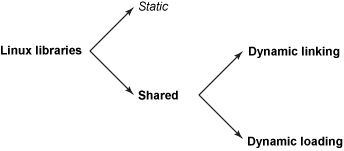

# LD_PRELOAD的拦截计划

> LD_PRELOAD是[Linux](https://so.csdn.net/so/search?q=Linux&spm=1001.2101.3001.7020)系统的一个环境变量，它可以影响程序的运行时的链接（Runtime linker），它允许你定义在程序运行前优先加载的动态链接库。这个功能主要就是用来有选择性的载入不同动态链接库中的相同函数。通过这个环境变量，我们可以在主程序和其动态链接库的中间加载别的动态链接库，甚至覆盖正常的函数库。一方面，我们可以以此功能来使用自己的或是更好的函数（无需别人的源码），而另一方面，我们也可以以向别人的程序注入程序，从而达到特定的目的。[1]

LD_PRELOAD的优点：

1. 功能强大：LD_PRELOAD可以控制程序的运行时行为，例如在调用某些系统函数时调用修改版的函数，改变进程的运行性质，甚至能够绕过一些安全机制。
2. 灵活性高：LD_PRELOAD允许用户在执行时临时加载一个共享器，从而为程序增加新的特性或修改现有的特性。
3. 方便调试：LD_PRELOAD可以方便地在动态链接库的加载时进行调试，以便及时发现程序中的问题。

LD_PRELOAD的缺点：

1. 安全性问题：由于LD_PRELOAD具有越过系统安全限制的能力，因此在操作时用户必须非常小心谨慎，避免导致系统的不稳定或任意代码执行的问题。
2. 潜在的兼容性问题：由于LD_PRELOAD加载的共享库会替换系统默认的库，可能会导致不兼容的问题。
3. 对性能的影响：由于在运行时注册所需的共享库，因此可能会影响程序的性能，特别是在大量运行时加载的情况下。
4. 系统调用包装器经常明显偏离其底层系统调用：根据您的 Linux 版本，glibc`open()`可能会调用`openat(2)`，`fork()`可能会调用`clone(2)`，其他调用可能会修改其标志或默认行为以符合 POSIX 标准。因此，很难可靠地预测给定的系统调用*包装器*是否调用了与其同名的系统调用。
5. `LD_PRELOAD`仅在动态链接 libc（或选择的目标库）时有效，但较新的语言（阅读：Go）和部署趋势（阅读：完全静态构建和非 glibc Linux 容器）使动态链接不太受欢迎。

总的来说，LD_PRELOAD具有强大、灵活、方便调试等优点，但从安全性和性能的角度来看，也需要适度使用并小心使用，以免发生潜在的兼容性问题或危险安全缺陷。

## 一、glibc库

libc 是指 C 语言标准库（C Standard Library），它是以 C 语言编写的可重用代码集合，通常与操作系统一起提供。libc 库实现了 C 语言标准规定的各种函数，包括输入输出、字符串处理、数学运算、内存管理、系统调用等操作的相关函数。

libc 库是一种基础性库，是一个 C 语言程序编写时必须依赖的库、系统编程中必不可少的一部分。它可以在 Linux 和其他类 Unix 操作系统上找到，是 Linux 系统的关键组成部分之一。运行 Linux 应用程序时，操作系统会自动加载相应的 libc 库。

在 Linux 系统中，相应的libc库一般被放在目录/usr/lib和/usr/lib64下，这些库有着不同的名字，例如libc.so.6表示此库用于 Linux 平台上的 C 语言标准库的实现。同时，libc 可以由不同的开发者和组织进行实现，并且在不同的发行版之间可能存在差异，例如 glibc 是 GNU 实现的libc库，在大多数主要的 linux 发行版中，glibc 都是默认的 libc 库。

在实际开发中，libc 库是 C 语言程序员经常使用的标准库之一。在编写 C 语言程序时，程序员可以通过包含相关头文件并调用其提供的函数，来方便地实现程序功能。

libc 库函数的执行流程可以概括为下面的四个步骤：

1. 程序调用 libc 库函数：C 语言程序通过调用 libc 库提供的函数，来实现程序的不同功能，例如文件操作、字符串处理、数学计算、系统调用等。
2. 进入 libc 库函数：当 C 语言程序执行调用 libc 库函数的代码时，CPU 会跳转到库函数的入口地址，开始执行库函数中的代码。通常情况下，libc 库函数会对函数参数进行检查，然后开始执行函数体内的操作。
3. 核心操作的执行：libc 库函数执行主要操作的逻辑，这些操作通常包括内存操作、文件操作、字符串操作、数学计算、系统调用等。libc 库函数在操作系统提供的系统调用上进行封装，使得 C 语言程序员可以使用高级抽象的接口实现对操作系统的访问，而不用直接进行系统调用。
4. libc 库函数返回结果：libc 库函数完成执行后，会将结果存储在函数定义或返回一个指针，然后返回控制权给调用方。这个返回结果可以被 C 语言程序再次调用，或是被其他库函数调用以完成 C 语言程序的功能。

总的来说，libc 库函数是 C 语言程序执行所必须的一部分，它的执行流程通常是程序员不可见的。libc 库函数通过系统调用等底层操作与操作系统进行交互，为 C 语言程序员提供了简便的高层抽象接口，让程序员可以更加关注业务逻辑的实现，而不用管系统底层复杂的实现细节。

## 二、LD_PRELOAD的使用

### 2.1 简单实现

```C++
/* random_nums.c
 * 输出十个随机数
 */
#include <stdio.h>
#include <stdlib.h>
#include <time.h>

int main() {
    srand(time(NULL));
    int i = 10;
    
    while(i--) {
        printf("%d\n", rand()%100);
    }
    return 0;
}
```

编译它：

```shell
gcc random_nums.c -o random_nums
```

创建同名的`rand`函数：

```C++
/*
 * unrandom.c
 */
int rand() {
    return 42;
}
```

将自定义的`rand`函数编译进共享库：

```shell
gcc -shared -fPIC unrandom.c unrandom.so
```

使用自定义的`rand`函数拦截libc的rand函数：

```shell
LD_PRELOAD=$PWD/unrandom.so ./random_nums
```

这种方式运行程序可以使得LD_PRELOAD加载的动态库只针对一个程序生效，如果想要在当前会话中使得LD_PRELOAD加载的动态库一直存在，可以将其写入到环境变量中：

```shell
export LD_PRELOAD=$PWD/unrandom.so
```

之后只要在当前会话中执行程序，就可以加载我们自定义的共享库：

```shell
./random_nums
```

### 2.2 相关gcc编译选型

`-static`

禁止使用动态库

`-w1,option`

把选项`option`传递给链接器；如果`option`包含逗号，会分隔为多个选项

`-shared`

指定生成一个共享目标文件，常搭配`-fPIC`使用

`-symbolic`

建立共享目标文件时候，把引用绑定到全局符号上

`-fPIC`

> -fPIC 作用于编译阶段，告诉编译器产生与位置无关代码(Position-Independent Code)， 则产生的代码中，**没有绝对地址，全部使用相对地址**，故而代码可以被加载器加载到内存的任意位置，都可以正确的执行。这正是共享库所要求的，共享库被加载时，在内存的位置不是固定的。
>
> 如果不加-fPIC,则加载.so文件的代码段时,代码段引用的数据对象需要重定位, 重定位会修改代码段的内容,这就造成每个使用这个.so文件代码段的进程在内核里都会生成这个.so文件代码段的copy.每个copy都不一样,取决于这个.so文件代码段和数据段内存映射的位置[2]

* [x] 还挺有意思，以后再去了解下**PIC**和**动态链接技术**

## 三、动态加载

通过LD_PRELOAD环境变量，我们可以将我们自己编写覆盖同名的libc库函数，当然除了覆盖这一行为之外，我们还可以使用它来完成拦截、监控的目的。

大体方法是在我们编写的函数中调用相应的libc库函数，然而当使用了LD_PRELOAD之后，编译器在链接库时会优先选择预加载的同名函数，即使在自定义的同名函数中调用libc库函数也不会使用libc库的函数，更可能编译器认为这是一个嵌套函数，所以为了在自定义的同名函数中使用libc库函数，我们需要一点小手段，比如直接获取libc库函数的函数指针，通常有以下几种方法可以获取libc库函数指针：

### 3.1 动态链接和动态加载

库旨在将类似的功能打包在一个单元中，然后与其他开发人员共享这些单元，并允许进行所谓的模块化编程。LInux支持两种类型的库：静态库在编译时静态绑定到程序，动态库在应用程序加载时加载。而动态库又有两种加载方式：动态链接（Dynamic Linking）和动态加载（Dynamic Loading）：



动态链接和动态加载都发生在程序运行时，但两者不同的是：

1. 动态链接需要操作系统的支持，该过程发生在内核从将 ELF 映像加载到用户空间虚拟内存的过程开始，动态链接器加载ELF中指定的共享库，然后执行重定位，将程序中定义的外部函数和数据地址绑定到共享库中相应符号地址。
2. 动态加载由应用程序自身负责。简单来说，就是应用程序可以指定要加载的共享库，然后将该库作为可执行文件调用其中提供的函数。

动态加载提供了一套API以供应用程序使用：

| Function | Description                        |
| -------- | ---------------------------------- |
| dlopen   | 打开共享库以供程序访问             |
| dlsym    | 从dlopen打开的共享库中访问符号地址 |
| dlerror  | 返回最后一次发生的错误             |
| dlclose  | 关闭共享库                         |

### 3.2 dlopen

dlopen的定义如下：

```C++
#include <dlfcn.h>

void *dlopen(const char *filename, int flags);

int dlclose(void *handle);

#define _GNU_SOURCE
#include <dlfcn.h>

void *dlmopen(Lmid_t lmid, const char *filename, int flags);

```

其中，filename是库文件的路径，可以是相对路径或绝对路径，flag表示加载方式，包含以下几个选项：

- RTLD_LAZY：懒惰链接方式，在需要时再加载符号。
- RTLD_NOW：立即链接方式，加载共享库时直接解析其中的符号，可能会导致初始化时间长。
- RTLD_GLOBAL：将符号表中的符号导出到其他被加载库的全局符号表。
- RTLD_LOCAL：不将符号表中的符号导出到其他被加载库的全局符号表。

dlopen函数返回一个指向共享库的句柄，如果加载失败则返回NULL，并可以使用dlerror函数获取错误信息。

### 3.3 dlsym

> dlsym函数的功能就是可以从共享库（动态库）中获取符号（全局变量与函数符号）地址，通常用于获取函数符号地址，这样可用于对共享库中函数的包装；[4]

dlsym所需要的头文件和函数原型如下：

```C++
#include <dlfcn.h>
void *dlsym(void *handle, const char *symbol);

#define _GNU_SOURCE
#include <dlfcn.h>

void *dlvsym(void *handle, char *symbol, char *version);
```

其中参数`handle`通常是由`dlopen`函数返回的共享库句柄，也可以是`RTLD_DEFAULT`和`RTLD_NEXT`两个伪句柄。`symbol`是打开的共享库中的符号名称，如果在指定的库或dlopen加载该库时自动加载的任何库中未找到该符号，则返回NULL。

我们可以通过`man`命令来查看两个伪句柄RTLD_DEFAULT和RTLD_NEXT的定义：

>RTLD_DEFAULT
>
> Find the first occurrence of the desired symbol using the default shared object search order.  The search will include global symbols in the executable and its dependencies, as well as symbols in shared objects that were  dy‐namically loaded with the RTLD_GLOBAL flag.
>
> RTLD_NEXT
>
>Find the next occurrence of the desired symbol in the search order after the current object.  This allows one to provide a wrapper around a function in another shared object, so that, for example, the definition of a function in a preloaded shared object (see LD_PRELOAD in ld.so(8)) can find and invoke the "real" function provided in another shared object (or for that matter, the "next" definition of the function in cases where there are  multiplelayers of preloading).

简单来说，`dlopen`可以帮你打开一个共享库文件，然后供你在里面找符号地址；RTLD_DEFAULT指定你在系统默认库中找符号地址；RTLD_NEXT指定你在当前库之后的动态库中找符号地址，这个伪句柄可以和LD_PRELOAD配合使用，正是我们需要的。

我们依旧使用第一节所使用的例子（一个简单的随机数程序）来展示dlopen和dlsym的配合：

```C++
/*
 * pack_random.c
 */
#include <stdio.h>
#include <dlfcn.h>

int rand() {
    void *libc_handle = dlopen("libc.so.6", RTLD_NOW);
    if (libc_handle == NULL) {
        fprintf(stderr, "Error: %s\n", dlerror);
        return 1;
    }

    int (*libc_rand)() = dlsym(libc_handle, "rand");
    if (libc_rand == NULL) {
        fprintf(stderr, "Error: %s\n", dlerror);
        dlclose(libc_handle);
        return 1;
    }
    
    fprintf(stdout,"This is a pack function!\n");

    return libc_rand();
}
```

输出结果如下：

```
This is a pack function!
97
This is a pack function!
49
This is a pack function!
23
This is a pack function!
79
This is a pack function!
83
This is a pack function!
5
This is a pack function!
91
This is a pack function!
32
This is a pack function!
16
This is a pack function!
45
```

当然也可以使用另外一个伪句柄RTLD_NEXT来实现，实现方式和上述的差不多，并且dlopen要求知道共享库的具体名字，使用RTLD_NEXT可能更方便，不过要求你确定接下来顺序加载的共享库中没有其他同名函数。（可以通过linux命令`ldd`来查看进程的共享库加载顺序）：

```c
/*
 * pack_random.c
 */
#include <stdio.h>
#include <dlfcn.h>

int rand() {
    int (*libc_rand)() = dlsym(RT, "rand");
    if (libc_rand == NULL) {
        fprintf(stderr, "Error: %s\n", dlerror);
        return 1;
    }
    
    fprintf(stdout,"This is a pack function!\n");

    return libc_rand();
}
```


有一点需要注意：在C语言标准中，**dlsym函数不是强制性规定的标准函数，而是由POSIX标准提供的函数**，因此在使用dlsym函数的时候需要使用POSIX标准的头文件<dlfcn.h>。但是，在一些操作系统中，dlsym函数的实现并不完全遵循POSIX标准，而是采用了GNU特有的实现方法，这种实现方法允许通过符号名直接获取函数指针。

因此，在一些操作系统中，如果希望使用dlsym函数直接获取符号名对应的函数指针，就需要使用_GNU_SOURCE宏，这个宏会启用GNU特有的实现方法。

例如，在Linux系统中，如果需要在程序中使用dlsym函数，就需要使用以下代码：

```c++
#define _GNU_SOURCE
#include <dlfcn.h>
```

使用_GNU_SOURCE宏可能会导致一些可移植性问题，因为该宏只在GNU系统中定义，并不是标准的C语言头文件。因此，在编写跨平台的代码时，最好根据实际情况决定是否需要使用该宏。

## 四、引用

1. [LD_PRELOAD作用](https://blog.csdn.net/chen_jianjian/article/details/80627693)
2. [gcc 编译参数 --- -fpic -fPIC](https://www.cnblogs.com/god-of-death/p/17052220.html)
3. [GCC编译选项含义解析](https://www.cnblogs.com/CocoML/p/14643389.html)
4. [动态库加载函数dlsym 在C/C++编程中的使用](https://www.xuedaon.com/?news/iot/884.html)
5. [Anatomy of Linux dynamic libraries](https://developer.ibm.com/tutorials/l-dynamic-libraries/)
6. [syscall_intercept](https://github.com/pmem/syscall_intercept)

