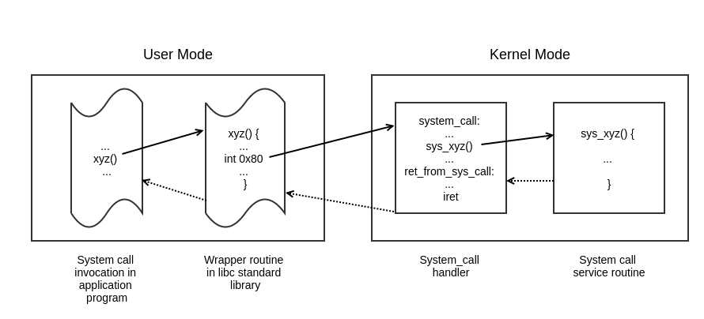
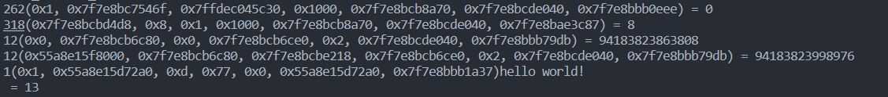
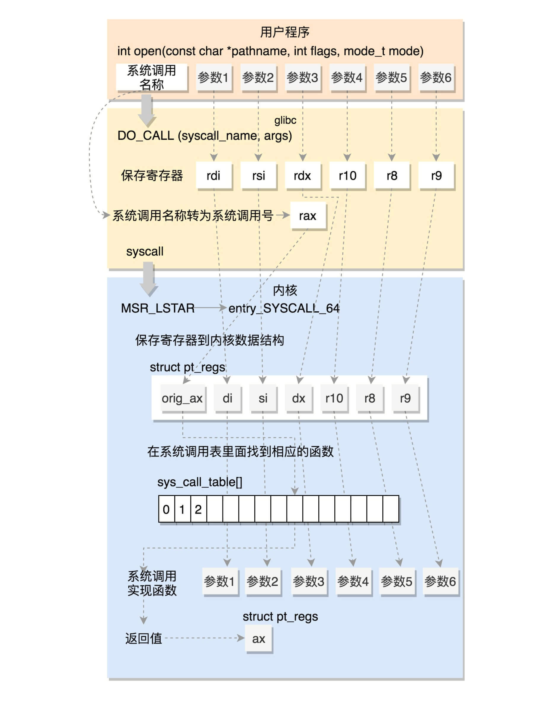
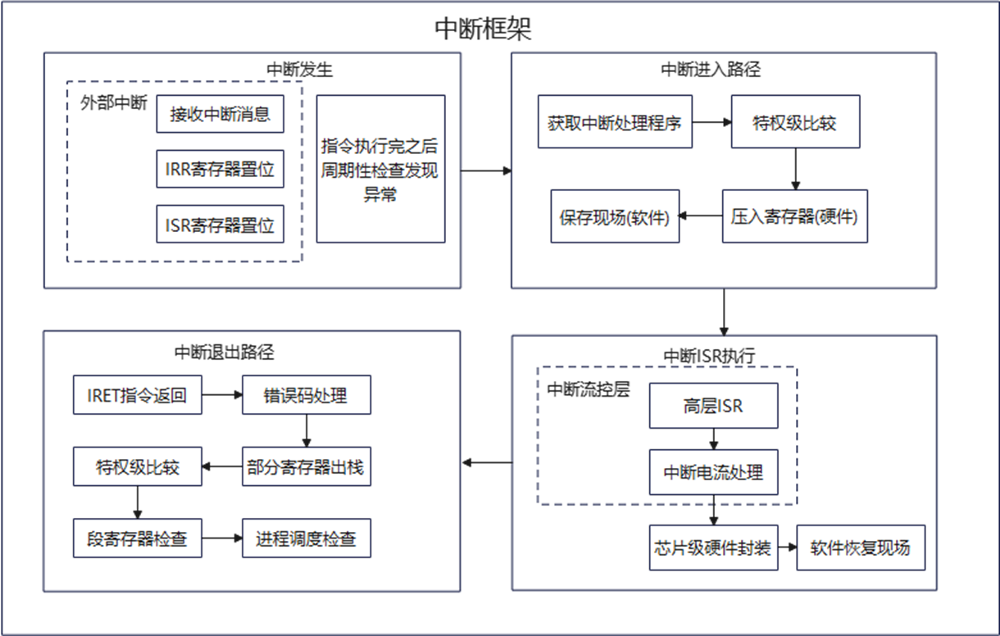
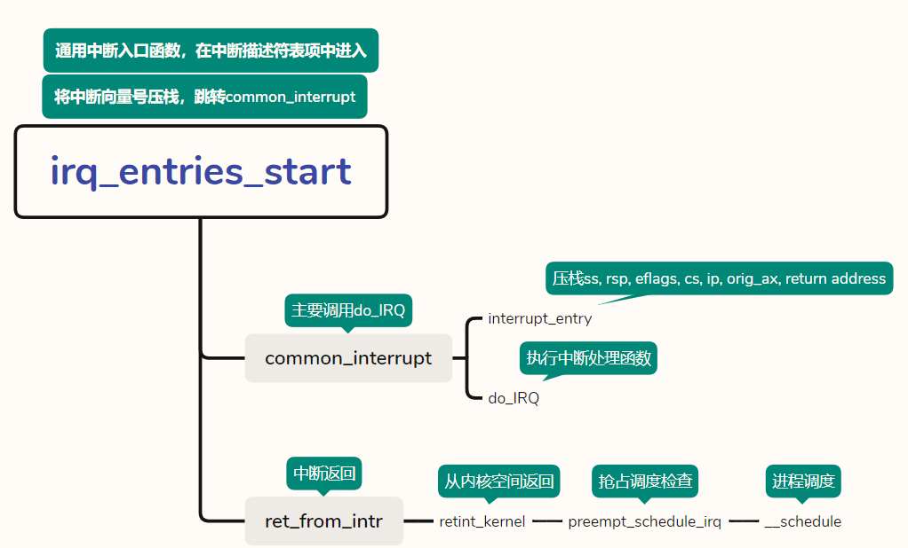
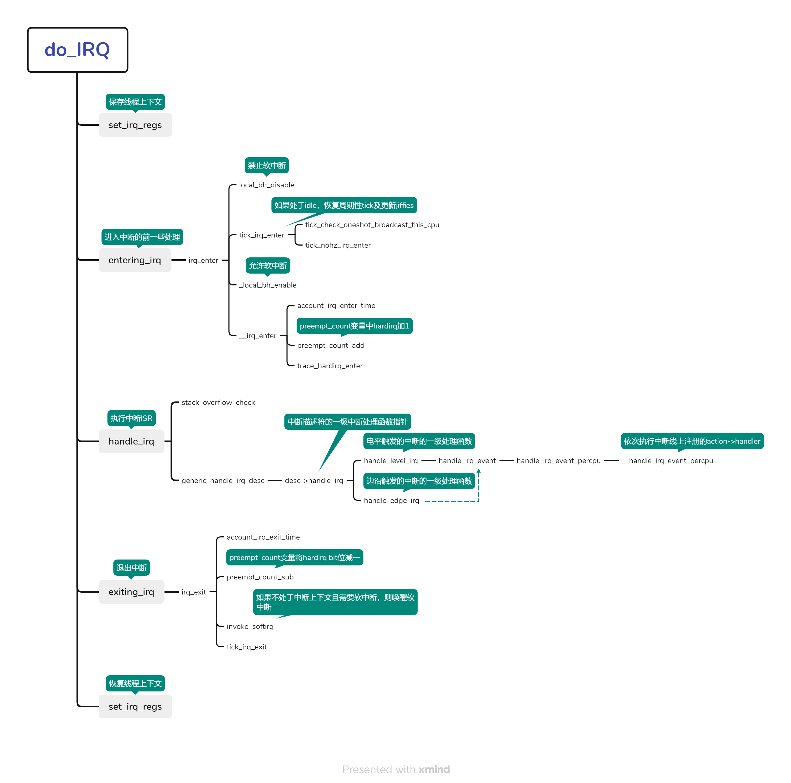

# 系统调用执行流程和拦截开销分析

Linux系统调用是操作系统所实现的应用编程接口(Application Programming Interface，API)，使得应用程序可以通过系统调用使用内核提供的各种资源，如果操作硬件、开关中断、改变特权模式等。

> 系统调用在内核空间和用户空间之间建立了一个连接的中间层，它主要为系统提供了下面三个主要功能：
>
> 第一，系统调用在底层硬件和用户空间之间建立了一个抽象的接口。例如，当用户空间的应用程序想读写一个文件时，程序员只需要通过系统调用接口完成读写操作即可，而不需要知道文件所在的底层磁盘是什么介质类型以及它所使用的是什么文件系统等一系列复杂的底层细节。
>
> 第二，系统调用让操作系统变得更加稳定和安全。Linux 中的内核好比就是一个仲裁者，它基于访问权限、用户组、临界区等机制来控制用户空间中应用程序用户空间中应用程序对底层硬件资源的访问，使得应用程序不会非法地使用硬件资源或者窃取其他应用程序所使用的资源以致对系统造成损害。
>
> 第三，系统调用便于实现系统虚拟化。系统调用提供的中间层，它屏蔽了许多的底层的细节，使得应用程序和底层系统的耦合性降低，这样系统的虚拟化变得更加简单。[[1]](#reference_1)

系统调用在每个平台的实现方式都不同，x86-32位通过软件中断（software interrupt， INT 80）实现，如下图，arm通过指令svc实现，但在X86-64下的Linux系统调用机制有了很大的不同，这是我们主要研究的部分。



## 一、为什么要分析系统调用的执行流程

我们的目标是高效的系统调用拦截程序，怎么解释高效，我们认为可以用**低开销**一词蔽之。但细分拦截开销又可以划成两部分，一部分是**执行拦截的开销**，另一部分是**非必要拦截目标的开销**。

**执行拦截的开销，即为拦截技术在特定拦截点完成拦截这一功能所花费的开销**，如ebpf中在do_syscall前后插入钩子函数拦截系统调用，那么执行拦截的开销即为函数的调用；而在ptrace中，对系统调用的拦截需要调用ptrace(PTRACE_SYSCALL)来使得被跟踪进程陷入暂停态并使用信号来通知跟踪进程进行处理，那么ptrace执行拦截的开销即为两次系统调用的开销、进程间交流等。

**而非必要拦截目标的开销，主要与拦截点设置和拦截目标有关。**系统调用是内核向应用程序提供服务的接口，几百个系统调用囊括了操作系统底层的大部分功能，在实际情况下，拦截所有的系统调用是非必要且不实际的。因此我们需要有目的的选择必要的系统调用进行拦截。但是在系统调用的整个执行流程中，大部分的 拦截点都需要设置过滤规则来过滤不是预设目标的系统调用，如：do_syscall是系统调用的通用入口，如果在do_syscall中设置拦截点，那么对于每一次系统调用的执行，我们都要去拦截系统调用号和参数进行对比，是否为拦截目标，这就造成了额外的开销。

因此，如何做到低开销的拦截，不仅和拦截技术有关，还与拦截点的设置相关。因此，我们会在本篇中简单分析系统调用的执行流程，并找出相对关键的拦截点。

## 二、用户态下拦截系统调用

在用户态下我们有三种方式使用系统调用提供的服务。

### 1.1 通过库函数

一种是调用libc库函数，如Linux下的*GNU* C Library，即glibc。glibc是C标准库的一种实现，提供了许多基本的系统函数和高级的功能，如多线程、国际化、流处理、动态内存分配、符号链接处理、消息目录、用户和组管理等。在Linux和其他类UNIX系统上广泛使用，可以说是Linux系统用户空间的重要组成部分。

此外，glibc封装Unix系统调用时，通过函数调用将一些系统调用所需的参数等进行了封装，使得开发者不必关心底层的实现细节，提高了程序的易用性和可移植性，因此我们可以通过调用库函数的方式间接调用系统调用，如

```c
#include <stdio.h>

int main(void)
{
    printf("hello world!\n");
    return 0;
}
```

在上面的代码中我们调用了glibc中调用`printf`库函数，用于向标准输出输出字符，它对系统调用`sys_write`做了封装，实际上是调用了`sys_write`才能向标准输出中输出字符。

但实际上一个库函数可能会对应多个系统调用，因为库函数不仅仅只是系统调用的简单封装，它还会实现自己的逻辑，以上面的代码举例，如果我们通过`ptrace`去拦截`printf`发出的系统调用，我们会发现它会输出：



其中每行第一个数字是系统调用号，括号内是我们拦截到的系统调用参数，等号后面是系统调用返回值。

在使用`printf`函数时，内部会调用众多的系统调用和库函数来完成输出操作，在上面的例子中，它会动态分配一段内存来存储输出字符串，这也就是为什么它会调用12号系统调用（sys_brk，用于改变进程数据段末尾边界的，即分配和释放动态内存），关于它的具体实现，我们并不关心，我们只要知道库函数和系统调用之间的关系是1:n就行了。

### 1.2 通过syscall()

第二种方式是使用glibc的库函数，`syscall()`，它是glibc提供的一个低层次的系统调用接口，它允许直接调用特定系统调用，并传递相应的参数。`syscall()`函数的函数原型如下：

```c
#include <unistd.h>
#include <sys/syscall.h>   /* For SYS_xxx definitions */

long syscall(long number, ...);
```

其中第一个参数`number`指定了系统调用号，后面的参数则表示相应系统调用所需要的参数。`syscall()`函数可以用来直接访问Linux内核中的系统调用，其不同于其他glibc提供的库函数，因为它的使用需要对相关系统调用号的了解和正确的参数传递：

```c
#include <stdio.h>
#include <string.h>
#include <unistd.h>
#include <sys/syscall.h>

int main(void)
{
    char *str = "Hello, World!\n";
    
    // 使用write函数输出字符串
    write(STDOUT_FILENO, str, strlen(str));
    
    // 使用syscall函数输出字符串
    syscall(SYS_write, STDOUT_FILENO, str, strlen(str));
    
    return 0;
}
```

### 1.3 通过汇编

最后一种调用方式是通过汇编语言直接调用系统调用接口。

如果我们还是32位系统，那么我们可以通过软件中断INT 80来触发系统调用，但现在是64位系统了，我们有了更简便的方式，使用SYSCALL/SYSRET指令：

```assembly
section .data
  msg db "Hello from user mode!", 0Ah
section .text
  global _start
_start:
  ; 调用系统调用write
  mov rax, 1           ; write系统调用编号为1
  mov rdi, 1           ; 将文件描述符stdout的值1传递给第一个参数，表示要输出到标准输出
  mov rsi, msg         ; 将输出的字符串的地址赋值给第二个参数，表示要输出的内容
  mov rdx, 19          ; 将输出的字符串的长度赋值给第三个参数，表示要输出的字符串长度（包括换行符）
  syscall              ; 调用系统调用

  ; 调用系统调用exit
  mov rax, 60          ; exit系统调用编号为60
  xor rdi, rdi         ; 将返回值设为0
  syscall              ; 调用系统调用
```

这也是glibc最低层的封装，当然这种方式并不常见，我们也不推荐直接使用这种方式。glibc的方式更为复杂，它定义了许多脚本和宏来封装系统调用，这里我们不关心的它的细节，有兴趣者可以去参阅[[2]](#reference_2)

### 1.4 用户态下的系统调用拦截点

通过上面的小节我们可以大致分析出系统调用的拦截点设置情况：

1. 直接拦截库函数
2. 拦截库函数底层对系统调用的汇编代码

各种方法都有不同程度的利弊，第一种方式是利用了库函数对系统调用的封装，直接拦截库函数就可以避免系统调用的执行，如使用LD_PRELOAD预加载技术，直接对库函数符号进行替换。但是缺点很明显，正如我们上面提到的，库函数不仅只是系统调用的封装，它还包含了高级的功能，它和系统调用之间的关系也不是一对一的，这个缺点很明显。

第二种方式是利用了库函数对系统调用的底层封装，库函数使用许多脚本和宏来封装系统调用，会在调用系统调用前后进行处理，我们可以通过热补丁的方式，在库函数加载进内存后替换这部分处理代码，将其替换为我们自己的拦截函数。

## 三、在系统调用处理例程中拦截系统调用

### 3.1 x86-64下的系统调用执行流程

在第六章中，我们了解到软件中断INT 80上注册的中断处理函数是在它的中断描述符`irq_struct.action`上，理论上我们只要去找到这上面注册的中断处理函数，就可以顺藤摸瓜找到系统调用的处理函数了。但实际上情况比较麻烦，中断门的初始化部分隐藏得比较深，我们也只找到了32位架构中对系统调用中断向量（IA32_SYSCALL_VECTOR， 128）的初始化过程， 它是在`trap_init`中跟随前16个系统保留的中断一起初始化的。

但在查阅部分资料后[[3]](#reference_3)，我们才发现现在的Linux内核中对于系统调用已经有了很大的变化（相较于我们的刻板印象，使用门跳转），在 x86-64 架构中，不需要单独为系统调用设置中断门，也不需要像在 x86 架构中一样设置中断描述符表（IDT）中的任务门。这是因为，在 x86-64 架构中，系统调用通过一定的寄存器和 CPU 指令（SYSCALL/SYSRET）完成，而不是处理器的中断机制触发。

x86-64中的系统调用入口为entry_SYSCALL_64，它在操作系统初始化时在`syscall_init()`函数中存入MSR寄存器中的MSR_LSTAR寄存器中。之后当用户需要调用系统调用，只需要通过SYSCALL指令，从MSR_LSTAR寄存器中获取入口地址。

entry_SYSCALL_64大致完成以下功能：

1. 保存用户态下系统调用相关的上下文。
2. 进入内核态，并设置内核态下的栈和段寄存器。
3. 根据系统调用号，将对应的系统调用处理程序的地址加载到 `rax` 寄存器中。
4. 通过 `sysretq` 指令返回到用户态，并恢复用户态的上下文

我们感兴趣的部分，也就是系统调用真正执行的那一部分，是在第三步，它调用了do_syscall_64来完成上述功能，这个函数也就是我们耳熟能详的系统调用通用处理入口（最起码在ebpf的libbpf中的sys_enter是在这里设置的）。

下图为一个总结过程[[4]](#reference_4)：




### 3.2 系统调用拦截点

事情脉络很明显了，在内核中系统调用有两个拦截点（x86-64）:

1. 系统调用通用入口do_syscall_64，它完成系统调用号和系统调用服务例程之间的映射，并调用相应系统调用服务例程。
2. 系统调用服务例程，也就是我们常识中前缀是sys_的系统调用实现代码，如系统调用号1，write对应的实现函数为：sys_write。我们可以在arch\x86\entry\syscalls\syscall_64.tbl中找到这个对应关系。

## 四、拦截点的开销分析

经过上面的分析，我们可以大致了解到，系统调用的拦截点其实有四个（目前为止我们了解到的），在用户态中有：

1. 直接拦截库函数
2. 拦截库函数底层对系统调用的汇编封装

在内核态中有：

1. 系统调用通用入口do_syscall_64。
2. 系统调用服务例程，也就是我们常识中前缀是sys_的系统调用实现代码。如系统调用write对应的sys_write函数

**拦截点的设置会影响到拦截技术和拦截目标的选择**。

实际上在系统调用服务例程之前，我们都无法避免这样一个开销：

1. 拦截每一个系统调用的执行
2. 获取系统调用号和拦截目标对比
3. 判断是否执行后端处理逻辑

最容易想到的避开不必要开销的方法是直接将拦截点设置在系统调用服务例程前或函数内，然而这几乎是不可能的！系统调用服务例程由do_syscall_64使用系统调用号从系统调用表中直接获取服务例程地址，也就是说无法在**特定系统调用服务例程之前**设置拦截点。而如果要在系统调用服务例程中插入拦截点，那么这一个想法是非常危险的！或许可以通过修改内核源码或使用Kernel Function Tracer (KFT) 做到，但这会对系统的稳定性和安全性产生影响。

而更实际的事情是，在内核中拦截系统调用，大部分方法会对整个系统造成影响，而不是单独争对单个进程。因为大部分在内核中拦截系统调用的方法，都是通过在系统调用入口前后插入钩子函数，检测每一次的系统调用执行是否为拦截目标，它会造成一个可怕的后果：操作系统的所有系统调用都会被拦截！

以EBPF举例，EBPF的核心是BPF虚拟机，它允许用户态程序将编写好后的BPF程序编译成字节码后注入内核。对于系统调用的拦截，它通常提供`kprobe()` 和 `kretprobe()` 函数，用于在系统调用的入口点和返回点处插入钩子函数，也即是在do_syscall_64。do_syscall_64的每次执行，都会首先调用我们注入的BPF程序进行拦截处理。然而这种BPF程序注入内核方式无疑相当于修改内核源码，它会对整个操作系统造成影响， 所有调用系统调用的进程。

## 五、参考引用

1. <span id="reference_1">[Linux 系统调用内核源码分析](https://flyflypeng.tech/%E5%86%85%E6%A0%B8/2016/05/10/Linux-%E7%B3%BB%E7%BB%9F%E8%B0%83%E7%94%A8%E5%86%85%E6%A0%B8%E6%BA%90%E7%A0%81%E5%88%86%E6%9E%90.html)</span>
2. <span id="reference_2">[glibc源码分析（一）系统调用](https://www.zhihu.com/column/p/28984642)</span>
3. <span id="reference_3">[X86_64处理器系统调用机制在linux上的实现](https://blog.csdn.net/chengwenyang/article/details/117794217)</span>
4. <span id="reference_4">[【学习笔记06】深入了解系统调用](https://bbs.huaweicloud.com/blogs/311236)</span>

## 六、在中断中拦截系统调用（x86-32位系统）

事实上我们犯了一个错误，一个调研上和刻板印象上的错误——我们依旧认为x86上的系统调用是通过中断来触发的，但在不断阅读Linux源码中关于系统调用中断向量（IA32_SYSCALL_VECTOR， 128）的初始化过程后，始终无法发现64位系统调用入口在哪里被注册到中断描述符上，之后我们突然惊醒，这个中断向量怎么是在32位架构下定义的呢？

~~悲剧是这样产生的，两天的时间浪费了~~

最终我们查阅资料了解到x86-64下的系统调用直接由SYSCALL/SYSRET调用了，而不是中断。但是既然已经做了这么多研究了，那么好歹还是花些笔墨来记录一下吧。

### 6.1 中断的基本概念

中断是一种计算机处理器的机制，它是指在计算机的正常执行过程中，硬件或软件发生了某种特殊事件，导致计算机暂停正在执行的程序，转而跳转到一个已经预设好的特殊地址处执行另一段程序的过程。

中断的作用是让处理器能够及时响应和处理各种需要立即处理的事件，如I/O信号的到来、时钟周期的到达、程序中的异常和错误等。当中断事件发生时，处理器会暂停当前程序的执行，保存好现场，然后跳转到预设的中断处理程序中去执行相应的中断处理工作。当中断处理工作完成后，处理器会从中断处理程序返回到之前的执行状态，继续执行原来的程序。

中断是操作系统实现的重要基础之一，也是实现多任务、响应外部事件等功能的必要手段。通过中断，操作系统可以及时响应外部设备的事件，从而提高系统的效率和实现各种复杂的功能。

中断大致可分为：

| 中断类型 | 中断来源     | 同步/异步中断 | 中断返回行为   |
| -------- | ------------ | ------------- | -------------- |
| 中断     | 外部设备     | 异步          | 返回下一条指令 |
| 故障     | 可恢复错误   | 同步          | 返回当前指令   |
| 陷阱     | 人为         | 同步          | 返回下一条指令 |
| 中止     | 不可修复错误 | 同步          | 不返回         |

以x86-64系统举例，它通过中断向量表来维护系统中的所有中断，也称为中断描述符表（IDT），它记录了中断处理程序的地址。每当CPU受到一个中断信号时，它都会根据中断信号的类型查找中断向量表，在表中找到相应的中断描述符，然后转入中断描述符所对应的中断处理程序。

当中断发生时，CPU会在中断向量表中查找相应的中断描述符，并根据中断描述符中记录的中断处理函数等信息，将CPU的控制权转移到对应的中断处理程序中。此时，中断处理程序会根据中断描述符中记录的中断号，找到对应的`struct irq_desc`，并将中断处理的相关信息记录到`struct irq_desc`中。之后，中断处理程序会处理中断请求（如果有），真正的中断处理程序通过链表的形式注册在`struct irq_desc`的`action`成员上。然后恢复中断控制器和处理器的状态，最后返回到被中断的进程继续执行。

x86-64有256个中断号，对应256个中断向量：

| **中断向量划分**                               | **对应中断**              |
| ---------------------------------------------- | ------------------------- |
| 0…31                                           | 系统陷阱和异常中断向量    |
| 32…127                                         | 设备中断                  |
| 128                                            | 系统调用中断              |
| 129  …INVALIDATE_TLB_VECTOR_START-1 except 204 | 设备中断（除了204号中断） |
| INVALIDATE_TLB_VECTOR_START …255               | 特殊中断                  |

其中第128号中断是为了系统调用而专门保留的，即内核向上层提供的系统调用接口。接下来的关注点就是它。

### 6.2 中断的执行流程

正好我们对中断的执行有过一定的兴趣，于是我们决定去Linux源码中去了解下中断子系统，但它显然不是几千字就能描述干净的，所以我们挑选了符合赛题情景的部分，即中断的执行流程，包括了函数的执行流程：



这是我们总结的一部分中断执行框架。

正如我们上面所说，中断向量表保存系统中的所有中断，表项包含中断的描述信息，以及中断通用处理程序入口地址`irq_entries_start`，我们通过探究Linux4.16的源码，分析了中断的执行流程，并通过思维导图来描述：



所有的中断向量都指向这个入口函数，它主要用于调用common_interrupt，完成压栈的工作，真正的中断处理函数是`do_IRQ`：



do_IRQ是一个通用的中断处理程序，它会做一些初始化和必须的工作，然后调用中断描述符`irq_struct.action`上注册的中断处理函数来真正的执行中断处理程序.

### 6.3 中断过程中的系统调用拦截点

通过上面的基本知识，我们可以分析出在中断中拦截系统调用可以从以下函数入手：

1. 通用中断处理函数入口irq_entries_start或do_IRQ
2. 128号中断的irq_struct.action上的注册函数

早在第二章（用户态下拦截系统调用），我们就知道了在中断入口——irq_entries_start或do_IRQ拦截系统调用是一件蠢事，那么唯一的选择就是在irq_struct.action的中断处理函数入口了。

但实际上在这里设置还是存在一些问题，因为INT 80不仅只能用于触发系统调用，除了被用于系统调用，在一些特殊情况下，INT 80也可以被用于硬件中断。例如，当CPU在保护模式下工作时，没有其他有效的方式来响应BIOS中断（BIOS中断仅能工作在实模式下）。所以，Intel提供了INT 80中断来支持BIOS中断，在这种情况下，INT 80中断不是用来触发系统调用的，而是被BIOS用来触发硬件中断的。

所以在中断中拦截系统调用还是存在一些问题的。
