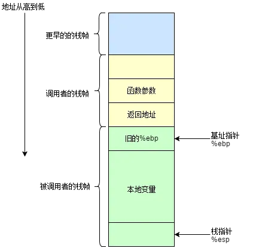

# 高效库函数和系统调用拦截技术

​																								

## 一、赛题信息

参赛队伍：队队怼怼对

参赛成员：王国琨、蔡柯迪，来自杭州电子科技大学

指导老师：贾刚勇

项目导师：胡万明、任玉鑫、汪旭

赛题名称：**高效库函数和系统调用拦截技术**

选题地址：https://github.com/oscomp/proj250-functioncall-syscall-Interception

Git仓库地址：https://github.com/huoMax/wc-intercept

**拦截基础库、系统调用等底层函数**，对理解掌握系统行为至关重要，在安全管理、计算容错、异常检测和性能分析中经常使用，但其拦截性能对系统影响较大，实现高效的拦截，是业界和学术界研究的重点。

通过该项目，可以深入理解基础库和OS的工作原理和执行流程。我们聚焦在系统底层函数的拦截，包括libc和系统调用，要求根据配置，拦截不同的函数、不同拦截频率、对接不同的拦截后的处理。通过本项目，可帮助学生深入理解OS中最常见的系统调用原理，掌握系统执行流程、操作系统原理、以及用户与内核交互等内容。

该项目通过实现高性能的拦截系统，降低函数拦截对系统性能的影响，优化拦截系统的可扩展性。

通过调研，熟悉现有拦截工具的原理，并理解其对系统性能的影响和原因。设计新的拦截机制，支持灵活配置不同的拦截目标、频率和处理后端，降低拦截所引入的额外开销。

第一题：基本的环境搭建和熟悉

- 理解系统调用和libc函数的调用执行流程
- 尝试现有的拦截工具，熟悉其功能和性能

第二题：拦截特定的系统调用

- 根据配置，确定拦截的系统调用范围
- 在系统调用前后，采集其相关信息，比如参数；返回值等
- 将拦截到信息对接给后端处理逻辑（具体的后端处理不在本课题范围）

第三题：拦截特定的libc函数

- 根据配置，确定拦截的libc函数范围及所需拦截信息
- 将拦截到信息对接给后端处理逻辑（具体的后端处理不在本课题范围）
- 优化对libc和应用的侵入式修改，最好实现应用无感

## 二、文档介绍及目录

我们将本分档细分为十一个部分。

第一部分为赛题信息，主要描述我们的参赛队伍信息、赛题要求。

第二部分是文档的介绍及目录，主要介绍文档各个部分是用来做什么的。

第三个部分是我们对赛题的选题意义、选题背景的调研以及对赛题的一些分析。

第四个部分是背景介绍，主要介绍一些问题背景。

第五个部分主要描述现有的拦截技术，并分析我们的wc-intercept拦截框架与它们的对比。

第六个部分主要描述我们代码的整体设计思路。

第七个部分是代码的安装与使用。

第八个部分是我们给出的一些使用案例，包括我们的一个简单的性能测试。

第九个部分是我们对我们的框架的总结、分析其不足，与能够改进的地方。

第十个部分是我们在实现赛题中记录的一些技术文档。

第十一个部分是本文档中借鉴到的一些博客、书籍的引用。

[toc]

## 三、选题意义、背景与赛题解析

### 3.1 选题意义

1. **安全与防御策略**：随着各种新型攻击手段的不断涌现，现代计算环境面临着前所未有的安全挑战。拦截基础库和系统调用的技术，能够为安全专家提供一种实时监控和响应潜在威胁的有效工具。选题研究将有助于深化我们对如何更好地构建防御策略的理解。

2. **性能与资源优化**：在众多应用中，从高性能计算到移动设备，资源的有效利用是关键。拦截技术，尤其是高效的拦截，可以为系统工程师提供宝贵的信息，用于优化性能和资源使用。此选题将探索这种技术如何助力提高计算效率。

3. **计算的透明性和可解释性**：随着计算系统日益复杂，为开发者和管理员提供系统的内部视角变得越来越重要。通过拦截基础库和系统调用，可以获取关于系统行为的详细数据，进而提高计算的透明性。这一选题将促进计算领域的可解释性研究。

4. **新技术的催生**：研究拦截技术不仅仅是为了优化现有系统。它还可能催生出全新的技术和方法论，如新型的容错策略、自适应调度机制或者更加先进的虚拟化技术。

综上所述，此选题不仅对当前的计算环境具有实际意义，而且对未来的技术创新和发展方向具有指导作用，值得深入研究和探讨。

### 3.2 选题背景

在计算机系统的设计和实施过程中，理解和掌握系统行为是至关重要的。基础库和系统调用作为操作系统与应用程序之间的界面，经常是研究系统行为的关键点。通过拦截这些调用，研究人员和工程师可以对系统行为进行深入分析，从而实现安全管理、计算容错、异常检测和性能分析。尤其在当前的计算环境中，随着云计算、边缘计算和物联网设备的普及，对系统的安全和性能要求更加严格。在这种背景下，高效的拦截机制成为了业界和学术界的研究焦点。

尽管拦截基础库和系统调用有其明显的优势，但它们对系统的性能影响不容忽视。每次拦截都会增加额外的开销，这在高性能计算或实时系统中可能是致命的。因此，如何在保持拦截功能的同时最小化性能损失，是一个巨大的挑战。

高效的拦截需要深入地了解操作系统的内部机制。例如，一些先进的技术可能涉及修改内核或使用硬件辅助功能。此外，为了避免对正常操作的干扰，拦截策略应该是可配置和可适应的。与此同时，对于某些应用领域来说，拦截后的行为可能才是重中之重，它们可能要求实现较为复杂的拦截逻辑，这种情况下需要对被拦截进程做出一些修改，这会对安全方面和动态扩展方面是一个重要挑战。

拦截基础库和系统调用是一种强大而复杂的技术，它在许多计算场景中都有其应用。然而，要实现高效的拦截，还需要进一步的研究和创新。随着技术的发展，我们期待未来会有更加高效、灵活和安全的拦截机制出现。

### 3.3 赛题解析

#### 3.3.1 基于赛题描述的简单分析

赛题主要将系统调用和库函数作为拦截目标，这里我们先做一个前提：我们下面的一些介绍都基于x86-64位下的Linux平台进行分析。

赛题要求可以大致分为两个部分：

* 降低拦截开销
* 支持动态扩展特性

降低开销并不意外，这是所有拦截技术都在追求的一件事，这有赖于不同拦截技术的选择与优化。动态扩展特性的支持才是本赛题的一个原生的强需求。基于赛题给的描述可以将其分为三类：

* 动态配置拦截目标：可以在进程未运行时、运行过程中动态更换需要拦截的目标
* 动态配置拦截后端处理逻辑：可以在进程未运行时、运行过程中动态更换拦截目标对应的拦截处理逻辑
* 动态配置拦截频率：针对某一拦截目标，设置拦截频率。如某个拦截目标拦截开销过大，可设置每10次拦截一次。

但是我们主要完成了第一点和第二点动态扩展特性，第三点动态扩展特性暂未考虑，具体原因在第五部分整体框架设计会给出。

#### 3.3.2 通用拦截框架

一个通用的拦截框架应该分为前端和后端。

拦截前端的功能是：

* 拦截系统调用或库函数
* 设置过滤规则，将拦截范围限定在拦截目标中
* 获取被拦截到的系统调用或库函数的相关信息，如参数、返回值等，保存并发送给拦截后端

拦截后端的功能应该是：

* 接收拦截前端发送的拦截信息
* 分析拦截信息，调用拦截目标对应的拦截后端处理逻辑

#### 3.3.3 拦截开销分析

既然需要降低拦截开销，那我们需要分析清楚拦截的开销有哪些，整个拦截行为的开销大致可以分为：

* 执行拦截的开销
* 拦截范围的开销
* 拦截后端处理的开销

其中，**拦截开销**和**拦截范围开销**按照通用拦截框架来描述的话，属于**拦截前端**的开销，而**拦截后端处理开销**归属于**拦截后端**。后端处理逻辑不在我们的考虑范围内，因此我们只需要关心前两个开销。

**执行拦截的开销，即为拦截技术在特定拦截点完成拦截这一功能所花费的开销**，如ebpf中在do_syscall前后插入钩子函数拦截系统调用，那么执行拦截的开销仅为函数的调用；而在ptrace中，对系统调用的拦截需要调用ptrace系统调用来使得被跟踪进程陷入暂停态并使用信号来通知跟踪进程进行处理，那么ptrace执行拦截的开销即为两次及以上的系统调用的开销、进程间通信交流等时间。

**拦截范围的开销，主要与拦截点设置和拦截目标有关**。以系统调用举例，系统调用是内核向应用程序提供服务的接口，几百个系统调用囊括了操作系统底层的大部分功能，在实际情况下，特别是在SMP系统中，多个用户进程会共享系统向上提供的系统调用接口，我们需要有目的的选择必要的系统调用进行拦截，比如设置只拦截某个进程内的系统调用，或者只拦截某个进程内的某个系统调用，我们认为拦截点和拦截技术决定了拦截范围，常见的拦截范围有：

* 整个系统
* 单个进程
* 单个进程内的多个系统调用
* 单个进程内的指定范围内的系统调用

而大多数拦截范围对于拦截目标来说还是有些广泛了，这个时候就需要拦截过滤规则来过滤不需要的拦截目标。

以ebpf举例：ebpf能监控整个系统的系统调用执行，那么它的拦截范围就是整个系统。但是很可能它只关注某个进程内的系统调用执行情况，并且只关注某几个系统调用，如write，read，那么它的拦截目标就是write/read，拦截过滤规则即是：pid-write/read。

又如ptrace，ptrace针对单个进程进行跟踪，那么它的拦截范围就是单个进程。过滤规则即是write-read。有基于ptrace的特点，我们可以结合软断点技术或预加载技术，使得ptrace只在特定函数返回内开启拦截功能，此时它的拦截范围即是**单个进程内的指定范围**

然而虽然可以将拦截开销细分为以上几种，但是最主要的开销还是执行拦截的开销。ebpf通过向内核中系统调用的关键路径注入拦截函数，使得执行拦截的开销仅为函数调用，它的开销优化无疑是比较好的，而ptrace在每次系统调用前后都通过ptrace系统调用来暂停被跟踪进程，它的执行拦截的开销就比较大了，这也是ptrace不被用作高性能拦截的一个原因，当然，它的高可扩展程度是另一个话题。

## 四、背景介绍

### 4.1 系统调用和库函数

系统调用的概念和库函数的概念我们这里不再详述，可以参阅附录【系统调用执行流程和拦截开销分析】

#### 4.1.1 系统调用的调用


系统调用是一个复杂的过程，在32位系统中，是通过INT80中断而实现的，系统调用执行逻辑隐藏在INT80的中断处理逻辑中，应用程序通过该中断号以及传入相关参数到对应寄存器中来调用系统调用。而在64位系统中简化了这个流程，系统调用通过SYSCALL/SYSRET调用和返回。系统调用的通用入口存放在MSR寄存器中的MSR_LSTAR寄存器中。之后当用户需要调用系统调用，只需要通过SYSCALL指令，从MSR_LSTAR寄存器中获取入口地址。

#### 4.1.2 系统调用的参数

在Linux x86-64中，系统调用参数通过寄存器传递，我们通常使用struct user_regs_struct来获取系统调用的上下文信息，按照参数从左到右分别存放在：RDI、RSI、RDX、R10、R8、R9这六个通用寄存器中，系统调用号通过RAX寄存器来传递，然而系统调用返回值也通过RAX来传递，为了避免两者混淆，所以在struct user_regs_struct中系统调用号通过ORIG_RAX来传递。

```c++
/* /usr/include/sys/user.h */
struct user_regs_struct
{
  __extension__ unsigned long long int r15;
  __extension__ unsigned long long int r14;
  __extension__ unsigned long long int r13;
  __extension__ unsigned long long int r12;
  __extension__ unsigned long long int rbp;
  __extension__ unsigned long long int rbx;
  __extension__ unsigned long long int r11;
  __extension__ unsigned long long int r10;
  __extension__ unsigned long long int r9;
  __extension__ unsigned long long int r8;
  __extension__ unsigned long long int rax;
  __extension__ unsigned long long int rcx;
  __extension__ unsigned long long int rdx;
  __extension__ unsigned long long int rsi;
  __extension__ unsigned long long int rdi;
  __extension__ unsigned long long int orig_rax;
  __extension__ unsigned long long int rip;
  __extension__ unsigned long long int cs;
  __extension__ unsigned long long int eflags;
  __extension__ unsigned long long int rsp;
  __extension__ unsigned long long int ss;
  __extension__ unsigned long long int fs_base;
  __extension__ unsigned long long int gs_base;
  __extension__ unsigned long long int ds;
  __extension__ unsigned long long int es;
  __extension__ unsigned long long int fs;
  __extension__ unsigned long long int gs;
};
```

#### 4.1.3 库函数的调用约定

要拦截库函数，那么就需要知道库函数的调用约定，不然连参数放置位置都不知道，那就不用谈什么拦截了。

x86 程序的调用约定很多，常用调用约定由：cdecl, stdcall, fastcall。而x86-64 程序的调用约定只有两种：Microsoft x64 calling convention, System V AMD64 ABI。我们关注Linux下的System V AMD64 ABI就可以了。

> Microsoft x64 calling convention 微软x64调用约定
>
> 使用RCX, RDX, R8, R9四个寄存器用于存储函数调用时的4个参数(从左到右)，使用XMM0, XMM1, XMM2, XMM3来传递浮点变量其他的参数直接入栈(从右至左)整型返回值放置在RAX中，浮点返回值在XMM0中。
>
> System V AMD64 ABI 此约定主要在Solaris，GNU/Linux，FreeBSD和其他非微软OS上使用
>
> 使用寄存器RDI, RSI, RDX, RCX, R8和R9存储函数调用时的前6个参数(从左到右)使用XMM0, XMM1, XMM2, XMM3, XMM4, XMM5, XMM6 和 XMM7 来放置浮点变量其他的参数直接入栈(从右至左)整型返回值放置在RAX中，浮点返回值在XMM0中。
>
> 引用【1】【https://blog.csdn.net/m0_47696151/article/details/121125390】

除此之外，我们还需要了解**栈帧**的概念。

帧，也就是stack frame，其本质就是一种栈，只是这种栈专门用于保存函数调用过程中的各种信息（参数（其他调用约定如_cdecl），返回地址，本地变量等）。栈帧有栈顶和栈底之分，其中栈顶的地址最低，栈底的地址最高，SP(栈指针)就是一直指向栈顶的。



从栈帧中我们可以获取函数的返回地址、浮点数参数或超过6个参数以上不能通过寄存器传递的参数。

#### 4.1.4 ELF文件格式

通过C++/C的调用约定以及栈帧结构，我们就可以锁定拦截信息的获取。之后我们还需要考虑如何获取要拦截的目标。对于用户来说，这个可能很简单，他们只需要传递库函数名称和相关原型给拦截程序，拦截程序就会自动设置拦截，然而不幸的是，我们不是用户，所以我们需要考虑如何通过一个库函数名称和库函数原型来找到拦截目标。这个过程需要我们去实现一个可执行文件解析的工作，而在这个过程中，我们需要对可执行文件、静态链接、动态链接有一定的认识。


ELF（Executable and Linkable Format，可执行可链接格式）是一种用于描述二进制文件格式的标准，它在 Unix 和 Unix-like 操作系统中得到广泛应用。ELF 文件格式定义了可执行文件、共享库和目标文件的内部结构，包括代码、数据、符号表、重定位表、动态链接信息等。

ELF 文件被广泛应用于 Unix 和 Unix-like 操作系统中的程序开发和部署中，如 Linux、FreeBSD、macOS 等系统。ELF 文件格式具有可扩展性和可移植性，支持多种体系结构和操作系统，并且具有较好的兼容性和可靠性。我们熟悉的C/C++、go等编译后的可执行文件在Linux上就表现为ELF文件格式。

ELF文件的主要结构为：

* ELF Header：ELF文件头，用于描述ELF的属性和信息
* Program Header Table：程序头表，用来描述segment的信息
* Section Header Table：节头表，用来记录ELF文件中每一个sectio的主要描述信息
* Section：不同的section，这部分由编译器决定，常见的section有.text、.data、.bss

具体的ELF介绍详见附录2【ELF文件格式与Libelf解析】

#### 4.1.5 静态链接与动态链接

静态链接（Static Linking）是将程序中所有目标文件和库文件的代码和数据段合并为一个可执行文件的过程。在静态链接中，符号的引用和定义都会被解析并替换为最终的地址，以便程序能够正确地执行。

动态链接（Dynamic Linking）是将程序中的目标文件和库文件在运行时动态加载到内存中的过程。在动态链接中，程序会依赖系统中已安装的共享库文件（Shared Library），在最开始，程序只会加载共享库文件的元数据，比如符号表，头表等，然后在进程运行过程对共享库中的符号进行“按需加载”。

静态链接的主要优点是生成的可执行文件不需要依赖外部的库文件，可以直接运行，不会受到共享库版本的影响。但是，静态链接会使可执行文件的大小变大，并且会导致程序启动时间变长。动态链接的主要优点是减少了程序的内存占用和启动时间，因为共享库的元数据可以共享使用，而且只有在需要时才会将共享库中的函数对应的代码页加载到内存中。但是，动态链接会使程序依赖外部的共享库文件，如果共享库文件不存在或版本不匹配，程序就无法正常运行。

静态链接的程序很直接，会将所有符号地址信息放入符号表.symtab中，我们只需要挨个遍历就可以获取符号信息和地址，用于拦截。

但是对于动态链接和共享库来说，它们常采用地址无关技术，想要获得共享库符号在进程中地址需要一个复杂的过程：

* 先从动态符号表.dynsym中确认动态符号以及它在.dynsym中的索引
* 根据索引信息从重定位表.rela.plt中获取重定位偏移量offset
* 根据offset在全局偏移量表.got中获取到真正的函数地址
* 如果使用了延迟绑定技术，那么函数第一次调用之前在第三步中获取到也只是.plt表中对应的符号解析程序PLT的地址，还需要等待函数第一次被调用，地址解析工作才会进行，我们才会获取到共享库函数真正的地址！

关于更多的静态链接和动态链接内容，详见附录3【动态链接和静态链接】

#### 4.1.7 延迟绑定

延迟绑定（Late Binding），也被称为动态绑定或运行时绑定，是一种在程序运行时，而非编译时，确定对象的方法或属性的技术。这与早期绑定（Early Binding）或静态绑定相对，后者在编译时确定了对象的方法或属性。

延迟绑定的特点如下：

1. **灵活性**：由于绑定发生在运行时，这意味着程序可以在执行时选择使用哪个方法或属性，这为编写灵活的代码提供了可能性。
2. **泛型编程**：可以编写处理各种对象和类型的泛型代码。
3. **降低编译时依赖**：程序不需要在编译时知道确切的对象类型，这可以减少代码之间的紧密耦合。

然而，延迟绑定也有一些缺点：

1. **性能开销**：由于绑定发生在运行时，延迟绑定通常比早期绑定有更大的性能开销。
2. **安全性**：在编译时，不会检查对象的方法或属性是否存在，因此可能在运行时出现错误。
3. **代码可读性**：由于不知道确切的对象类型，使得代码的可读性和维护性可能受到影响。

GCC/G++默认编译选项是不开启延迟绑定的，但可以通过编译选项-Wl,-z,lazy来强制开启延迟绑定。

我们可以通过检查可执行文件的动态section .dynamic来查看是否开启了延迟绑定：

```c++
huomax@huomax-ubuntu20:~/wgk/wc-intercept/wc-ptrace$ readelf -d test_dynamic 

Dynamic section at offset 0x2db8 contains 27 entries:
  标记        类型                         名称/值
 0x0000000000000001 (NEEDED)             共享库：[libc.so.6]
 0x000000000000000c (INIT)               0x1000
 0x000000000000000d (FINI)               0x1258
 0x0000000000000019 (INIT_ARRAY)         0x3da8
 0x000000000000001b (INIT_ARRAYSZ)       8 (bytes)
 0x000000000000001a (FINI_ARRAY)         0x3db0
 0x000000000000001c (FINI_ARRAYSZ)       8 (bytes)
 0x000000006ffffef5 (GNU_HASH)           0x3a0
 0x0000000000000005 (STRTAB)             0x4a0
 0x0000000000000006 (SYMTAB)             0x3c8
 0x000000000000000a (STRSZ)              143 (bytes)
 0x000000000000000b (SYMENT)             24 (bytes)
 0x0000000000000015 (DEBUG)              0x0
 0x0000000000000003 (PLTGOT)             0x3fa8
 0x0000000000000002 (PLTRELSZ)           72 (bytes)
 0x0000000000000014 (PLTREL)             RELA
 0x0000000000000017 (JMPREL)             0x628
 0x0000000000000007 (RELA)               0x568
 0x0000000000000008 (RELASZ)             192 (bytes)
 0x0000000000000009 (RELAENT)            24 (bytes)
 0x000000000000001e (FLAGS)              BIND_NOW
 0x000000006ffffffb (FLAGS_1)            标志： NOW PIE
 0x000000006ffffffe (VERNEED)            0x548
 0x000000006fffffff (VERNEEDNUM)         1
 0x000000006ffffff0 (VERSYM)             0x530
 0x000000006ffffff9 (RELACOUNT)          3
 0x0000000000000000 (NULL)               0x0
```

延迟绑定由节类型（FLAGS）指定，如果节类型（FLAGS）明确为BIND_NOW，则为立即绑定。但是如果该节类型（FLAGS）不存在，那么就是延迟绑定。

毫无疑问，它会对我们的拦截工作造成一定的麻烦，然而仅此而已，我们只需要在延迟绑定函数第一次调用时的返回地址处进行函数的地址更新就行了。

#### 4.1.8 其他

**编译器优化**

很多时候编译器背着我们做了很多见不得人的事（我们确实看不到它做了什么），比如它会将一个函数优化为另一个函数。这种优化方案给我们的解析符号表工作带来了很大困扰。比如对于printf的参数如果是以'\n'结束的纯字符串，printf会被优化为puts函数，而字符串的结尾'\n'符号被消除。

**函数名称修饰**

函数名称修饰（Function Name Mangling）是指编译器将函数的名称转换成一个唯一的标识符，以便在链接时能够正确地匹配函数的调用和定义。在C++语言中，函数名称修饰是编译器根据函数的参数类型、返回值类型、以及函数名等信息生成的一种符号重载机制。

经常使用C的人可能不会认识到这个问题，但如果C++人群，并且常使用反汇编等底层技术的人就会对C++的函数名称修饰有很大认识。

C++中支持很多特性，如重载、重写、命名空间、类构造/析构函数、类普通函数、类静态成员函数、模板、虚函数等，这就会给编译器的解析工作带来很大困扰，如果采用C语言的函数名称修饰方式（就是没有任何修饰），那么就全乱套了。所以C++会将用户定义的函数在编译过程中转换为另一种标识符。这意味着如果我们需要去拦截C++的函数，我们还需要函数原型、命名空间、类等信息才能正确解析出函数的符号标识。

对此我们的应对措施是：不做任何事情。我们选择将这件事由用户来解决，用户可以通过readelf、nm等工具轻松获取拦截函数符号标识，如果要让我们去完成这件事的话，不仅需要我们去实现一个繁琐的名称转换工作，还需要用户额外提供：函数原型、命名空间、类的结构等信息，这是得不偿失的。

### 4.2 ptrace

更详细的ptrace相关介绍，详见附录4【Ptrace拦截系统调用】

`ptrace` 是Linux下的一个系统调用，通过该系统调用可以使得一个进程（**tracer**）去观察和控制另一个进程（**tracee**）的执行，并检查和更改tracee的内存和寄存器。主要实现于断点调试和系统调用跟踪，是反调试技术的基础手段，我们熟悉的`gdb`和 `strace` 就是利用`ptrace`进行编写的。

ptrace通过不同的标志位来实现不同的功能。一般而言，使用ptrace跟踪进程有两种方式：

1. 父子进程间：使用**PTRACE_TRACEME**标志，子进程作为被跟踪者（tracee），父进程作为跟踪者（tracer）；
2. 不相关进程间：使用**PTRACE_ATTACH**标志，跟踪进程（tracer）使用指定进程PID跟踪指定进程（tracee）；

以父子进程跟踪方式举例，如图所示：


1. `tracee`创建子进程`tracee`，`tracee`中调用ptrace(PTRACE_ME, )向`tracer`发送SIGCHLD信号，并陷入暂停状态等待父进程跟踪；
2. `tracer`通过waitpid处于暂停状态直到接收到`tracee`的信号，接收到SIGCHLD信号之后使用PTRACE_SYSCALL通知`tracee`继续运行，然后通过waipid陷入暂停状态等待下一个信号的到来；
3. `tracee`执行execve跳转到另外一个代码段，继续执行代码直到下一个系统调用的入口，此时`tracee`陷入`syscall-enter-stop`状态并向`tracer`发送信号；
4. `tracer`接收到SIGTRAP信号从暂停态恢复，执行相应逻辑代码，执行完毕后使用PTRACE_SYSCALL通知`tracee`继续运行；
5. `tracee`接收到信号继续运行，执行系统调用。执行完毕后向`tracer`发送SIGCHLD信号并陷入`syscall-exit-stop`状态；
6. `tracer`接收到SIGCHLD信号从暂停态恢复，执行相应逻辑代码，执行完毕后使用PTRACE_SYSCALL通知`tracee`继续运行；
7. `tracee`继续执行，直到下一个系统调用入口，重复上述过程或程序结束；

PTRACE_CONT和PTRACE_SYSCALL是ptrace的操作码，通常被父进程使用来决定子进程陷入中止后的唤醒方式：

* `PTRACE_CONT` 用于继续进程的执行，如果进程当前被暂停，那么它会被恢复到之前被暂停的位置继续执行。如果进程没有被暂停，那么它会继续正常执行。该操作会忽略目标进程中发生的任何系统调用；
* `PTRACE_SYSCALL` 也用于继续进程的执行，但它会特别地在系统调用的入口和结束位置暂停。使得父进程可以更方便的监控系统调用；

### 4.2 软断点的实现

为了实现使用ptrace拦截库函数，我们借鉴了GDB的思路：通过ptrace向指定位置插入软断点来控制被跟踪进程的执行。当被跟踪进程因为软断点而阻塞时，拦截进程会收到相应信号进行处理（获取拦截信息，执行后后端处理逻辑）。当把软断点设置在目标函数的入口地址和函数返回地址时，就完成了拦截功能。

软断点的实现原理其实很简单，主要有以下几个步骤：

* 获取函数入口地址
* 通过ptrace获取函数的第一条指令，然后修改指令内容为断点指令0xcc，并保存原有指令内容
* 当被跟踪进程执行到断点指令时，会陷入SIGTRAP，并通知拦截进程。
* 拦截进程执行相应处理逻辑
* 单步越过断点，如恢复指令原有内容，重新设置IR寄存器等

下面是一个简单的实现代码：

```c++
void Monitor::step_over(BreakPoint::ptr bp, struct user_regs_struct* regs) {
    /* 重置IR寄存器, 因为遇到断点导致IR寄存器加一 */
    regs->rip = regs->rip-1;
    if (ptrace(PTRACE_SETREGS, m_pid, 0, regs) == -1) {
        WC_LOG_ERROR(logger) << "[Monitor::step_over] Can't reset IR regster: " << bp->m_address << std::endl;
        exit(-1);
    }

    /* 单步越过断点 */
    bp->disable();
    if (ptrace(PTRACE_SINGLESTEP, m_pid, 0, 0) == -1) {
        WC_LOG_ERROR(logger) << "[Monitor::step_over] Can't single step over: " << bp->m_address << std::endl;
        exit(-1);
    }
    int status;
    waitpid(m_pid, &status, 0);
}
```

### 4.3 预加载与动态加载

#### 4.3.1 预加载

预加载与动态加载技术是实现动态扩展特性以及优化ptrace拦截函数开销的主要技术，更多描述详见附录5【LD_PRELOAD的拦截计划】。预加载技术指的是LD_PRELOAD环境变量：

> LD_PRELOAD是[Linux](https://so.csdn.net/so/search?q=Linux&spm=1001.2101.3001.7020)系统的一个环境变量，它可以影响程序的运行时的链接（Runtime linker），它允许你定义在程序运行前优先加载的动态链接库。这个功能主要就是用来有选择性的载入不同动态链接库中的相同函数。通过这个环境变量，我们可以在主程序和其动态链接库的中间加载别的动态链接库，甚至覆盖正常的函数库。一方面，我们可以以此功能来使用自己的或是更好的函数（无需别人的源码），而另一方面，我们也可以以向别人的程序注入程序，从而达到特定的目的。引用[2]

LD_PRELOAD的优点：

1. 功能强大：LD_PRELOAD可以控制程序的运行时行为，例如在调用某些系统函数时调用修改版的函数，改变进程的运行性质，甚至能够绕过一些安全机制。
2. 灵活性高：LD_PRELOAD允许用户在执行时临时加载一个共享器，从而为程序增加新的特性或修改现有的特性。
3. 方便调试：LD_PRELOAD可以方便地在动态链接库的加载时进行调试，以便及时发现程序中的问题。

LD_PRELOAD的缺点：

1. 安全性问题：由于LD_PRELOAD具有越过系统安全限制的能力，因此在操作时用户必须非常小心谨慎，避免导致系统的不稳定或任意代码执行的问题。
2. 潜在的兼容性问题：由于LD_PRELOAD加载的共享库会替换系统默认的库，可能会导致不兼容的问题。
3. 对性能的影响：由于在运行时注册所需的共享库，因此可能会影响程序的性能，特别是在大量运行时加载的情况下。
4. 系统调用包装器经常明显偏离其底层系统调用：根据您的 Linux 版本，glibc`open()`可能会调用`openat(2)`，`fork()`可能会调用`clone(2)`，其他调用可能会修改其标志或默认行为以符合 POSIX 标准。因此，很难可靠地预测给定的系统调用*包装器*是否调用了与其同名的系统调用。
5. `LD_PRELOAD`仅在动态链接 libc（或选择的目标库）时有效，但较新的语言（阅读：Go）和部署趋势（阅读：完全静态构建和非 glibc Linux 容器）使动态链接不太受欢迎。

总的来说，LD_PRELOAD具有强大、灵活、方便调试等优点，但从安全性和性能的角度来看，也需要适度使用并小心使用，以免发生潜在的兼容性问题或危险安全缺陷。

通过LD_PRELOAD加载动态库，会替换在之后的动态库的同名函数，这个替换是发生在加载阶段，它也可以被视为函数拦截，将原有的函数逻辑替换为我们自己实现的函数逻辑，这个拦截行为是没有任何开销的！

但是如果我们的需求仅是在库函数的前后做一些事情，还需执行库函数的代码，实现库函数的功能，那么我们还需要动态加载技术，以及享受它带来的拦截开销。

#### 4.3.2 动态加载与动态链接

库旨在将类似的功能打包在一个单元中，然后与其他开发人员共享这些单元，并允许进行所谓的模块化编程。LInux支持两种类型的库：静态库在编译时静态绑定到程序，动态库在应用程序加载时加载。而动态库又有两种加载方式：动态链接（Dynamic Linking）和动态加载（Dynamic Loading）：


动态链接和动态加载都发生在程序运行时，但两者不同的是：

1. 动态链接需要操作系统的支持，该过程发生在内核从将 ELF 映像加载到用户空间虚拟内存的过程开始，动态链接器加载ELF中指定的共享库，然后执行重定位，将程序中定义的外部函数和数据地址绑定到共享库中相应符号地址。
2. 动态加载由应用程序自身负责。简单来说，就是应用程序可以指定要加载的共享库，然后将该库作为可执行文件调用其中提供的函数。

动态加载提供了一套API以供应用程序使用：

| Function | Description                        |
| -------- | ---------------------------------- |
| dlopen   | 打开共享库以供程序访问             |
| dlsym    | 从dlopen打开的共享库中访问符号地址 |
| dlerror  | 返回最后一次发生的错误             |
| dlclose  | 关闭共享库                         |

通过预加载技术，我们可以将自己的拦截后端处理逻辑命名为库函数的同名函数实现替换，然后通过动态加载技术使用原有库函数的功能，如此一来就完成了拦截过程。

## 五、现有的拦截技术及对比

### 5.1 LD_PRELOAD

LD_PRELOAD也称为预加载技术、动态库劫持技术。在Unix-like操作系统中，动态链接器是用于加载和链接动态链接共享库的工具。这些共享库包含程序运行所需的函数和数据结构。`LD_PRELOAD`是动态链接器提供的一个环境变量，用于改变共享库加载的顺序。

**功能**：
- **改变加载顺序**：通过指定`LD_PRELOAD`，用户可以强制程序首先加载某个特定的共享库，而不是默认的加载顺序。

- **函数拦截**：利用这个机制，我们可以创建自定义版本的库函数。当程序调用该函数时，它会首先使用`LD_PRELOAD`指定的库中的版本，而不是系统库中的版本。这常被用于修改、扩展或监视函数的行为。

- **性能调优和调试**：有时，为了性能分析或调试目的，需要替换某些库函数。通过`LD_PRELOAD`，可以不修改原始代码并重新编译来实现这一点。

**结构**：
- **环境变量**：`LD_PRELOAD`实际上是一个环境变量，可以设置为一个或多个共享库的路径，这些路径用空格或冒号分隔。

- **动态链接器**：在程序启动时，动态链接器读取`LD_PRELOAD`环境变量，并优先加载指定的共享库。

- **拦截库**：这些由`LD_PRELOAD`加载的库一般包含与其他系统库中重名的函数，从而达到拦截目的。

**限制**：
- **安全风险**：`LD_PRELOAD`可能被恶意利用，因为它允许运行时更改程序的行为。一些系统可能限制或完全禁止其使用以提高安全性。

- **不适用于所有程序**：静态链接的程序（即那些所有函数和数据都已编译进二进制文件的程序）不受`LD_PRELOAD`的影响。

- **兼容性问题**：替换的函数需要与原始函数保持接口兼容性，否则可能会引发运行时错误。

- **版本冲突**：当系统更新其库时，拦截库可能会出现不兼容或过时的问题。

**触发**：
- **程序启动**：当启动一个程序时，如果设置了`LD_PRELOAD`环境变量，动态链接器就会在加载其他共享库之前先加载指定的库。

- **函数调用**：一旦程序尝试调用一个函数，如果该函数在`LD_PRELOAD`指定的库中存在，则会调用该版本的函数。如果没有，则会继续在其他库中查找。

总之，`LD_PRELOAD`是一个强大的机制，允许开发者和管理员改变程序在运行时的行为，而无需修改源代码或重新编译。虽然它为性能调优、调试和功能增强提供了便利，但也带来了一定的风险，因此在使用时需要谨慎。

### 5.2 ptrace

`ptrace`是Linux和其他UNIX-like操作系统提供的一种进程跟踪和控制机制。这个系统调用最初是为调试工具设计的，允许一个进程观察和控制另一个进程的执行，同时也能读写其内存和寄存器。随着时间的推移，它已成为众多工具的基石，如`strace`、`gdb`和其他调试器。

**功能**：

- **指令跟踪**：允许跟踪进程的指令执行，从而得知进程调用了哪些系统调用或函数。
  
- **读写内存和寄存器**：通过`ptrace`, 一个进程可以读取或修改另一个进程的内存和寄存器。
  
- **控制进程状态**：可以暂停、恢复或单步执行一个进程。这对于调试目的尤为有用，因为可以在特定点或条件下暂停目标进程。
  
- **信号交互**：当子进程收到或发送信号时，父进程可以通过`ptrace`捕获并处理这些信号。

**结构**：
- **系统调用接口**：`ptrace`主要是通过系统调用提供的，有多个请求/命令参数（如`PTRACE_PEEKDATA`, `PTRACE_SINGLESTEP`等）来定义特定的操作。
  
- **目标进程**：`ptrace`的操作都是针对所谓的"目标进程"或"被跟踪进程"，这通常是子进程或其他由调试器控制的进程。
  
- **状态变化**：当被跟踪进程的状态发生变化（如接收到信号或达到断点）时，它会暂停执行，直到控制进程给出进一步的指示。

**限制**：
- **安全性和隐私**：由于`ptrace`允许一个进程访问另一个进程的内存，它可能被恶意软件用于执行不良行为。因此，许多现代系统通过`YAMA`或其他安全模块对其进行限制。
  
- **性能**：频繁使用`ptrace`，尤其是在高频率的事件上，可能导致显著的性能开销。
  
- **并发问题**：在多线程程序中使用`ptrace`可能会面临复杂的同步和并发问题。

**触发**：
- **系统调用和断点**：当被跟踪进程执行到一个系统调用或一个已设置的断点时，`ptrace`会暂停该进程，并通知控制进程。
  
- **外部事件**：例如，当被跟踪进程收到一个信号时，控制进程可以被通知并决定如何处理该信号。

`ptrace`是一个强大的工具，适用于调试、监控和修改进程。然而，其使用需要谨慎，因为它涉及到进程的内部状态和内存。在现代系统中，由于安全和隐私考虑，`ptrace`的能力可能受到某些限制。

### 5.3 ebpf

eBPF（Extended Berkeley Packet Filter）最初是为网络数据包过滤而设计的，但它已经迅速演变为一个强大的内核编程框架，广泛应用于Linux内核中的各种子系统。起初，BPF作为BSD操作系统的一部分被引入，用于高效的数据包过滤。但随着时间的推移，特别是在Linux环境下，BPF被扩展并增强，使其不仅适用于网络过滤，还可以服务于其他内核任务。

**功能**：
- **网络监控和过滤**：eBPF的初衷是为网络包提供高效的处理和过滤能力。
  
- **性能和跟踪**：通过eBPF，开发者可以监控和跟踪内核和用户空间的函数调用，帮助分析系统性能。

- **安全增强**：eBPF可以被用于系统调用过滤，增强系统的安全性。
  
- **用户定义操作**：允许用户在内核空间执行自定义的程序，而无需修改内核代码或加载传统模块。

**结构**：
- **BPF字节码**：开发者为特定任务编写的程序，通常使用C语言，然后通过特定的编译器（如Clang/LLVM）转换为BPF字节码。
  
- **BPF虚拟机**：Linux内核中的轻量级虚拟机，能够解释和执行上述BPF字节码。
  
- **帮助程序**：允许BPF程序与内核其他部分交互，例如读取或更新数据结构，调用某些内核函数等。
  
- **Map数据结构**：用于存储键值对，允许内核和用户空间之间，或不同BPF程序之间共享数据。

**限制**：
- **安全限制**：为防止恶意操作，eBPF程序必须是有限的，即不能有无限循环，并且对内核的访问受到限制。
  
- **大小限制**：BPF程序通常有一个最大指令数限制，确保它们不会过于复杂。
  
- **验证过程**：提交给内核的每个eBPF程序都会经过一个验证器，确保它是安全的，不会导致内核崩溃或执行恶意操作。

**触发**：

- **挂钩点（Hook Points）**：eBPF程序可以附加到多种挂钩点，例如网络堆栈中的特定位置、系统调用、调度事件、跟踪点等。当这些事件发生或条件满足时，相关的eBPF程序会被触发。
  
- **用户空间工具**：例如BCC（BPF Compiler Collection）和`bpftool`，可以用来加载、管理和调试eBPF程序。


**不足**

* eBPF程序不能调用任意的内核函数，只限于内核模块中列出的BPF辅助函数，函数支持列表也随着内核 的演进在不断增加;最新进展是支持了直接调用特定的内核函数调用；
* eBPF程序不允许包含无法到达的指令，防止加载无效代码，延迟程序的终止; 
* eBPF程序中循环次数限制且必须在有限时间内结束，Linux5.3在BPF中包含了对有界循环的支持，它 有一个可验证的运行时间上限;
* eBPF堆栈大小被限制在MAX_BPF_STACK，截止到内核Linux5.8版本，被设置为512eBPF字节码大小最 初被限制为 4096 条指令，截止到内核 Linux 5.8 版本， 当前已将放宽至 100 万指令 ，对于无特权的 BPF 程序，仍然保留 4096 条限制 (BPF_MAXINSNS);新版本的 eBPF 也支持了多个 eBPF 程序级联调用， 可以通过组合实现更加强大的功能;

eBPF为Linux内核提供了一个强大、灵活且高效的编程框架，支持多种应用场景，从网络过滤到性能监测、安全增强等。它结合了性能和灵活性，同时也确保了内核的稳定性和安全性。

### 5.4 Kprobes

Linux内核提供了多种工具和机制来监控和跟踪内核活动。其中，`kprobes` 是一种动态跟踪工具，允许开发者和系统管理员在运行时针对内核代码插入断点，而无需重新编译或重新启动。这一工具自Linux 2.6版本开始引入，用于辅助调试和性能监测。Kprobes支持多种功能：

- **动态断点**：与传统的断点不同，`kprobes` 可以在系统运行时被设置或移除。这使得它在生产环境中特别有用，因为不需要中断系统的运行。
- **自定义处理**：每个`kprobe` 都与一个处理函数关联，当断点被触发时，该处理函数会被调用。这为用户提供了强大的自定义跟踪和处理能力。
- **两种主要类型**：
  - **kprobes**：在特定地址上设置断点。
  - **jprobes**：提供一种方式将特定函数的控制流"跳转"到另一个自定义函数，从而使用户可以访问函数参数。

Kprobes由以下组件组成：

- **断点和处理器**：主要组成部分是断点地址和关联的处理函数。当执行流到达断点地址时，处理函数会被触发。
- **内核数据结构**：内部使用数据结构来管理和跟踪`kprobes`。例如，`kprobe`结构包括断点地址、处理函数指针等。
- **注册和注销**：用户可以通过特定的API注册和注销`kprobes`。这通常通过特定的内核函数（如`register_kprobe`）完成。

出于Kprobes是通过软断点来实现的拦截的，它也存在一些问题：

- **性能开销**：虽然`kprobes`设计为尽可能低的开销，但频繁触发的断点还是会对系统性能产生影响。因此，在生产环境中使用时需要谨慎。
- **安全性**：`kprobes`有潜在的风险，尤其是在处理器中执行的代码。一个错误的处理函数可能导致系统崩溃或其他不可预测的行为。
- **位置限制**：不是所有的内核地址都可以被`kprobes`安全地使用。有些位置可能会导致不稳定的行为。

`kprobes`是Linux内核中的一个强大工具，允许动态地插入断点并执行自定义处理，特别适合于调试和性能分析。但使用时需要注意其潜在的性能和安全风险。

### 5.5 seccomp

`seccomp`，或称为安全计算模式，最初是为Linux设计的，它提供了一种方式来限制进程可以执行的系统调用。`seccomp`最早在Linux 2.6.12内核中引入，旨在允许程序进入一个安全模式，其中它只能执行`read()`, `write()`, `exit()`和`sigreturn()`四个系统调用。后来的`seccomp-bpf`扩展了这一概念，允许更为精细的控制，使用BPF (Berkeley Packet Filter) 语法来定义允许或拒绝的系统调用规则。

**功能**：

- **系统调用过滤**：`seccomp`允许对进程所能执行的系统调用进行限制，从而创建一个更为受限的执行环境。

- **增强沙箱**：可以与其他沙箱技术（如cgroups、namespaces）结合使用，为应用程序提供一个高度受限制的运行环境。

- **安全增强**：通过限制可用的系统调用，`seccomp`可以减少潜在的攻击面，特别是对于容器、浏览器和其他需要限制其能力的应用程序。

**结构**：
- **模式**：`seccomp`有两种主要模式：`SECCOMP_MODE_STRICT`和`SECCOMP_MODE_FILTER`。前者只允许基本的系统调用，而后者则使用BPF来定义一个详细的系统调用过滤策略。

- **BPF过滤器**：在过滤模式中，规则是使用BPF语法定义的，这使得规则可以非常具体和精细。

- **返回操作**：当一个系统调用被阻止时，`seccomp`可以配置为执行特定的操作，例如发送一个信号、中止进程或返回一个错误码。

**限制**：
- **不是全能的**：尽管`seccomp`可以限制系统调用，但它不能限制已被允许系统调用的具体参数或行为。

- **复杂性**：创建精细、准确并且不破坏应用程序正常功能的BPF规则可能需要深入的知识和测试。

- **兼容性**：不同的架构有不同的系统调用，因此`seccomp`策略可能需要为不同的架构进行调整。

**触发**：
- **系统调用执行**：当进程尝试执行一个系统调用时，`seccomp`会检查该调用是否被允许。如果被禁止，则会根据配置的返回操作执行相应操作。

- **应用请求**：应用程序或容器管理器可以明确请求进入`seccomp`模式或加载特定的BPF过滤器。

`seccomp`是Linux提供的一种强大的安全特性，可以显著限制进程的能力，从而降低潜在的安全风险。它已经在许多现代应用中得到应用，尤其是在容器和浏览器技术中，其中限制运行代码的能力是至关重要的。尽管如此，正确使用`seccomp`可能需要深入的专业知识，确保既提供了安全性，又不妨碍正常的应用程序功能。

### 5.7 Uprobes

在Linux中，内核开发者长期以来一直拥有多种机制来动态追踪内核空间的行为，例如`kprobes`。然而，对于用户空间的应用程序，这样的追踪工具却不够充足。为了弥补这一缺陷，`uprobes`被引入，提供了一种在用户空间应用程序的特定代码地址上设置断点的能力，而无需修改应用程序本身。

**功能**：

- **动态追踪**：`uprobes`允许开发者在用户空间应用程序的任何位置设置断点。
- **事件驱动**：当程序执行到设置了`uprobe`的地址时，它会触发一个预定义的操作，通常是执行一段指定的代码。
- **数据访问**：`uprobes`提供了读取或修改应用程序上下文（例如寄存器或内存）的能力。
- **回调**：当触发`uprobe`时，可以定义特定的回调函数来执行。

**结构**：
- **注册点**：为了使用`uprobes`，开发者需要定义一个“注册点”或断点，在这个地址上，应用程序的执行将被中断。
- **处理程序**：当达到注册点时，关联的处理程序（通常是一个回调函数）将被执行。
- **上下文信息**：处理程序在执行时可以访问关于被中断应用程序的详细信息，如寄存器状态、当前指令等。

**限制**：

- **性能开销**：虽然`uprobes`的开销相对较低，但在高频率地设置和触发`uprobes`时仍可能导致性能问题。
- **仅限于可执行代码**：`uprobes`只能放在用户空间的可执行代码上，而不能放在数据或其他非可执行区段。
- **不支持某些体系结构**：不是所有的硬件体系结构都支持`uprobes`，尽管大多数常见的体系结构如x86、ARM和PowerPC都有支持。
- **内核版本的依赖性**：早期的Linux内核版本可能不支持`uprobes`或其某些功能。为了完整地利用`uprobes`，可能需要较新的内核版本。

`uprobes`为Linux开发者和系统管理员提供了一个强大的工具，用于深入分析和理解用户空间应用程序的行为。它特别适用于那些不便于或不可能静态修改或重新编译的场景。

### 5.7 wc-intercept与其他技术的对比

#### 5.7.1 现有的拦截技术

Linux中现有的拦截技术大多为以上所提到的几种：**LD_PRELOAD**、**ptrace**、**ebpf**、**krpobes**、**seccomp**、**Uprobes**，其他的多为内核跟踪/分析工具，如：**SystemTap**、**LTTng (Linux Trace Toolkit Next Generation)**、**Audit Framework**、**Intel Processor Trace (PT)**、**Linux Kernel Markers**，但是它们并不具备拦截的功能。

#### 5.7.1 现有的拦截技术的工作地点

除了LD_PRELOAD和ptrace可以在用户态被调用之外，其他几种拦截技术都是工作在内核之中的，包括最强大的ebpf程序，也是经过虚拟机运行在内核态。既然运行在内核态，就存在威胁内核的风险。比如一个简单的例子，基于ebpf和kprobe的libbpf可以用于拦截任意进程的系统调用，能够任意修改系统调用的参数，并且拦截范围针对的是整个操作系统，我已经想好怎么让系统奔溃了！

而uprobe在大部分情况下都是应用于内核之中，为内核中的程序提供向用户态程序指定位置插入断点的功能。

#### 5.7.3 应用于函数拦截

LD_PRELOAD可以应用于拦截共享库函数，它通过在进程加载时的符号替换机制，可以实现共享库函数的无消耗开销。

ptrace也可以应用于函数的拦截，只不过需要配合软断点技术，然而通过ptrace来实现软断点功能，开销比较大。

uprobes主要是为了允许内核在用户态程序的指定地址上设置断点而设计的。这确实意味着它不是一个常规应用程序通常会调用的API，如文件I/O或网络操作的系统调用。但是，开发者和系统管理员通常会使用用户态工具来设置、管理和删除uprobes。例如，perf这样的工具可以利用uprobes来对用户态程序进行动态追踪。在这种上下文中，用户态工具是与内核交互，为用户态应用程序注册或删除uprobes的。

#### 5.7.4 本文提出的拦截框架—wc-intercept

`wc-intercept`是本文提出的一个拦截框架，旨在高效的拦截动态库函数和系统调用，能够支持多种拦截技术，向下层屏蔽多种拦截技术的差异，向上层提供统一的拦截接口。

目前`wc-intercept`支持ptrace和LD_PRELOAD两种拦截技术，能够做到：

* 拦截用户自定函数（非动态库函数）
* 拦截动态库函数
* 拦截系统调用
* 支持事件回调，当拦截到拦截目标后，会自动触发用户注册的后端处理逻辑
* 动态更换拦截目标
* 动态更换拦截后端处理逻辑

用户可以通过配置文件来设置拦截目标和注册拦截后端处理逻辑，并通过命令行参数指定选择要使用哪一种拦截技术。

为了支持动态更换后端处理逻辑，用户需要指定一个动态库存放自定义的后端处理逻辑，拦截进程会通过配置文件信息在该库中搜索对应的拦截后端处理逻辑。

在程序运行过程中，用户可以使用`kill`命令，向拦截程序发送通知更改拦截目标或者拦截处理程序，目前支持两种动态更换方式：

1. 不改变后端处理逻辑动态库 `kill -10 pid`
2. 重新上传后端处理逻辑动态库 `kill -12 pid`

与现有的其他的拦截技术相比较，`wc-ptrace`是一个拦截框架，能够支持多种不同的拦截机制，并由用户主动切换。目前仅支持ptrace、软断点和LD_PRELOAD，目前并不支持ebpf。而ebpf本身并不是一种拦截机制，而是一种跟踪技术，一些工具如BCC、libbpf可以将其与kprobe、uprobe结合实现系统调用、库函数拦截。

`wc-intercept`出于一些考虑，将后端处理逻辑放在用户态的一个动态库中，通过动态加载来实现动态更换，并且要求拦截前端与拦截后端保持同步机制，能够为后端处理逻辑提供更强大的支持。然而ebpf出于安全性考虑，不支持拦截后端与拦截前端的同步，它要求内核中拦截前端必须要在指定指令时间内完成，可以看出ebpf哪怕与其他技术相结合，它也不适合一些复杂的逻辑处理，更适用于内核事件的跟踪。所以目前不考虑将ebpf集成到`wc-intercept`中。

但是`wc-intercept`依旧有一些缺陷：

1. 函数拦截功能是由ptrace配合软断点实现，开销过大，虽然通过LD_PRELOAD机制可以解决动态库函数的拦截开销，但是通过该机制设置的拦截目标不可更换。
2. 实现动态更换的时机是异步的，需要在下一次拦截发生时才能进行更换，如果一旦没有了拦截目标，那么等更换拦截目标时将没有任何事情发生。

## 六、整体框架设计

### 6.1 通用拦截框架与整体框架

#### 6.1.1 通用拦截框架与同步机制

一个支持动态扩展特性的通用拦截框架应该划分为两个部分：拦截前端和拦截后端

拦截前端由拦截后端设置，可以根据拦截目标灵活的选择拦截点以及设置拦截过滤规则，并在拦截发生后获取拦截上下文信息，发送给拦截后端，同时能够接收拦截后端的指令，控制被拦截进程的内容、行为。

拦截后端应该负责：拦截前端的初始化、拦截过滤规则的设置、拦截点的选择、拦截目标的设置、接收前端的拦截上下文、调用后端处理逻辑、动态扩展特性等。

同时，拦截前端和拦截后端应该是同步的：


被拦截函数应该等待注册的后端处理函数执行之后才能执行。例如，我们需要对被拦截函数的指针指向的数据进行读取，如果我们不应用同步机制，那么可能当拦截后端拿到拦截上下文，正准备读取时，在被拦截中将这个指针的free了，这个指针变成了一个野指针，拦截后端将会读取到未知的数据传递个后端处理函数！

#### 6.1.2 整体拦截框架功能实现

整个拦截框架基于ptrace、预加载与动态加载实现，以单个进程为最大拦截范围，能够支持：

* 拦截用户自定函数
* 拦截动态库函数
* 支持延迟绑定的动态库函数
* 支持事件触发回调函数
* 拦截系统调用
* 动态更换拦截目标
* 动态更换拦截后端处理逻辑

#### 6.1.3 整体框架设计与介绍


整体拦截框架可以分为两个部分，分别是前端和后端，前端所完成功能与之前介绍一致，这里主要介绍拦截后端的拦截逻辑。拦截前端和拦截后端可以集成在一个进程中，如使用ptrace跟踪的父进程负责所有拦截逻辑。也可以分开放置在不同的进程中，如ebpf的拦截逻辑（当然我们并未实现ebpf）

拦截后端可以主要划分为四个模块，分别是：

* ELF解析模块：解析被拦截程序，从中获取被拦截的函数目标相关信息
* 环境变量模块：用来管理环境变量，用户使用时传入的命令行参数等
* 配置文件模块：用来解析配置文件，使用json格式。
* 监控器Monitor模块：负责拦截逻辑流管理，拦截点设置、拦截初始化、动态扩展特性等功能，是整个拦截框架的核心。

用户只用关心后端处理逻辑、配置文件的编写，以及拦截程序的启动选项。通过传入相应配置文件、环境变量参数、以及需要拦截的程序，拦截器会自动完成完成初始化工作并启动拦截：

* 解析配置文件，获取用户传入的拦截目标信息
* 解析被拦截程序的ELF文件，获取被拦截目标的详细信息
* 从环境变量模块中获取用户的设置，如是否启动预加载功能，初始化拦截监控器Monitor
* 拦截监控器以子进程的方式启动被拦截程序，并设置拦截点
* 根据上面解析的拦截信息，拦截管理器选择拦截逻辑流，开启拦截
* 在拦截过程中，用户可以通过信号来通知拦截管理器进行动态扩展，拦截管理器异步的更换拦截目标或拦截后端

我们希望拦截程序能够支持多种拦截技术，向上层用户提供一个统一拦截功能，向下层屏蔽多种拦截技术的细节。这个努力由ELF解析模块和监控器模块实现。

我们将整个拦截过程划分为上述的框架图，解耦不同拦截技术的过程：拦截目标解析，拦截点设置、拦截逻辑流更新。我支持通过命令行选项和配置文件来让用户选择使用哪一中拦截技术。

不同拦截技术的拦截逻辑不同，如与被拦截进程的同步控制，获取拦截上下文等，所以不同的拦截技术需要不同的拦截逻辑流，如：

* 仅使用ptrace拦截函数
* 使用ptrace拦截系统调用
* 仅使用预加载拦截

### 6.2 拦截系统调用

#### 6.2.1 简单示例

系统调用的拦截较为简单，如下面给出的代码，就可以完成一个最简单的拦截功能：

```c++
int
main(int argc, char **argv)
{
    if (argc <= 1)
        FATAL("too few arguments: %d", argc);

    pid_t pid = fork();
    switch (pid) {
        case -1: /* error */
            FATAL("%s", strerror(errno));
        case 0:  /* child */
            ptrace(PTRACE_TRACEME, 0, 0, 0);
            /* Because we're now a tracee, execvp will block until the parent
             * attaches and allows us to continue. */
            execvp(argv[1], argv + 1);
            FATAL("%s", strerror(errno));
    }

    /* parent */
    waitpid(pid, 0, 0); // sync with execvp
    ptrace(PTRACE_SETOPTIONS, pid, 0, PTRACE_O_EXITKILL);

    for (;;) {
        /* Enter next system call */
        if (ptrace(PTRACE_SYSCALL, pid, 0, 0) == -1)
            FATAL("%s", strerror(errno));
        if (waitpid(pid, 0, 0) == -1)
            FATAL("%s", strerror(errno));

        /* Gather system call arguments */
        struct user_regs_struct regs;
        if (ptrace(PTRACE_GETREGS, pid, 0, &regs) == -1)
            FATAL("%s", strerror(errno));
        long syscall = regs.orig_rax;

        /* Print a representation of the system call */
        fprintf(stderr, "%ld(%ld, %ld, %ld, %ld, %ld, %ld)",
                syscall,
                (long)regs.rdi, (long)regs.rsi, (long)regs.rdx,
                (long)regs.r10, (long)regs.r8,  (long)regs.r9);

        /* Run system call and stop on exit */
        if (ptrace(PTRACE_SYSCALL, pid, 0, 0) == -1)
            FATAL("%s", strerror(errno));
        if (waitpid(pid, 0, 0) == -1)
            FATAL("%s", strerror(errno));

        /* Get system call result */
        if (ptrace(PTRACE_GETREGS, pid, 0, &regs) == -1) {
            fputs(" = ?\n", stderr);
            if (errno == ESRCH)
                exit(regs.rdi); // system call was _exit(2) or similar
            FATAL("%s", strerror(errno));
        }

        /* Print system call result */
        fprintf(stderr, " = %ld\n", (long)regs.rax);
    }
}
```

### 6.2.2 拦截开销分析

然后使用ptrace拦截系统调用会导致较大的拦截开销，我们给出一次拦截的过程：

* ptrace(PTRACE_SYSCALL, pid, 0, 0)	          - 拦截程序中调用ptrace，通知被拦截进行继续执行
* waitpid(pid, &status, 0)						              - 拦截程序阻塞，等待被拦截程序陷入syscall-enter-stop
* ptrace(PTRACE_GETREGS, pid, 0, &regs)      - 获取拦截上下文，判断是否是拦截目标
* ptrace(PTRACE_SYSCALL, pid, 0, 0)               - 继续被拦截程序的执行，被拦截程序开始执行系统调用
* waitpid(pid, &status, 0)						              - 拦截程序阻塞，等待被拦截程序陷入syscall-exit-stop
* ptrace(PTRACE_GETREGS, pid, 0, &regs)      - 获取拦截上下文，判断是否是拦截目标
* 返回第一步，继续循环

一次系统调用拦截，就需要被拦截程序调用四次系统调用，还没有计算两个进程阻塞的时间，所以ptrace的拦截功能是在算不上高效。

### 6.3 拦截库函数

#### 6.3.1 拦截库函数的方式

**拦截函数入口**

我们使用ptrace和软断点的方式来拦截库函数，那么我们首要就是要了解库函数在进程中的调用地址，即库函数的入口地址（第一条指令），这就是我们为什么去解析ELF文件的原因。

正如我们之前所说，仅仅拦截用户自定义函数的话（即非共享库函数），那么较为简单，只需要从符号表.symtab中获取函数信息即可，但如果换成共享库函数，那么事情就比较麻烦了。正如我们之前所说，获取库函数的入口的入口地址需要：

* 先从动态符号表.dynsym中确认动态符号以及它在.dynsym中的索引
* 根据索引信息从重定位表.rela.plt中获取重定位偏移量offset
* 根据offset在全局偏移量表.got中获取到真正的函数地址
* 如果使用了延迟绑定技术，那么函数第一次调用之前在第三步中获取到也只是.plt表中对应的符号解析程序PLT的地址，还需要等待函数第一次被调用，地址解析工作才会进行，我们才会获取到共享库函数真正的地址！

等获取库函数的重定位地址之后，我们才能进行软断点的插入，即拦截点的设置。

**拦截函数返回**

与拦截函数入口不同，函数的入口是一个固定的地址，而函数的返回地址通常是一个变化的值（除非是在循环中）。注意，我们这里所说的返回地址指的是：调用者调用函数后的下一条指令，如以下汇编分析：

```c++
0000000000001189 <main>:
    1189:       f3 0f 1e fa             endbr64 
    118d:       55                      push   %rbp
    118e:       48 89 e5                mov    %rsp,%rbp
    1191:       48 83 ec 10             sub    $0x10,%rsp
    1195:       c7 45 f8 b4 00 00 00    movl   $0xb4,-0x8(%rbp)
    119c:       8b 45 f8                mov    -0x8(%rbp),%eax
    119f:       8d 50 ff                lea    -0x1(%rax),%edx
    11a2:       89 55 f8                mov    %edx,-0x8(%rbp)
    11a5:       85 c0                   test   %eax,%eax
    11a7:       0f 95 c0                setne  %al
    11aa:       84 c0                   test   %al,%al
    11ac:       74 2a                   je     11d8 <main+0x4f>
    11ae:       e8 dd fe ff ff          callq  1090 <rand@plt>
    11b3:       89 45 fc                mov    %eax,-0x4(%rbp)
    11b6:       8b 45 fc                mov    -0x4(%rbp),%eax
    11b9:       89 c6                   mov    %eax,%esi
    11bb:       48 8d 3d 42 0e 00 00    lea    0xe42(%rip),%rdi        # 2004 <_IO_stdin_used+0x4>
    11c2:       b8 00 00 00 00          mov    $0x0,%eax
    11c7:       e8 a4 fe ff ff          callq  1070 <printf@plt>
    11cc:       bf 01 00 00 00          mov    $0x1,%edi
    11d1:       e8 aa fe ff ff          callq  1080 <sleep@plt>
    11d6:       eb c4                   jmp    119c <main+0x13>
    11d8:       b8 00 00 00 00          mov    $0x0,%eax
    11dd:       c9                      leaveq 
    11de:       c3                      retq   
    11df:       90                      nop
```

printf函数在地址0x11c7被调用者（main函数）调用，它的下一条指令地址为0x11cc，这才是我们所说的返回地址。

对于变化的函数返回地址来说，幸好还有栈帧这一结构，当函数被call指令调用时会由调用者将函数的返回地址压栈，我们可以从栈帧中获取函数的返回地址，不然我们只能人的去汇编文件中查找了！

#### 6.3.2 拦截库函数的开销分析

对于库函数的拦截，使用ptrace的性能开销更是高昂：

* 设置断点：
  * **ptrace**(PTRACE_PEEKDATA, m_pid, m_address, **NULL**) 	                  - 获取断点处的指令内容
  * **ptrace**(PTRACE_POKEDATA, m_pid, m_address, data_with_int3)         - 将断点指令插入原指令地址，保存原指令内容
* 断点触发，单步越过：
  * **ptrace**(PTRACE_SETREGS, m_pid, 0, regs)										   - 重置IR寄存器，因为取到断点指令后PC计数自动加一
  * **ptrace**(PTRACE_PEEKDATA, m_pid, m_address, **NULL**)                       - 获取断点处指令内容
  * **ptrace**(PTRACE_POKEDATA, m_pid, m_address, restore_data)            - 恢复断点处原指令的内容
  * **ptrace**(PTRACE_SINGLESTEP, m_pid, 0, 0)                                           - 单步执行断点处原指令
* 针对下一次拦截，重新设置断点：
  * **ptrace**(PTRACE_PEEKDATA, m_pid, m_address, **NULL**) 	                  - 获取断点处的指令内容
  * **ptrace**(PTRACE_POKEDATA, m_pid, m_address, data_with_int3)         - 将断点指令插入原指令地址，保存原指令内容

很明显，上面的开销比拦截一个系统调用的开销更高，然而更恐怖的是，上面这个过程仅仅是用于拦截函数入口，如果还需要拦截函数返回，则还需要重复一遍上述过程！

### 6.4 对于库函数拦截的优化

通过上一节对使用ptrace拦截库函数的开销进行分析，我们认识到使用ptrace拦截库函数实在是和”高效“沾不上边，然而它可以基于ptrace使用的动态扩展又是我们不能舍弃的，那么我们该怎么办？我们可以通过预加载和动态加载来优化这个部分。

基于4.3节的内容，我们可以基于预加载实现一个简单的拦截后端处理逻辑，然后在拦截器中设置环境变量LD_PRELOAD，就可以实现无拦截开销拦截：

```c
typedef void (*(*wc_malloc_handle)(size_t));
void* malloc(size_t size) {
    wc_malloc_handle wc_malloc = (wc_malloc_hanlde)dlsym(RTLD_NEXT, "malloc");
    printf("malloc enter\n");
    void * tmp = wc_malloc(size);
    printf("malloc exit\n");
    return tmp;
}
```

然而这个代码有一个问题，虽然这种方式实现的库函数拦截可以降低拦截行为开销，但是当我们去获取原有库函数的函数指针时，任然需要在函数中通过dlsym查找动态库，相当于每调用一次函数，就会从库函数的共享库中查找一次函数指针，这依旧是一笔不小的开销。

所以我们考虑进行优化，通过将其设置为全局静态变量使得只打开一次库函数的共享库：

```c
/* 返回值不为指针 */
#define FUNC(name, ret_type,...) \
    typedef ret_type ((*wc_##name##_handle)(__VA_ARGS__)); \
    wc_##name##_handle wc_##name = NULL;

/* 返回值为指针 */
#define FUNC_PTR(name, ret_type, ...) \
    typedef ret_type (*(*wc_##name##_handle)(__VA_ARGS__)); \
    wc_##name##_handle wc_##name = NULL;

/* 初始化 */
#define INITIAL(name) \
    if (wc_##name == NULL) { \
        wc_##name = (wc_##name##_handle)dlsym(RTLD_NEXT, #name); \
    }

FUNC_PTR(malloc, void, size_t)

void* malloc(size_t size) {
    INITIAL(malloc)
    return wc_malloc(size);
}
```

这样只需要额外定义一个宏，并在自定义的同名函数中调用宏INITIAL来获取原有库函数指针，就可以达到优化的目的。

但是这种技术去拦截库函数有个缺点，它只能在被拦截进程加载时设置拦截目标和拦截处理逻辑，一旦设置之后就不能变更！所以我们推荐对于高频率使用、不会动态更换的拦截目标使用预加载特性，而对于低频率使用，可能会在进程运行过程中动态更换的拦截目标使用ptrace拦截技术。

## 七、代码安装与使用

### 7.1 代码安装

安装依赖

```shell
sudo apt-get install libelf-dev
sudo apt-get install libjsoncpp-dev
```

git拉取

```shell
git clone https://github.com/huoMax/wc-intercept.git
```

进入主目录

```shell
cd wc-ptrace
make
```

make会自动编译项目代码，编译好的拦截器可执行文件在wc-ptrace/目录下，通过命令行就可启动拦截器，如：

```shell
./tracer -e ./tracee 
```

命令行参数`-e`指定要拦截的程序地址，命令行参数`-l`指定使用预加载功能。拦截器会默认创建一个日志文件`logger.txt`，位于拦截器统一目录下。配置文件默认为拦截器同一目录下的conf/config.json，可以在配置文件中指定拦截目标和拦截后端处理逻辑。

### 7.2 使用

下面是一个程序，每秒获取一个随机数并输出：

```c
/* tracee.c */
#include <unistd.h>
#include <stdlib.h>
#include <stdio.h>

int main() {
    int count = 180;

    while (count--) {
        int num = rand();
        printf("num: %d\n", num);
        sleep(1);
    }
    return 0;
}
```

我们为它设定一个简单后端处理逻辑：

```C
/* backend_table.c */
#include <stdio.h>
#include <sys/user.h>
#include <sys/ptrace.h>

void test_rand_enter(struct user_regs_struct* regs, int pid) {
    printf("rand enter\n");
}

void test_rand_exit(struct user_regs_struct* regs, int pid) {
    printf("rand exit\n");
}
```

两个后端处理逻辑分别对应rand函数入口和rand函数返回，编译两个程序：

```shell
gcc -shared -fPIC backend_table.c -o backend_table.so
gcc tracee.c -o tracee
```

设置配置文件：

```json
{
    "library_path": "/home/huomax/wgk/wc-intercept/wc-ptrace/example/backend/shared/backend_table.so",
    "logger_path": "./logger.txt",
    "funcs": [
        {
            "func_name": "rand",
            "back_enter": "test_rand_enter",
            "back_exit": "test_rand_exit"
        }
    ]
}
```

开启拦截：

```shell
./trace -e ./tracee
```

显示输出


### 7.3 支持的配置文件格式与命令行参数

配置选项

```c
// 支持的拦截信息选项
#define SYSCALL_NAME        "syscall_id"    // 系统调用号
#define FUNC_NAME           "func_name"     // 函数名
#define FREQUENCY           "frequency"     // 拦截频率，未使用
#define BACKEND_ENTER       "back_enter"    // 函数/系统调用入口的后端处理函数名称
#define BACKEND_EXIT        "back_exit"     // 函数/系统调用返回的后端处理函数名称
#define LD_PRELOAD          "preload"       // LD_PRELOAD支持，未使用

// 配置文件选项
#define INTERCEPT_FUNC      "funcs"         // 所有的函数拦截目标
#define INTERCEPT_SYSCALL   "syscalls"      // 所有的系统调用拦截目标
#define CONFIG_LIBRARY      "library_path"  // 指定后端处理逻辑库路径
#define CONFIG_LD_PRELOAD   "ld_preload"    // 指定的预加载库路径
```

命令行参数

| 参数 | 描述                                                        |
| ---- | ----------------------------------------------------------- |
| -l   | 指定使用LD_PRELOAD                                          |
| -e   | 指定要拦截的程序路径                                        |
| -c   | 指定配置文件路径，默认在拦截器同级目录下的 conf/config.json |

### 7.4 日志文件

日志文件用于拦截器的调试与错误信息输出，通过配置文件选项`logger_path`指定日志文件路径。

### 7.5 后端处理逻辑

#### 7.5.1 后端处理函数原型限制

为了方便后端处理逻辑的加载，我们限制了后端处理逻辑的参数和返回值，我们希望后端处理逻辑能够以下方式命名：

```c
void func_name(struct user_regs_struct* regs, int pid)
```

参数`struct user_regs_struct* regs`和`int pid`为拦截上下文信息，包含了函数/系统调用时的寄存器上下文。出于第4.1.3节提到的调用约定，函数参数/系统调用参数存放在栈和寄存器中，不同的拦截目标的参数位置可能不同（比如浮点数在栈中，需要esp和ebp来获取），所以我们提供一个寄存器上下文来使得用户自己选择。

#### 7.5.2 LD_PRELOAD的使用规范

在6.4节中我们提到了LD_PRELOAD的相关优化，为了降低LD_PRELOAD使用原动态库函数的功能的开销，我们提供了三个宏：

```c
/* 返回值不为指针 */
#define FUNC(name, ret_type,...) \
    typedef ret_type ((*wc_##name##_handle)(__VA_ARGS__)); \
    wc_##name##_handle wc_##name = NULL;

/* 返回值为指针 */
#define FUNC_PTR(name, ret_type, ...) \
    typedef ret_type (*(*wc_##name##_handle)(__VA_ARGS__)); \
    wc_##name##_handle wc_##name = NULL;

/* 初始化 */
#define INITIAL(name) \
    if (wc_##name == NULL) { \
        wc_##name = (wc_##name##_handle)dlsym(RTLD_NEXT, #name); \
    }
```

其中宏`FUNC`和`FUNC_PTR`用来定义函数指针，宏`INITIAL`用了设置全局函数指针，指向原动态库函数，应该按照以下方式调用：

```c
FUNC_PTR(malloc, void, size_t)

void* malloc(size_t size) {
    INITIAL(malloc)
    return wc_malloc(size);
}
```

#### 7.5.3 提供的ptrace接口

为了给后端处理函数提供更强大的支持，我们封装了一些ptrace接口，使得用户能够对拦截进程做修改或调整。

这些接口放在`backend/include`中，在编译动态库时，需要链接DL动态库，如

```shell
gcc -shared -fPIC backend_table.c -o backend_table.so -ldl
```

注意，动态库应该以C语言编写，暂不支持以C++编写的动态库。

## 8、应用案例

### 8.1 性能测试

我们使用以下示例程序用于拦截，程序会重复十万次一个过程：打开文件，分配缓冲区，读写文件，关闭。

```c
#include <stdio.h>
#include <time.h>
#include <stdlib.h>
#include <string.h>

int main() {

    FILE *input, *output;
    struct timespec start = {0};
    clock_gettime(CLOCK_MONOTONIC_RAW, &start);
    
    int count = 100000;
    while (count--) {
        char *buffer = (char*)malloc(sizeof(char)*256);
        memset(buffer, '\n', sizeof(char)*256);
        input = fopen("read.txt", "r, ccs=GBK");
        output = fopen("write.txt", "a, ccs=GBK");
        fgets(buffer, 256, input);
        fwrite(buffer, sizeof(char), 256, output);
        fclose(input);
        fclose(output);
        free(buffer);
    }

    struct timespec end = {0};
    clock_gettime(CLOCK_MONOTONIC_RAW, &end);
    printf("cost msec: %ld\n", (end.tv_sec * 1000 + end.tv_nsec / 1000000)-(start.tv_sec * 1000 + start.tv_nsec / 1000000));
    return 0;
}
```

设置配置选项

```c
{
    "library_path": "/home/huomax/wgk/wc-intercept/wc-ptrace/library/backend_table.so",
    "logger_path": "./logger.txt",
    "syscalls": [
    ],
    "funcs": [
        {
            "func_name": "malloc",
            "back_enter": "test",
            "back_exit": "test"

        },
        {
            "func_name": "free",
            "back_enter": "test",
            "back_exit": "test"
        },
        {
            "func_name": "fopen",
            "back_enter": "test",
            "back_exit": "test"

        },
        {
            "func_name": "fclose",
            "back_enter": "test",
            "back_exit": "test"
        },
        {
            "func_name": "fgets",
            "back_enter": "test",
            "back_exit": "test"

        },
        {
            "func_name": "fwrite",
            "back_enter": "test",
            "back_exit": "test"
        },
        {
            "func_name": "memset",
            "back_enter": "test",
            "back_exit": "test"
        },
    ]
}
```

由于我们只测试拦截的性能开销，因此这里的后端处理逻辑为空函数，即：

```c++
void test(struct user_regs_struct* regs, int pid) {
    
}
```

拦截结果分析：


### 8.2 动态扩展

下面的测试程序都是同一段代码，每隔一秒输出一个随机数：

```c
#include <unistd.h>
#include <stdlib.h>
#include <stdio.h>

int main() {
    int count = 180;

    while (count--) {
        int num = rand();
        printf("num: %d\n", num);
        sleep(1);
    }
    return 0;
}
```

配置文件为：

```json
{
    "library_path": "/home/huomax/wgk/wc-intercept/wc-ptrace/example/backend/shared/backend_table.so",
    "logger_path": "./logger.txt",
    "syscalls": [
    ],
    "funcs": [
        {
            "func_name": "sleep",
            "back_enter": "test_sleep_enter",
            "back_exit": "test_sleep_exit"
        },
        {
            "func_name": "rand",
            "back_enter": "test_rand_enter",
            "back_exit": "test_rand_exit"
        }
    ]
}
```

为了更直观的看到动态更换的结果，我们的后端逻辑是一个简单的输出：

```c
void test(struct user_regs_struct* regs, int pid) {
    
}

void test_rand_enter(struct user_regs_struct* regs, int pid) {
    printf("rand enter\n");
}

void test_rand_exit(struct user_regs_struct* regs, int pid) {
    printf("rand exit\n");
}

void test_sleep_enter(struct user_regs_struct* regs, int pid) {
    printf("sleep enter\n");
}

void test_sleep_exit(struct user_regs_struct* regs, int pid) {
    printf("sleep exit\n");
}
```

运行：

```shell
./tracer -e ./test_dynamic
```

运行过程中通过kill命令使用SIGUSER1信号向拦截器发送更换拦截信息通知

```shell
kill -10 pid
```

演示结果gif如下：

链接：https://pan.baidu.com/s/1SNi4gn81ZrvnNGE-jNO_ZA 
提取码：v87a 

录制的gif太大了不能放入git，所以这里放个网盘链接。

### 8.3 延迟绑定

由于gcc编译器默认不适用延迟绑定，我们可以通过编译选项强制开启它，并且使用同一段测试代码，分布编译成不开启延迟绑定和开启绑定，使用拦截器观察拦截结果，拦截结果相同则说明支持延迟绑定：

```shell
gcc test_dynamic.cc -o test_dynamic
gcc test_dynamic.cc -o test_delay -Wl,-z,lazy
```

测试代码如下：

```c
#include <unistd.h>
#include <stdlib.h>
#include <stdio.h>

int main() {
    int count = 180;

    while (count--) {
        int num = rand();
        printf("num: %d\n", num);
        sleep(1);
    }
    return 0;
}
```

配置文件如下：

```json
{
    "library_path": "/home/huomax/wgk/wc-intercept/wc-ptrace/example/backend/shared/backend_table.so",
    "logger_path": "./logger.txt",
    "syscalls": [
    ],
    "funcs": [
        {
            "func_name": "rand",
            "back_enter": "test_rand_enter",
            "back_exit": "test_rand_exit"
        }
    ]
}
```

后端处理逻辑如下：

```c
void test_rand_enter(struct user_regs_struct* regs, int pid) {
    printf("rand enter\n");
}

void test_rand_exit(struct user_regs_struct* regs, int pid) {
    printf("rand exit\n");
}
```

没有开启延迟绑定的拦截结果如下：


开启了延迟绑定的程序拦截结果如下：


两者并无差别，拦截器识别了延迟绑定，并做出处理，这种处理对用户来说是不可见的。

## 九、总结、不足与展望

### 9.1 总结

`wc-intercept`是本文提出的一个拦截框架，旨在高效的拦截动态库函数和系统调用，能够支持多种拦截技术，向下层屏蔽多种拦截技术的差异，向上层提供统一的拦截接口。

目前`wc-intercept`支持ptrace和LD_PRELOAD两种拦截技术，能够做到：

* 拦截用户自定函数（非动态库函数）
* 拦截动态库函数
* 拦截系统调用
* 支持事件回调，当拦截到拦截目标后，会自动触发用户注册的后端处理逻辑
* 动态更换拦截目标
* 动态更换拦截后端处理逻辑

用户可以通过配置文件来设置拦截目标和注册拦截后端处理逻辑，并通过命令行参数指定选择要使用哪一种拦截技术。

为了支持动态更换后端处理逻辑，用户需要指定一个动态库存放自定义的后端处理逻辑，拦截进程会通过配置文件信息在该库中搜索对应的拦截后端处理逻辑。

在程序运行过程中，用户可以使用`kill`命令，向拦截程序发送通知更改拦截目标或者拦截处理程序，目前支持两种动态更换方式：

1. 不改变后端处理逻辑动态库 `kill -10 pid`
2. 重新上传后端处理逻辑动态库 `kill -12 pid`

与现有的其他的拦截技术相比较，`wc-ptrace`是一个拦截框架，能够支持多种不同的拦截机制，并由用户主动切换。目前仅支持ptrace、软断点和LD_PRELOAD，目前并不支持ebpf。而ebpf本身并不是一种拦截机制，而是一种跟踪技术，一些工具如BCC、libbpf可以将其与kprobe、uprobe结合实现系统调用、库函数拦截。

`wc-intercept`出于一些考虑，将后端处理逻辑放在用户态的一个动态库中，通过动态加载来实现动态更换，并且要求拦截前端与拦截后端保持同步机制，能够为后端处理逻辑提供更强大的支持。然而ebpf出于安全性考虑，不支持拦截后端与拦截前端的同步，它要求内核中拦截前端必须要在指定指令时间内完成，可以看出ebpf哪怕与其他技术相结合，它也不适合一些复杂的逻辑处理，更适用于内核事件的跟踪。所以目前不考虑将ebpf集成到`wc-intercept`中。

### 9.2 遇到的困难

关于EBPF路线：

1.	复杂性挑战： eBPF 是一个功能强大且灵活的工具，但它的学习曲线可能相对陡峭，特别是对于初学者。编写和调试 eBPF 程序可能需要一些时间和精力，尤其是面对特定内核版本的限制和问题时。
2.	内核版本问题： eBPF 功能的可用性可能会受到特定内核版本的限制，这可能会导致某些高级功能在旧版本的内核上无法正常工作。
3.	文档和资源不足： 虽然 eBPF 生态系统在不断发展，但与其他技术相比，。它的文档和资源可能还相对较少。如ebpf程序中的SEC的使用。
4.	ebpf本身限制：程序本身存在可验证的运行时间上限，堆栈大小存在限制，无法做比较复杂的功能
5.	定位问题困难：如通过bpf_map_update_elem查询map时，若不进行判断是否查询成功，会出现能通过编译但无法运行的情况。

关于其他技术实现的困难：

1. 通过ptrace、软断点、回调函数实现的事件注册机制较为麻烦，为此我们重构了两三次整个代码。
2. ptrace的拦截开销不太乐观，我们努力的寻找方法，但也只能通过LD_PRELOAF弥补
3. 能够自由应用的时间较少，按照计划我们还应该去了解uprobe的底层机制，和kprobe的机制来优化我们的框架，但目前只完成了ptrace和LD_PRELOAD

### 9.2 不足与展望

我们的框架`wc-intercept`依旧有一些缺陷：

1. 函数拦截功能是由ptrace配合软断点实现，开销过大，虽然通过LD_PRELOAD机制可以解决动态库函数的拦截开销，但是通过该机制设置的拦截目标不可更换。
2. 实现动态更换的时机是异步的，需要在下一次拦截发生时才能进行更换，如果一旦没有了拦截目标，那么等更换拦截目标时将没有任何事情发生。
3. 系统调用的拦截开销没有优化。
4. 原本预计还应该支持uprobe、kprobe、tracepoints，但存在一些问题没有解决，ebpf出于本身的安全性考虑不支持我们设想中的拦截后端-拦截前端的串行同步机制，这个问题还未解决。
5. 整体框架设计还不太成熟，还不能应用于生产环境中。

或许我们的框架设计还不太成熟，未来我们会探究更多的开源项目和拦截技术，找到更多的拦截可能性来完成我们的功能。

## 十、附录

1. [系统调用执行流程和拦截开销分析]()
2. [ELF文件格式与Libelf解析]()
3. [动态链接和静态链接]()
4. [Ptrace拦截系统调用]()
5. [LD_PRELOAD的拦截计划]()

## 十一、引用参考

1. 《[一段程序说明C语言不同调用约定的区别](https://blog.csdn.net/m0_47696151/article/details/121125390)》
2. [《LD_PRELOAD作用》](https://blog.csdn.net/chen_jianjian/article/details/80627693)
3. [《BPF-based error injection for the kernel》](https://lwn.net/Articles/740146/)
4. [《GOT&PLT 延迟绑定》](https://omasko.github.io/2018/03/18/GOT-PLT/)
5. [《Linux中main是如何执行的》](https://www.cnblogs.com/harlanc/p/7774882.html)
6. [《ELF Tool Chain Wiki》](https://sourceforge.net/p/elftoolchain/wiki/libelf/)
7. [《Searchable Linux Syscall Table for x86 and x86_64》](https://filippo.io/linux-syscall-table/)
8. [《Linux 下的 ELF 完整结构分析》](https://www.yhspy.com/2020/06/17/Linux%20%E4%B8%8B%E7%9A%84%20ELF%20%E5%AE%8C%E6%95%B4%E7%BB%93%E6%9E%84%E5%88%86%E6%9E%90/)
9. [《Writing a Linux Debugger Part 2: Breakpoints》](https://blog.tartanllama.xyz/writing-a-linux-debugger-breakpoints/)
10. [《[深入浅出 eBPF]》](https://www.ebpf.top/)
11. [《[eBPF 入门开发实践教程零：介绍 eBPF 的基本概念、常见的开发工具]》](https://tutorial.eunomia.dev/0-introduce/index.html#ebpf-入门开发实践教程零介绍-ebpf-的基本概念常见的开发工具)
12. [《BPF 进阶笔记（二）：BPF Map 类型详解：使用场景、程序示例》](https://arthurchiao.art/blog/bpf-advanced-notes-2-zh/#bpf_map_type_cgroup_array)
13. [《[经典 libbpf 范例: uprobe 分析 - eBPF基础知识 Part4]》](https://segmentfault.com/a/1190000043625503)
